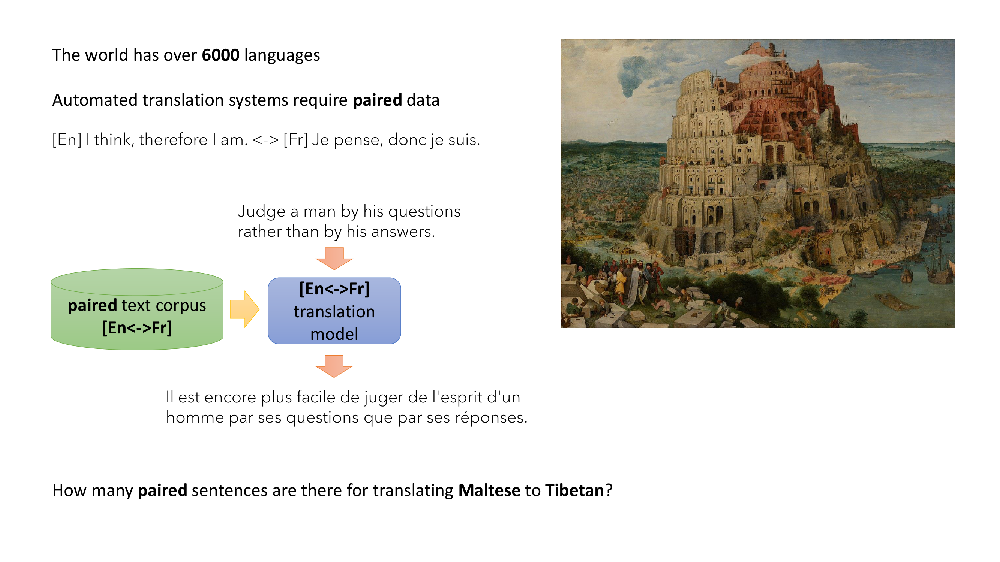
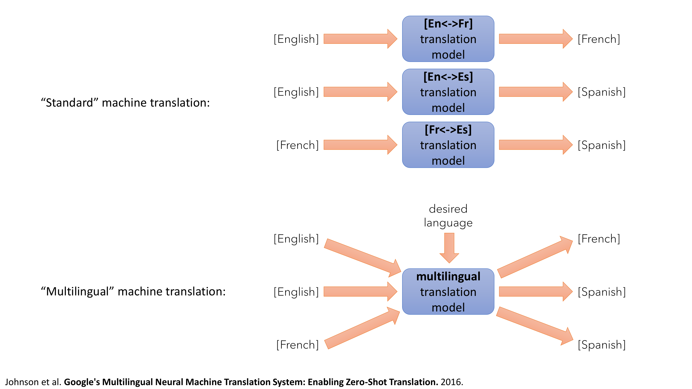
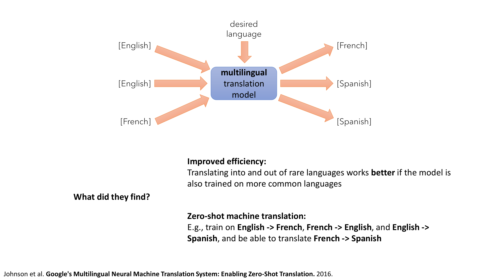
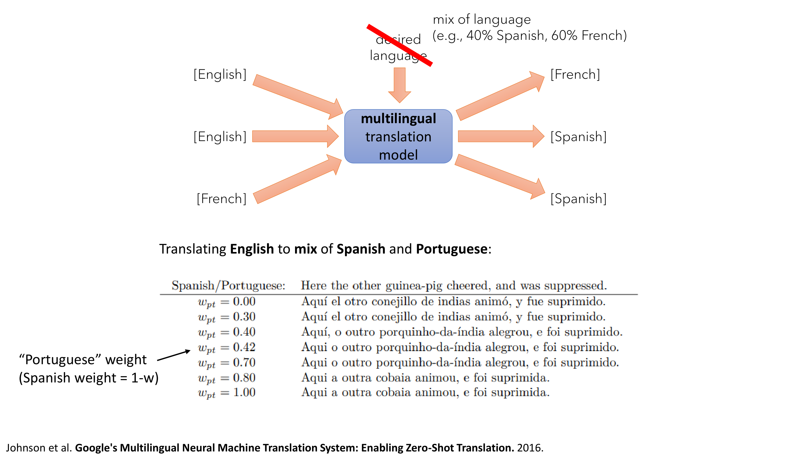
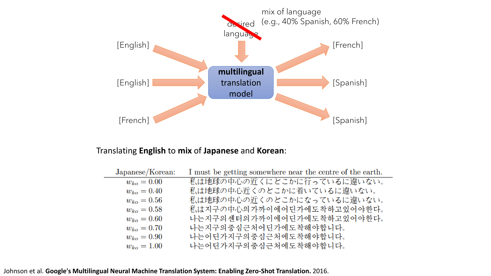
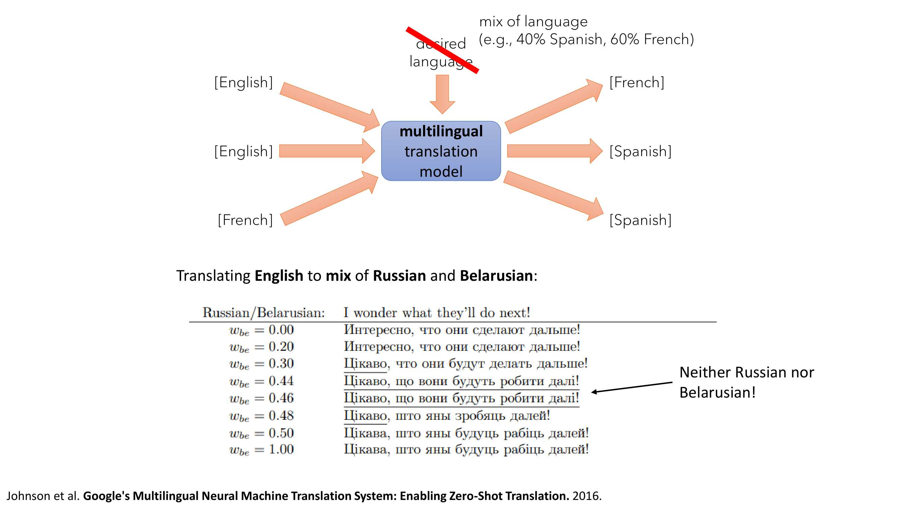
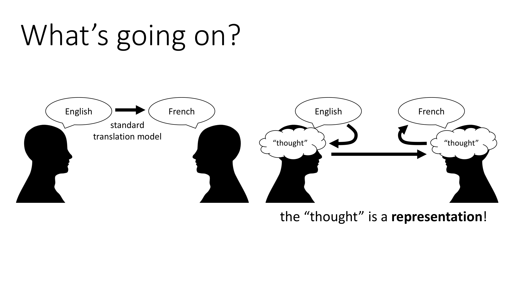

The world has over 6,000 different languages.

However, if we want to train a model to translate from one language to another, for example for a machine translation system, we typically need paired data, meaning we need examples of sentences in one language and the corresponding translation to another, such as this example, I think therefore I am in English, corresponding to French, Je pense, donc je suis.

So the way that we would train a machine translation system is we would typically take a large corpus of paired examples, meaning sentences in one language with their corresponding translation to another, and then train a translation model on this, and once that model is trained it can take in sentences in the source language and produce their corresponding translations in the target language.

But this approach can be pretty onerous if you consider how many languages there are.

Especially when it comes to obscure languages or languages that just don't have as many speakers, these are sometimes referred to as low-resource languages.

For instance, how many paired sentences do you think there are in existing datasets for translating Maltese into Tibetan?

When researchers at Google had to contend with this problem for Google Translate, they thought about more creative solutions.

And I want to tell you about one of these, because I think it illustrates an important principle about deep learning.

So a standard machine translation system would train separate models for every pair of languages.

So if you want to translate English into French, you would get a corpus of English sentences and their corresponding French translations.

You might also get a corpus of English sentences and their corresponding Spanish translations, maybe another one of French sentences and their corresponding Spanish translations, and so forth.

What these folks wanted to do to alleviate this issue with low-resource languages is to instead build a multilingual machine translation model.

Instead of having separate models for every pair of languages, they would have a single model that can read in a sentence in any language and then translate it into any other desired language when provided with an additional input that specifies the target language.

So you would take this multilingual model, give it your sentence in whatever language, it happens to be in, and then you would tell it, turn this into Spanish, and it would output the corresponding sentence in Spanish.

Now, crucially, a model like this can be trained on exactly the same data as the collection of standard models listed above.

You simply take all of your paired English and French sentences and label those as having the target language French.

You take all of your French to Spanish sentences, label those as having the target language Spanish, and so on and so on.

Conceivably, you could also tell the model with the source language, but the model can usually figure that out just from looking at the source sentence.

So training such a model doesn't require any other data.

You're just taking the data you already have and using it in a different way.

Now, why might this be a good idea?

Well, those of you that speak multiple languages might already be guessing as to what's going on here.

A lot of languages share commonalities.

So if you know how to speak Spanish, for instance, that doesn't mean that you can speak Italian.

Of course, Italian and Spanish, are different languages.

But it does mean that you can often make a decent educated guess as to the meaning of individual Italian words, because there might be similar words in Spanish based on similar roots.

So a multilingual model of this sort conceivably could learn commonalities between languages, and even for languages for which it has relatively few examples, it could figure out educated guesses as to how to translate into those languages.

Another thing such a model could do is it could perform translation without requiring a particular pairing.

So if you've translated English into Spanish, and English into French, and English into Japanese, your model probably has built up some sort of internal representation of English sentences, so that if you then also train on, for example, translating Japanese into Chinese, but you've never translated English into Chinese, your model may be able to figure out that the English sentence, when it's read in, is turned into some universal representation that can then be decoded into any language you want.

So what did these researchers find?

Well, one of the things they found, of course, is that such an approach could improve efficiency.

Especially when it comes to translating into and out of low-resource languages, such an approach could work better than if the model was, than if you used a standard, single-language model, and the inclusion of more common languages made the low-resource language translation work better.

So if you have a low-resource Romance language that uses similar root words as Spanish and French, including lots of Spanish and French data, would also improve the quality of your translation into and out of that low-resource language.

So that kind of makes sense.

Another thing they found, which was a little more surprising, is that you could actually accomplish zero-shot, zero-shot machine translation, meaning you have a pair of languages for which you've never seen paired data.

Now that doesn't mean that you've never seen that language.

So perhaps you trained on English to French, and French to English, and English to Spanish, and now you could translate French to Spanish.

So you've seen French before, and you've seen Spanish before, but you've never seen examples of going from one to the other.

And this kind of zero-shot translation is exactly what I was talking about before, that essentially, if internally, the model has some internal representation that is agnostic to language, it makes sense that it would need to see all of the pairs of languages.

Another interesting experiment that these researchers did is they studied what would happen if they told the model to decode, to translate, into a mix of languages.

Now, the technical aspect of how this works, we'll find out a little bit more about that when we talk more about supervised learning a few weeks from now.

But at a high level, it's actually fairly easy when you have a model that is conditioned on a categorical variable, like a desired language, to also test it, conditioning on a mix of those variables.

Because typically, when these variables are passed into the model, they are represented as a collection of bits, and those bits can take on values, typically those values are 0 and 1, but you can set them to fractional values also, without any change to the model.

So that means it's very easy to take this model and to ask it, instead of producing English, or French, or Spanish, ask it to produce 40% Spanish, and 60% French, and see what it does with that.

So, it's kind of a weird experiment, but it gives us a little bit of insight into the mind of this model.

It'll give us a little bit of insight as to how it's actually processing these multilingual problems.

So here's an experiment where we are taking in an English sentence, and then asking the model to output a mix of Spanish and Portuguese.

So, the number here on the left side, is the weight on Portuguese.

So if it's 1.0, that means that you're asking the model to produce pure Portuguese, if it's 0.0, that means you're asking it to produce pure Spanish.

And anything in the middle is a mix.

Now, I don't speak Spanish or Portuguese, but just looking at these sentences, you can kind of get a sense for what's going on.

The words get swapped out one at a time, or two or three at a time, so gradually it replaces some of the Spanish words with Portuguese words, until it turns the sentence into complete Portuguese.

So you can take a moment to look at this sentence.

Here, the other guinea pig cheered and was suppressed.

OK, that's the English sentence.

And on the first line, you can see that, you know, the Spanish, the word presumably for guinea pig is conejillo de indias animó.

I guess, I don't speak Spanish, but I assume that's what it is.

Whereas if you look at the Portuguese translation at the bottom, you can see that it's a very different word that presumably means guinea pig in Portuguese.

Here's another interesting example.

This is translating English into a mix of Japanese and Korean.

So the number here represents the percentage Korean, so if you're asking for w_{ko} 1.0, that means you're asking for pure Korean.

If you ask for 0.0, that means it's pure Japanese.

Now, Japanese and Korean use different scripts.

So, interestingly enough, the actual output that's produced, it doesn't really spend a lot of time producing a mix of Japanese and Korean characters.

So there's like something weird going on at 0.58, but mostly it's either pure Japanese characters or pure Korean characters.

However, and I have to, again, take the author's word of this, because I don't read Japanese or Korean, but apparently the grammar in the sentence that's produced actually more gradually switches from Japanese to Korean.

So obviously at 0.0, it's Japanese grammar.

Apparently in the middle, for 0.58 and 0.60, it switches over from Japanese characters to Korean characters, but the grammar looks more Japanese.

And then for 0.70, 0.90, and 1.0, the grammar becomes more and more Korean.

Okay, so that's pretty interesting.

But this is my favorite example, and maybe it's my favorite because I actually can read the language, but here they're translating from English into either Russian or Belarusian.

Now, and the number here represents the percentage Belarusian.

Now, the interesting thing here is that Belarusian is actually a very low-resource language.

Very relatively few people actually speak Belarusian, even in Belarus.

So the translation into Belarusian is presumably going to be relying a lot more on other related languages, such as Russian.

So at 0.0, it's a correct translation into Russian.

I don't speak Belarusian, but the two languages are almost mutually intelligible.

The sentence at the bottom looks pretty reasonable for a Belarusian sentence, I think.

What's interesting is what happens in the middle.

And you can kind of tell from looking at the words, even if you can't read the script, that some of the words that pop up for 0.44 and 0.46 don't look like either of the words at the top in Russian, or the words at the bottom in Belarusian.

Interestingly enough, the sentences that are produced in the middle for 0.44 and 0.46 are actually another language.

That language, in this case, is Ukrainian.

And that actually makes a lot of sense, because sort of the jump from Russian into Belarusian looks a little similar to the jump from Russian to Ukrainian.

Both Belarusian and Ukrainian are East Slavic languages, but with heavier influences from Polish and other Central European languages, as opposed to Russian, which is kind of further to the East.

So it makes a lot of sense that a model that has fairly limited data in Belarusian would utilize some of that additional knowledge that comes from also learning to translate into Ukrainian.

And you just get this kind of Ukrainian sentence popping up in the middle of a translation as you interpolate from Russian to Belarusian.

So that's pretty cool.

Why did I want to tell you this anecdote to start off the class?

Well, I think this story about this multilingual model illustrates an important point about deep learning.

I think this is a big part of why deep learning is so exciting.

The story, to me, is really one of the representations.

If we think of a very literal way to translate one language into another, we would say, well, let's just take a sentence in English and just try to turn it into a sentence in French.

That's kind of a standard view of translation.

But another way to think about the translation problem is to say, well, the sentence that you got, it was spoken in English, but it was the consequence of some thought that the speaker had.

And this thought is, in some sense, language agnostic.

So it's like the semantic content of that phrase.

And if you can figure out the thought, I don't mean like telepathy, I don't mean actually figure out what they were thinking, but sort of figure out some language of agnostic representation of the underlying meaning, and then imagine what it would look like for a French speaker to produce words corresponding to that same thought, then you could have a very powerful way of doing translation.

Because then you wouldn't need to see pairs of all possible languages, right?

The thought is language agnostic, so the thought transfers from one language to another trivially.

So if you know how French speakers and Spanish speakers and English speakers and Belarusian speakers can turn thoughts into words, and you know how to figure out thought from the word in each of those languages, then you don't need to see all the pairs, you just need to see for every language how that language can be turned into a thought and how that thought can be turned into a corresponding language.

So you don't need all the pairs if you can do this.

This is another way of saying that machine translation becomes a lot easier if you have the right representation.

So what I'm calling thought here, very loosely, is really a representation.

It is, in this case, a representation of those phrases that contains the semantic meaning without being married to a particular language for expressing that meaning.

Now, of course, this is a very lofty way of talking about it.

In reality, of course, the model is not doing quite something so fancy.

It doesn't really understand what the words mean, but nonetheless it comes up with some kind of representation that is more invariant to language than the words themselves.

So let's talk about representation learning.

The classic view of machine learning problems is basically a problem of predicting y from x.

And when we learn kind of basic statistics, statistical fitting and so on, we see a picture that looks something like this.

You have your 'x's, your inputs on the horizontal axis, you have your 'y's, your outputs on the vertical axis, and your job is to figure out how to turn those 'x's into those 'y's by fitting some kind of model.

In this case, it's a linear fit, so here we're fitting a linear model.

But I think that the story about machine translation gives us a somewhat different view of what machine learning could actually be doing.

So what is x in practice?

In practice, x is not just a number.

It could be a sentence in another language.

It could be an image.

It could be a sound.

It could be an utterance that someone spoke.

All of these things are far more complex than a number.

They contain far more structure inside them.

And the big reason, why techniques like deep learning are so powerful and have generated so much excitement in recent years, is that they can acquire representations of these complex inputs that are suitable for actually making meaningful and complex predictions.

Handling such complex inputs requires representations, and deep learning methods allow us to automatically learn those representations.

So the power of deep learning lies in the ability to learn such representations automatically from data.

And that's going to be the topic of this class.