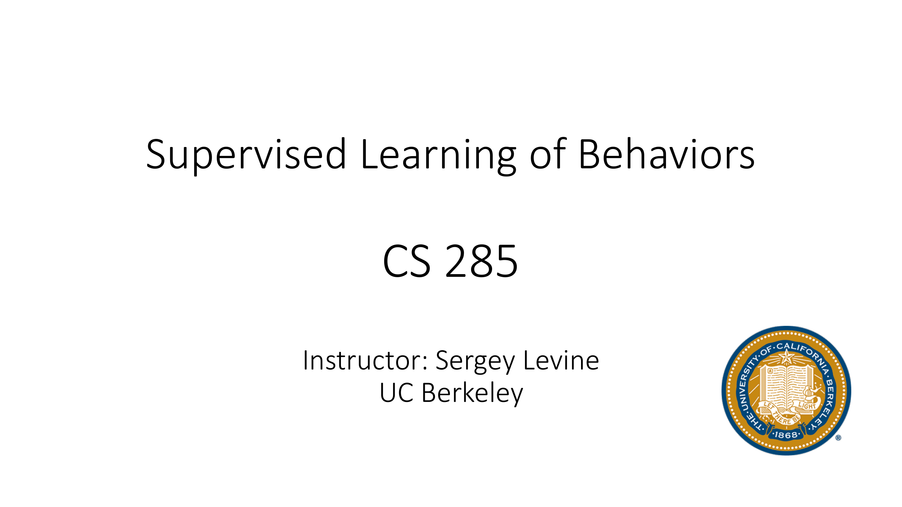
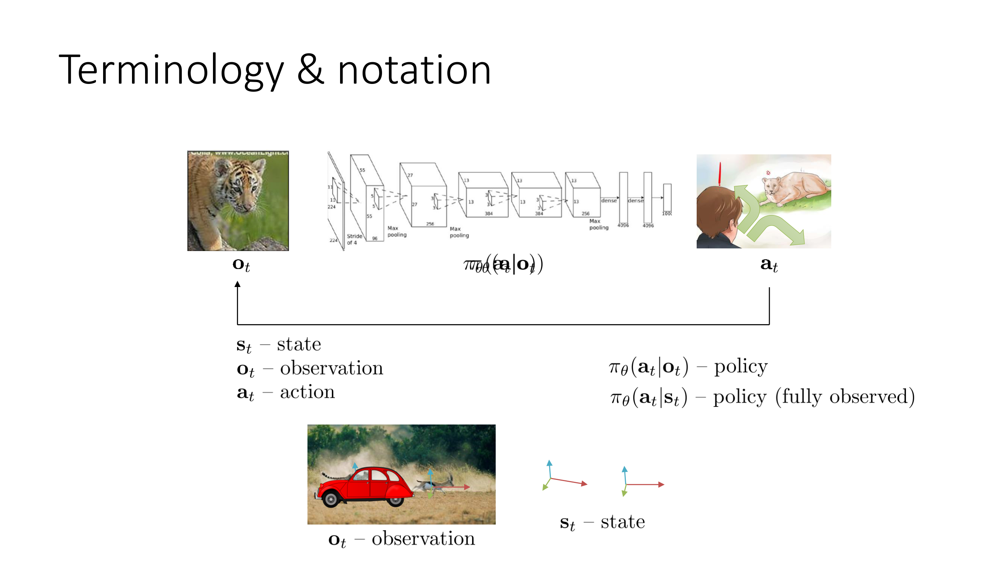
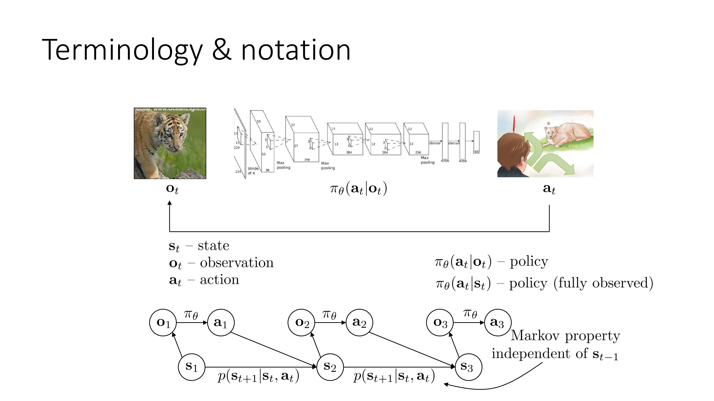
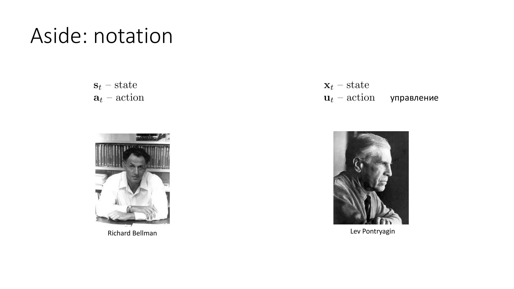
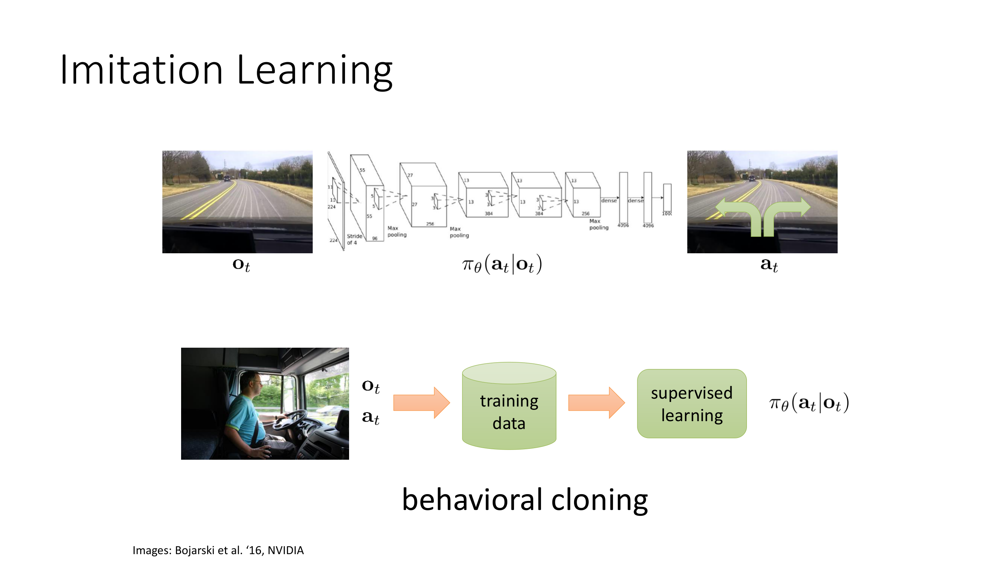
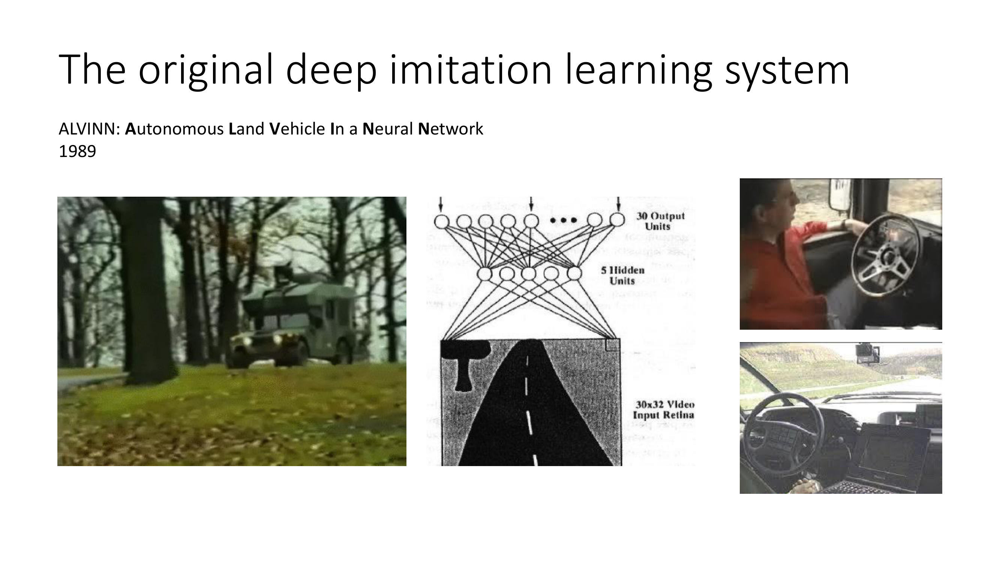
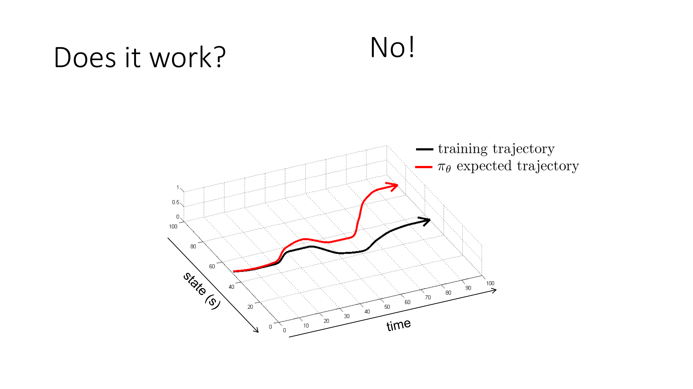
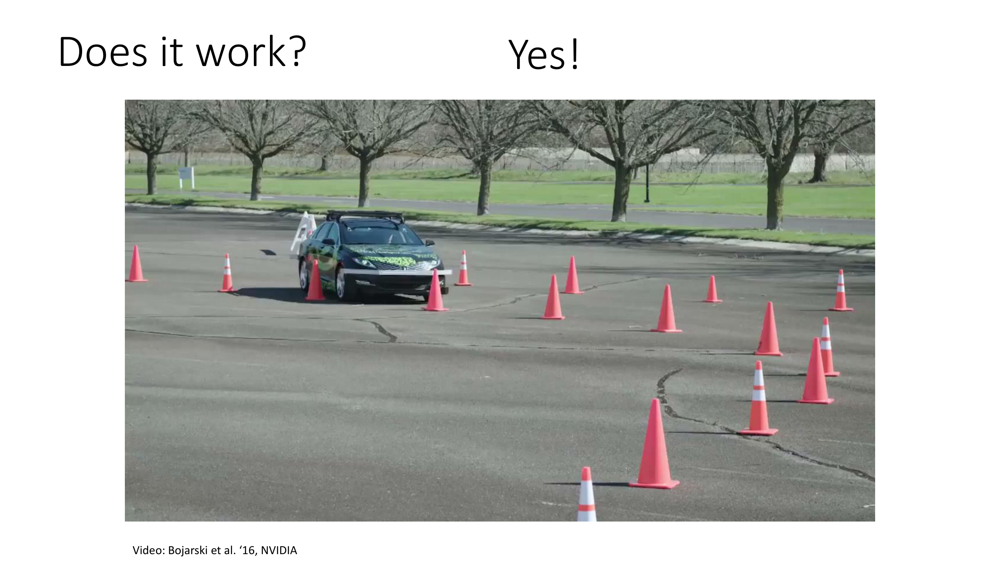
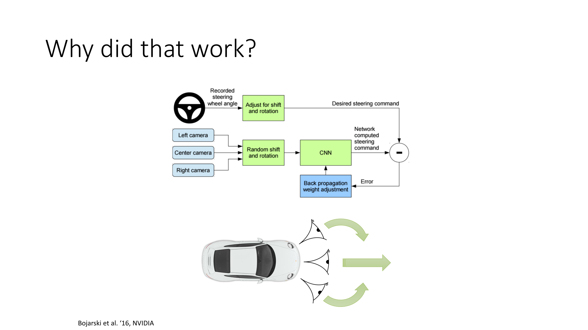
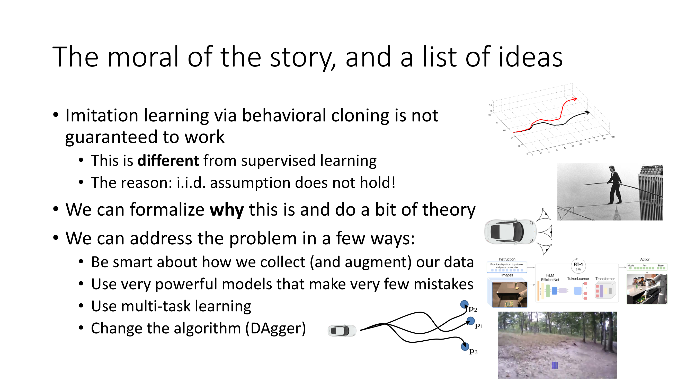

Hi, welcome to lecture 2 of CS285.

Today we're going to talk about supervised learning of behaviors.

So let's start with a little bit of terminology and notation.

So we're going to see a lot of terminology in this lecture denoting policies that we're going to be learning from data, and we're not going to talk about reinforcement learning just yet, we're going to talk about supervised learning methods for learning policies, but we'll get started with a lot of the same terminology that we'll use in the rest of the course.

So typically if you want to represent your policy you have to represent a mapping from whatever the agent observes to its actions.

Now this is not such a strange object, those of you that are familiar with supervised learning, you can think of this as much the same way that you represent for example an image classifier.

An image classifier maps from inputs x to outputs y, a policy maps from observations o to outputs a, but other than changing the names of the symbols, in principle things haven't actually changed all that much.

So in the same way that you might train an image classifier that looks at a picture and outputs the label of that picture, you could train a policy that looks at an observation and outputs an action.

Same principle.

We're going to use the letter π to denote the policy and the subscript θ to denote the parameters of that policy, which might be for example the weights in a neural network.

Now typically in a control problem, in a decision-making problem, things exist in the context of a temporal process.

So at this instant in time I might look at the image from my camera and make a decision about what to do, and then at the next instant in time I might see a different image and make a different decision.

So typically we will write both the inputs and outputs with a subscript lowercase t to denote the time step t.

For almost all of the discussion in this course we're going to operate on discrete time, meaning that t you can think of it as an integer that starts with zero and is then incremented with every time step.

But of course in a real physical system, t might correspond to some continuous notion of time.

For example t=0 might be 0 milliseconds and to the control process t=1 might be 200 milliseconds, t=2 might be 400 milliseconds, and so on.

Now in an actual sequential decision-making process of course the action that you choose will affect the observations that you see in the future, and your actions are not going to be image labels like they are for example, in a standard image classification task, but they're going to be decisions, decisions that are bearing on future outcomes.

So instead of predicting whether the picture is a picture of a tiger, you might predict a choice of action, like run away or ignore it or do something else.

But this doesn't really change the representation of the policy.

If you have a discrete action space, you would still represent the policy in basically the same exact way that you represent an image classifier if your inputs are images.

You could also have continuous action spaces.

And in that case, perhaps the output would not be a discrete label.

Maybe it would be the parameters of a continuous distribution.

A very common choice here is to represent the distribution over a as a Gaussian distribution, which means that the policy would output the mean and the covariance for that Gaussian.

But there are many other choices we could make.

So to recap our terminology, we're going to have observations, which we denote with the letter o and the subscript t to denote that it's the observation of time t.

Our output will be actions, which we denote with a letter a and a subscript t.

And our goal will be to learn policies that, in the most general sense, are going to be distributions over (a|o).

Now, something I want to note here, because this is sometimes a source of confusion, a policy needs to provide us with an action to take.

In the most general case, policies are distributions, meaning that they assign a probability to all the possible actions given a particular observation.

Of course, a policy could be deterministic meaning that it prescribes a single action for a given observation that's a special case of a distribution it's just a distribution that assigns a probability of one to something, and a probability of zero to everything else.

So in most cases, we will actually talk about stochastic policies, policies that specify a distribution over actions.

But keep in mind that this is fully general in the sense that deterministic policies are simply a special case of these distributions.

And it's very convenient to talk about distributions here for the same reason that we tend to talk about distributions in supervised learning.

So in supervised learning, if you're classifying images, perhaps you only really want to predict one label for a given image, but you might still learn distribution over labels, and then just take the most likely output, and that makes training these things a lot more convenient.

And it's the same way with decision making and control, that training these policies as probability distributions often is much more convenient, even if in the end, we only want the single best action.

Now, one more term that we have to introduce, and here we're going to start getting to some of the idiosyncrasies of sequential decision making, is the notion of a state.

The state is going to be denoted with the letter s, and also the subscript t.

And a state is, in general, a distinct thing from the observation.

Understanding this distinction will be very important for certain types of reinforcement learning algorithms.

It's not so important for today's lecture, because for imitation learning, we often don't need to make this distinction, although even here, it'll be important when we try to understand the theoretical underpinnings of some of these imitation learning methods.

And sometimes when we learn policies, we'll write policies as distributions over (a|s), rather than given o.

I will try to point out when this is happening and why, but to understand the difference between these two objects, let's talk about the difference between states and observations, and then we'll come back to this.

And typically, we'll refer to policies that are conditioned on the full state as fully observed policies, as opposed to policies conditioned on observation, which might have only partial information.

So what do I mean by this?

Well, let's say that you are observing a picture of a cheetah chasing a gazelle, and you need to make some decision about what to do in this situation.

Now, the picture consists of pixels, so they're recordings from a camera.

You know that underneath those pixels, there are actual physical events taking place that, you know, maybe the cheetah has a position and velocity, and so does the gazelle.

But the input, technically, is just an array of pixels.

So that's the observation.

The state is what produced that observation.

And the state is a concise and complete physical description of the world.

So if you knew the positions and velocities and maybe like the mental state of the cheetah and the gazelle, you could figure out what they're going to do next.

The observation sometimes contains everything you need to infer the state, but not necessarily.

So, for example, maybe there's a car driving in front and you don't see the cheetah.

The cheetah is still there.

The state hasn't changed just because it's not visible.

But the observation might have changed.

So in general, it might not be possible to perfectly infer the current state, s_t, from the current observation, o_t.

Whereas going the other way, going from s_t to o_t, by definition of what a state is, is always possible because a state always encodes all the information you need to produce the observation.

So if it would help to think about it this way, if you imagine this was a simulation, s_t might be the entire state of the computer's memory encoding the full state of the simulator, whereas the observation is just an image that is rendered out based on that state on the computer screen.

So going from observation back to state might not be possible if some things are not visible.

Now, if we want to make this a little bit more precise, and we can, we can describe this in the language of probabilistic graphical models.

So in the language of probabilistic graphical models, we can draw a graphical model that represents the relationship between states, observations, and actions.

For those of you that took some course that covers Bayes nets, this will look familiar.

For those of you that haven't, roughly speaking in these pictures, the edges denote conditional independence relationships.

So if there's an edge, then the variable is not independent of its parents.

And in some cases, these things can encode independencies.

I won't get into the details of how to understand probabilistic graphical models.

If you haven't covered this part, this won't entirely make sense to you.

But hopefully the verbal explanation of the relationship between these variables will still make sense.

So the policy π_θ is, at least for the partial observed case, our relationship between o and a.

So it gives the conditional distribution over (a|o).

So that's this edge in the graph.

The state is what determines how you transition to the next state.

So the state and action together provide a probability distribution over the next state p(s_{t+1}|s_t,a_t).

That is sometimes referred to as the transition probabilities or the dynamics.

You can think of this as basically the physics of the underlying world.

So when we write down equations of motion in physics, we don't write down equations describing how image pixels move around.

We write down equations about how rigid bodies move and things like that.

So that's referring to s, the state, the position of the cheetah, the velocity of the cheetah.

So the cheetah might transition to a different position based on its current velocity and maybe based on how hungry the cheetah is and what it's trying to do.

And that's all captured in the state.

And then something to note about the state is that the state s_3 here is conditionally independent of the state s_1 if you know the state s_2.

So let me say that again because that might have been a little bit unclear.

If you know the state s_2 and you need to figure out the state s_3, then s_1 doesn't give you any additional information.

That means that s_3 is conditionally independent of s_1 given s_2.

This is what is referred to as the Markov property.

And it's one of the most fundamental defining features of a state.

Essentially, if you know the state now, then the state in the past does not matter to you because you know everything about the state of the world.

And that actually makes sense if you think back to that analogy about the computer simulator.

If you know the full state of the memory of the computer, that's all you really need in order to predict future states because the past memory of the computer doesn't matter.

The computer is only going to be making its simulation stuff based on what's in memory now.

The computer itself has no access to its memory in the past, only its memory now.

So it makes sense that the future is independent of the past given the present.

So this is referred to as the Markov property.

And it's very, very important.

The Markov property essentially defines what it means to be a state.

A state is that which captures everything you need to know to predict the future without knowing the past.

That doesn't mean that the future is perfectly predictable.

The future might still be random.

There might be stochasticity.

But knowing the past doesn't help you resolve that randomness.

Okay, so just to finish this discussion, now it's hopefully clear what the distinction between policies that operate on observations, π(a_t|o_t), and policies that operate on states, π(a_t|s_t) is.

So some algorithms, especially some of the later reinforcement learning algorithms we'll describe, can only learn policies.

That operate on states, meaning that they require the input into the policy to satisfy the Markov property, to fully encode the entire state of the system.

Some algorithms will not require this.

Some algorithms will be perfectly happy to operate on partial observations that are perhaps insufficient to infer the state.

I'll try to make this distinction every time I present an algorithm.

But I will warn you right now that reinforcement learning practitioners and researchers have a very bad habit of often confounding o and s.

So sometimes people will refer to o as s.

They'll say, o, this is my state, when in fact they mean this is my observation.

Sometimes vice versa.

And sometimes they'll make this distinction very unclear.

Sometimes they'll switch back and forth between observations and states.

So this confusion often happens.

If everything is going well, this confusion is benign because it's typically, this kind of confusion typically happens for algorithms where it doesn't matter whether it's state or observation.

So then it's kind of okay to mix them.

I'll try not to mix them.

But sometimes I'll fall into old habits and mix them anyway, in which case I'll do my best to tell you.

But be warned that o and s gets mixed up a lot.

If you want to be fully rigorous and fully correct, this slide explains the difference.

So as an aside on notation, in this class, we use the standard reinforcement learning notation where s denotes states and a denotes actions.

This kind of terminology goes back to the study of dynamic programming, which was pioneered in the 50s and 60s, principally in the United States by folks like Richard Bellman.

And I believe the s and a notation actually was first used in his work.

Although I could be wrong about that.

Those of you that have more of a controls or robotics background might be familiar with a different notation, which means exactly the same thing.

So if you've seen the symbol x used to denote state, such as a configuration of a robot or a controlled system, and the symbol u to denote the action, don't be concerned.

It means exactly the same thing.

This kind of notation is more commonly used in controls.

A lot of it goes back to the study of optimal control and optimization, much of which was actually pioneered in the Soviet Union by folks like Lev Pontryagin.

And much like the word action begins with a symbol a, the word action also begins with a symbol u.

In Russian, that's the word управление.

So that's why we have u, x, well, because it's a commonly used variable in algebra.

Okay.

So.

That's the set.

Now let's actually talk about imitation, the main topic of today's discussion.

So our goal will be to learn policies, which are distributions over (a|o), and to do this using supervised learning algorithms.

So since getting data of people running away from tigers is not something that you can do very readily, I'm going to use a different running example throughout today's lecture, which is a kind of autonomous driving example.

So our observations will be images from a dashboard mounted camera on a vehicle.

And our actions will be steering commands, turning left or turning right.

And you could imagine collecting data by having humans drive cars, record their steering wheel commands, and record images from their camera, and use this to create a data set.

So every single time step, your camera records an image, and you record the steering wheel angle, and you create a training tuple out of this, an input o and an output a.

And you collect this into a training set, where a's are labels and o's are inputs.

And now you can use this training set the same way that you use a labeled data set in, let's say, image classification, and just train a deep neural network to predict distributions over (a|o) using supervised learning.

That is the essence of the most basic kind of imitation learning method.

We sometimes call this kind of algorithm behavioral cloning, because we're attempting to clone the behavior of the human demonstrator.

So.

That's a very basic algorithm.

Now, from what I've told you just now, you can already implement a basic method for learning policies.

And what we'll discuss for the rest of today's lecture is, does this method work?

Why does it work and when?

How can we make it work more often?

And can we develop better algorithms that are a little smarter than just straight up using supervised learning that will work more consistently?

Okay.

So supervised learning produces this policy, just like supervised learning might produce an image classifier.

This is called behavioral cloning.

Now, these kinds of methods have been around for a very, very long time.

One of the first, what we would call large scale, larger scale learning based control methods was actually an imitation learning method called ALVINN, developed in 1989, which stands for autonomous land vehicle in a neural network.

And that was what we would today call a deep RL method for learning based control.

It used data from human drivers to train a neural network with a whole heaping load of hidden units, five whole hidden units, to look at a 30 by 32 observation of a road and output commands to drive a vehicle.

And it could drive on roads.

It could follow lanes and could do some basic stuff.

You know, probably wouldn't be able to handle traffic laws very well.

But it was a very rough sketch on autonomous driving system.

Quite a long time ago.

But if we want to ask more precisely whether using these behavioral cloning methods in general is guaranteed to work, the answer, unfortunately, is no.

We'll describe, we'll discuss the formal reasons for this in a lot more detail.

But to give you a little bit of intuition to get us started, let's think about it like this.

I'll draw a lot of plots of this sort in today's lecture.

In these plots, one of the axes represents the the state.

So, imagine the state is one-dimensional.

Of course, in reality, the state is not really one-dimensional.

But, for visualization, that's what it's going to be.

And the other axis is time.

Now, in this kind of state-time diagram, you can think of this black, curvy line as one of the training trajectories.

In reality, of course, you would have many training trajectories.

But, for now, let's say you have just one.

And now, let's imagine that you train on this training trajectory.

You get your policy.

And then you're going to run your policy from the same initial state.

So the red curve will represent the execution of that policy.

And let's say you did a really good job.

So you took all of your lessons from CS189, and you took care to make sure that you're not overfitting, and you're not underfitting.

But of course, your policy will still make at least a small mistake, right?

Every learned model is not perfect.

It'll make tiny mistakes, even in states that are very similar to ones that were seen in training.

And the problem is that when it makes those tiny mistakes, it'll go into states that are different from the ones it saw in training.

So if the training data involves driving quite straight on the road in the middle of the lane, and this policy makes a little deviation, goes a little bit off-center, now it's seeing something unfamiliar that's a little different than what it saw before.

And when it sees something that's a little different, it's more likely to make a slightly bigger mistake.

And the amount by which these mistakes increase might be very small at first, but each additional mistake puts you in a state that's more and more unfamiliar, which means that the magnitude of the mistake will increase.

And that means that by the end, if you have a very long trajectory, you might be in extremely unfamiliar states, and therefore you might be making extremely large mistakes.

This doesn't happen in supervised learning, in regular supervised learning.

And the reason it doesn't happen is actually something that we discussed in Lecture 1.

There's a particular assumption that we make in supervised learning.

Some of you might remember it.

If you think you might remember it, maybe you can pause this video and think about this a little bit.

And when you're on pause, I'll tell you the answer.

The answer, of course, is the IID property.

In regular supervised learning, we assume that each training point doesn't affect the other training points, which means that the label you output for example number 1 has no bearing on the correct solution for example number 2.

But of course, that's not the case here, because here, when you select an action, it actually changes the observation that you will observe at the next time step.

So it's violating a fairly fundamental assumption that is always assumed in regular supervised learning.

However, in reality, naive behavioral cloning methods can actually work pretty well.

These are some results from a fairly old paper at this point from NVIDIA, where they attempted a behavioral cloning approach for autonomous driving, a kind of modernized version of ALVINN.

And initially, they had a lot of trouble.

Their car was giving them a lot of bad turns, running into traffic cones, et cetera.

But after they collected a lot of training data, 3,000 miles of training data, they could actually get a vehicle that would follow lanes reasonably competently.

It could drive around the cones, it could follow roads.

And they always have a safety driver in there, and it's not by any means a complete autonomous driving system.

But it certainly seems like the pessimistic picture on the previous slide might not actually hold in practice, at least not always.

So what is it that this paper actually did?

What is it that made it work?

Well, there are a lot of complex decisions in any machine learning system.

But one decision that I wanted to tell you about a little bit that maybe kind of sets the tone for some of the ideas that I'll discuss in the rest of the lecture is a diagram that's buried deeper down in that paper that shows that, well, okay, so they've got their recorded steering angle, they've got some convolutional neural net, that's pretty typical.

And they have some cameras, but they have this center camera, left camera, and right camera, and this random shift and rotation.

What's up with that?

Well, there's a little detail in how the policy is trained in that work.

And the detail is this.

So their car actually has three cameras.

It has a regular forward-facing camera, which is the one that's actually going to be driving the car.

And then they also have a left-facing camera.

And they take the images from the left-facing camera, and they label them, not with the steering command that the human actually executed during data collection, but with a modified steering command that steers a little bit to the right.

So imagine what that camera sees.

What the camera sees when the car is driving straight on the road is an image similar to what the car would have seen if it swerved to the left.

And they synthetically label that with an action that corrects and swerves back to the right.

And they do the same thing for the right-facing camera.

They label it with an action that's a little bit to the left of the one that the human driver actually used.

And you can kind of imagine how this might correct some of the issues that I discussed before, because if the policy makes a little mistake and it drives a little further to the left than it should have, now it's going to see something similar to what that left-facing camera would have seen.

And now that state is not so unfamiliar, because it has been seen before in those left-facing cameras.

Now it's being seen in the front-facing camera, but the policy doesn't know which camera it's looking through.

It just knows that it's similar to that image before that was labeled with a turn to the right.

So it will correct.

Okay, so why did I want to tell you this?

What's the moral of the story?

And what does that tell us about how we can actually make naive behavioral cloning methods work pretty well in practice?

Well, the moral of the story is that imitation learning via behavioral cloning is not in general guaranteed to work.

And we'll make this actually precise, and we'll describe precisely how bad the problem really is.

And this is different from supervised learning.

So for supervised learning, you can derive various sample complexity and correctness bounds.

Of course, when deep neural nets are in the picture, those bounds often make strong assumptions that might not hold in practice, but at least that's a fairly well understood area.

And this generally doesn't hold in behavioral cloning.

And the reason fundamentally is the IID assumption, the fact that individual outputs will influence future inputs in the sequential setting, but they will not in the classic supervised learning setting.

We can formalize why with a bit of theory, and we'll talk about that today.

And we can address the problem in a few ways.

First, we can be smart about how we collect and augment our data.

And that is what that paper from NVIDIA did, arguably with a technique similar to data augmentation, where instead of simply directly using the true observations that the human driver observed together with their actions, they add some additional kind of fake observations from these left and right facing cameras with synthetically altered actions to fix up the problem.

We can also use very powerful models that make very few mistakes.

Remember that the issue originally was due to the fact that we made those small mistakes in the beginning, which then build up over time.

If we can minimize the mistakes, if we use very powerful models, perhaps in combination with the first bullet point, then we can mitigate the issue as well.

There are some other solutions that are maybe a little bit more exotic, but can be very useful in some cases.

For instance, sometimes switching to more of a multitask learning formulation, learning multiple tasks at the same time, can, perhaps surprisingly, actually make it easier to perform imitation learning.

And then we can also change the algorithm.

We can use a more sophisticated algorithm that directly solves this problem, this compounding errors problem, and we'll discuss one such algorithm called Dagger.

Now that typically involves changing the learning process.

In the case of Dagger, it actually changes how the data is collected, but it can provide a more principled solution to these issues, and you will actually implement this algorithm in your homework.

So that's what I'll discuss next for the rest of the lecture.

And the first part will be a discussion of the theory in part two.