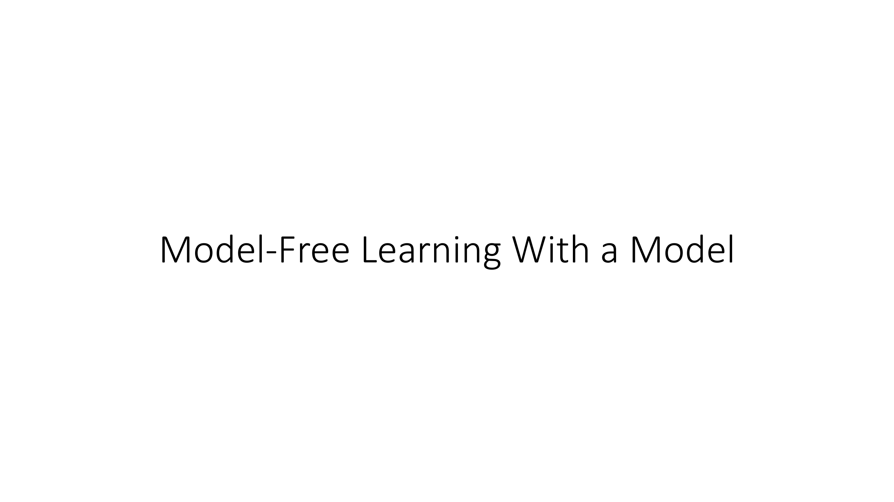
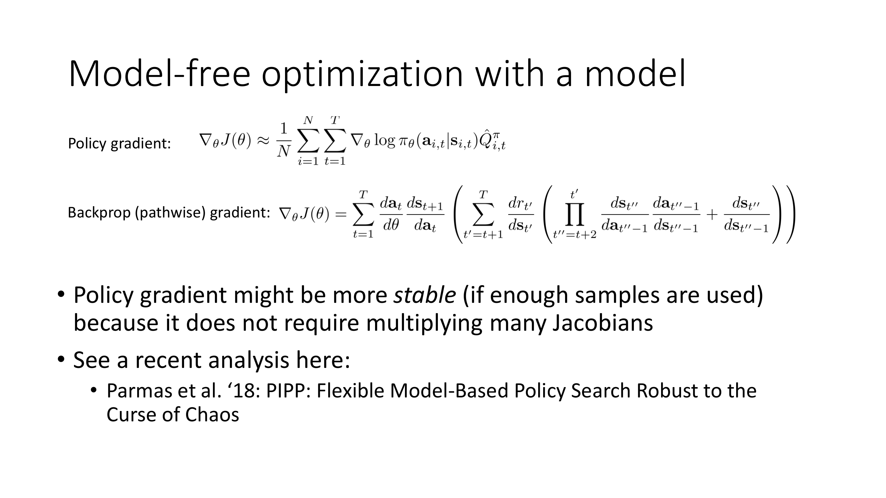
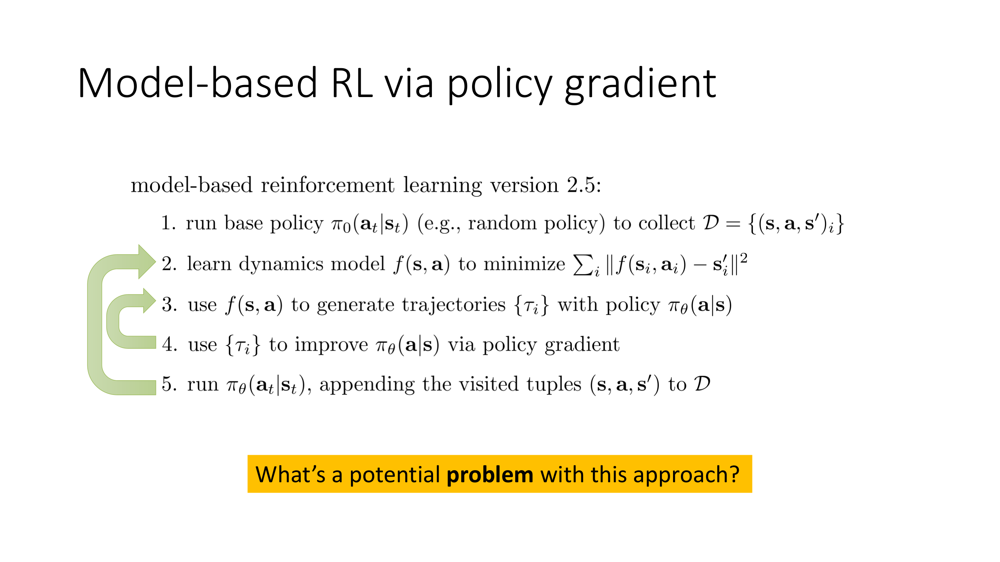
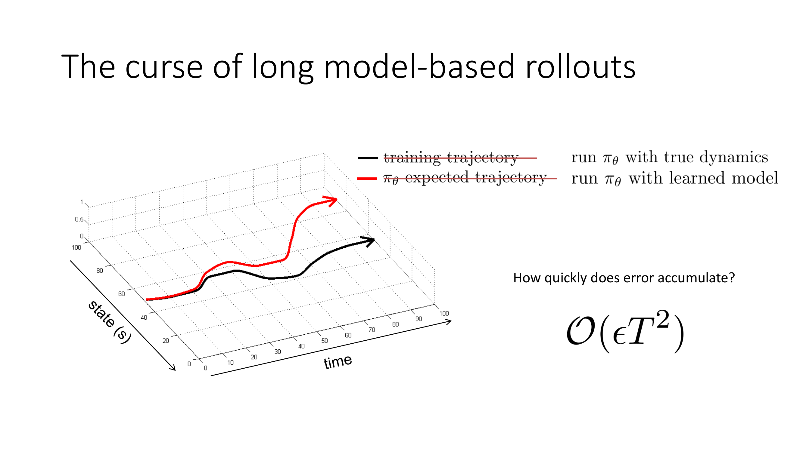
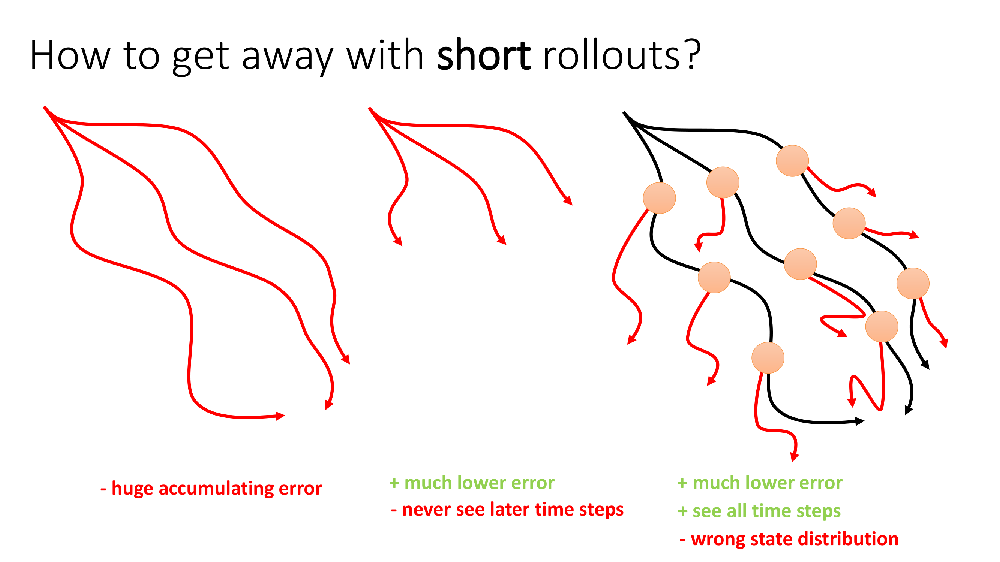
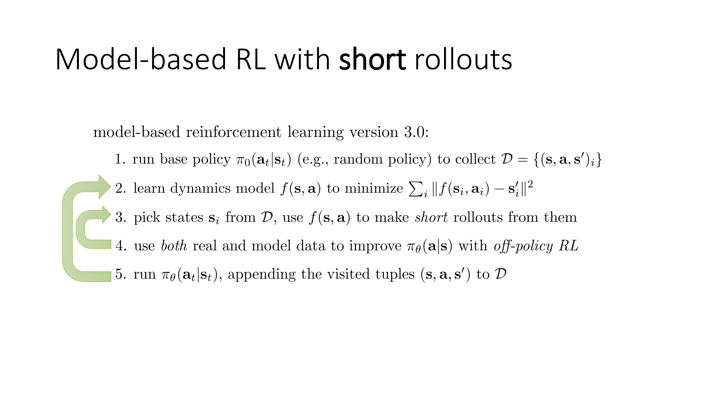

All right, let's talk about model-free reinforcement learning with a learned model, so essentially model-based RL by using model-free RL methods.

Before we get into algorithms, let's make a little bit more precise some of the things that we discussed in the previous portion of the lecture on what these back-propagation gradients actually look like and why they might not be as good as using model-free methods.

So this is the familiar policy gradient expression that we had before.

This is basically just directly taken from previous lectures.

Now, we talked about the policy gradient as a model-free reinforcement learning algorithm, but you could just as well think of it as a gradient estimator that could be used to estimate the gradient of the reward with respect to the policy parameters.

Used in this way, it's sometimes referred to as a likelihood ratio gradient estimator or colloquially as the reinforced gradient estimator.

But it's important to remember that as a gradient estimator, it doesn't necessarily have to have anything to do with reinforcement learning.

Anytime that you have these kinds of stochastic computation graphs, you could use this type of estimator.

Now before, the really convenient thing for us about this kind of gradient estimator is that it doesn't contain the transition probabilities.

That's a little bit of a lie, of course, because in reality, you do need the transition probabilities to calculate the policy gradient because you need a sample.

And those samples come from the policy and from the transition probabilities, but the transition probabilities themselves do not show up in the expression except insofar as they generate the samples.

And in particular, we don't even know their derivatives.

But there's nothing stopping you from using this gradient estimator with a learned model.

So just the same way that you would sample from the real MDP before, now you could sample from the learned model.

The alternative, the back propagation gradient, it's also sometimes called a pathwise gradient, can be written out like this.

Now this might seem like a very daunting mathematical expression, but all I did here was I just applied the chain rule of calculus to compute the derivatives with respect to the policy parameters for those computation graphs that I showed in the previous section.

So there's an outer sum over all time steps and every time step there's the derivative of the action at that time step with respect to the policy parameters times the derivative of the next state with respect to the action.

And then that expression in parentheses is just the derivative of the reward for all future states with respect to the next state.

And the you know the particular problematic part is of course that giant product in the second set of parentheses which is a product of all the jacobians between time step t' and t+1.

So that's a little bit of a problem because in there you have these ds, da and ds, ds terms which are basically the derivative of the next state with respect to the previous action and the next state with respect to the previous state and they all get multiplied together.

So if you imagine that your states are n dimensional, just those ds terms that the very last term in the expression that's going to be an n by n matrix and there's going to be a lot of those matrices getting multiplied together and if those matrices have eigenvalues that are larger than 1 then if you multiply enough of them together eventually they explode and if they have eigenvalues less than 1 you multiply enough of them together eventually they vanish.

So that's what makes this pathwise gradient so difficult to deal with.

Just as a detail I do want to note here that the likelihood ratio gradient at the top is technically only valid for stochastic policies and stochastic transitions.

The pathwise gradient at the bottom is technically only valid for deterministic policies and transitions.

But this is a solvable problem and you could in fact extend the pathwise gradient to some types of stochastic transitions by using something called the reparameterization trick which we will learn about in a later lecture and you can even make the policy gradient nearly deterministic by taking the limit as the variance of let's say a Gaussian policy or transition probability goes to zero and you can still get an expression for it although it'll be a little bit different.

So it's easier to write the policy gradient for stochastic systems and the pathwise gradient for deterministic systems but that's not a fundamental limitation.

The fundamental difference is that the pathwise gradient involves that product of all those Jacobians whereas the policy gradient does not.

Now some of you might be wondering at this point well it seems like there's kind of a free lunch going on here like how is it that you can just get rid of a giant product of Jacobians but there is a trade-off of course which is that the policy gradient requires sampling.

So that's that's kind of where the difference comes in and in fact if you were to really dig down to the optimization details of these procedures it actually turns out the policy gradient has some fairly deep connections with things like finite differencing methods.

So there is no free lunch the policy gradient does pay a price for getting rid of the product of Jacobians but if you're multiplying enough Jacobians together you know paying the price of switching over to sampling can be worth it.

So the policy gradient might in fact be more stable if you generate enough samples because it doesn't require multiplying many Jacobians.

Now before generating lots of samples was a problem because when we were talking about model-free RL those samples required actually running a real physical system but if we're talking about model-based RL then generating those samples could involve simply running your model which costs compute but it doesn't cost any kind of like physical interaction with your MDP.

So now that trade-off might be well worth it for us because generating more samples is just a matter of you know sort of sticking more GPUs in the data center.

If you want to learn more about the numerical stability issues specifically in regard to policy gradients you can check out this 2018 paper that talks about some of the stability issues but the short version is that the model-free gradient can actually be better.

Now from this we could write down you know what again I might call them I might make up a name for the name I'm going to make up is model-based RL version 2.5.

Model-based RL version 2.5 is going to be very similar to 2.0 except instead of using back propagation it's going to use the policy gradient.

So step 1 run some policy to collect the data set, step 2 learn a dynamics model, step 3 use that dynamics model to sample a whole lot of trajectories with your current policy, step 4 use those trajectories to improve the policy by a policy gradient and you can of course use all the actor critic tricks all that stuff here and then repeat step 3 a few more times.

So you can take many policy gradient steps, resampling trajectories each time but not generating any more real data nor retraining your model.

And once you've improved your policy enough that you're happy with it then you would run your policy to collect more data, append those to your data set and use that larger data set to now train a better model.

So this algorithm would get rid of the issue with back propagation that we discussed before but it still has some problems.

And in the end, this is not actually the model-based RL method that most people would want to use.

So what might be the problem with this procedure?

Take a moment to think about this and again you could pause the video and ponder this on your own time and when you're ready to continue, then continue and I will tell you what's wrong with this.

Okay so the issue really has to do with making long model-based rollouts.

To understand those this issue, let's actually think back to something we discussed earlier in the course when we talked about imitation learning.

When we talked about imitation learning, we learned that if you train a policy with supervised learning and you try to run that policy, it might make a small mistake because every learned model will make at least a small mistake.

But the problem is that when your learned policy makes a small mistake, it'll deviate a little bit from what was seen in the data.

And when it deviates a little bit from what was seen in the data, it'll find itself in an unfamiliar situation where it'll make a bigger mistake.

And these mistakes will compound.

And we learned when we discussed imitation learning that this issue really comes down to something called distributional shift.

It comes down to the problem that the distribution over states under which your policy was trained with supervised learning differs from the distribution of states that it receives as input when it's actually executed in the environment.

Now the same exact challenge applies to learned models.

So we talked about this of course before when we discussed learned models that if the black curve now represents running π_θ with the true dynamics and the red curve represents running it with a learned model, then when you run it with a learned model, the learned model will make some mistakes.

It'll put itself into slightly different states.

And in those slightly different states, it'll make bigger mistakes.

So if your model-based rollout is long enough, eventually it'll differ significantly from the real world because the mistakes get bigger and bigger.

Now this is all for the case where you're running the same policy as the one that you used to collect the data.

But of course, in model-based RL version 2.5, you're going to change the policy.

You're going to make it better with respect to your model, which means that the issue is even further exacerbated, because now you'll be running with a learned dynamics model that is different from the real dynamics model, and with a modified policy that is different from the policy that collected the data.

So the distributional shift will be even worse.

So how quickly does the error accumulate?

Well even in the best case when you run the same exact policy, just like in the behavior cloning discussion it will accumulate as ϵT^2 and I would leave it as an exercise to you guys to show that in fact that there's a bound of ϵT^2 and the bound is tight.

The logic for that is extremely similar to what we had in behavior cloning but the takeaway for us for now is that errors build up very quickly as the horizon of your model-based rollout increases which means that making long model-based rollouts is very costly to you in terms of accumulated error.

This is another way of saying that the longer your rollout is the more likely it is that the conclusion you draw from that rollout meaning that its reward will differ from what you would actually get if you were to roll out in the real world.

So perhaps what we want to do is avoid long rollouts.

Perhaps we want to devise model-based RL methods that can get away with only ever using short rollouts.

Can we do something like this?

So long rollouts are bad because they have huge accumulated errors.

Well what if we just reduce the horizon like you know our task has a horizon of 1000 and we'll limit our rollouts to only 50 steps.

This will have much lower error.

The problem is that of course what an MDP with a horizon of 1000 doesn't look the same as the same MDP with a horizon of 50.

There may be something that happens in those later time steps that you would never see in the earlier time steps.

If you're for example controlling a robot that's supposed to cook a meal in the kitchen well maybe it'll take 30 minutes to cook a meal and if you only make model-based rollouts that are five minutes in length that's hardly enough time for the robot to like put the pot on the stove.

So this isn't really good enough because you're essentially just changing the problem.

So here's a little trick that we can use.

What if we only ever make short model-based rollouts but we'll still use a smaller number of long real world rollouts.

So let's say that these black trajectories actually represent real world rollouts that are to the full length of the MDP.

And we'll collect these relatively infrequently and then when we make our model-based rollouts we won't start them at the beginning, we'll actually sample some states from these real-world rollouts, we'll sample them maybe uniformly at random over the whole trajectory and then from each one we'll make a little short model-based rollout.

So this has some interesting trade-offs.

We do have the much lower error because our model-based rollouts are very short now and we get to see all the time steps so you will sample some of these states from very late in the trajectory and make your model-based rollout from there so you will see later time steps as well.

But here's the problem.

What kind of policy does the state distribution of these model-based rollouts correspond to?

Well the answer is it's complicated.

In fact if your policy is changing as you're making these short model-based rollouts that are branched from the real-world rollouts, you use the different policy to roll into that state than you're using to roll out of it.

So you got to those orange dots using the policy that was collecting the data and then when you run your model from there now you're switching to the new policy that you are improving.

And that's actually a little bit problematic because the state distribution that you get from this is not the state distribution of your latest policy, it's not the state distribution of the policy that collected the data either, it's actually kind of a mix of the two.

That's not necessarily fatal and certainly if you make small changes to your policy then all that same logic that we talked about when we discussed advanced policy gradient methods would still apply, but usually the point of using model-based RL is to improve your policy more between data collection episodes so that you can be more data efficient.

And in that case this gets to be a little bit of a problem because if the whole point is to change the policy a lot, now that state distribution mismatch is going to hurt us if we use on policy methods like policy gradient algorithms.

So we can do this but it turns out that to make this work really well typically it's better to use off policy algorithms like Q-learning or Q-function actor-critic methods.

Although it is possible and people have devised policy gradient based strategies that employ this kind of idea, you just can't change the policy as much in between data collection rounds.

So model-based RL with short rollouts is something that we could call model-based RL version 3.0 and this is actually getting much closer to the kinds of methods that people actually use in practice.

So the way these methods work is just like before they would collect some data, use that data to train a model, then they would pick some states from the data set they collected in the real world and then use them all to make short rollouts from those states.

And these can be very short.

They can be as short as one time step.

In practical algorithms even when they're longer they're on the order of ten time steps.

So very short, much shorter than full Horizon of the problem.

And then typically these methods would use both real data and the model-based data to improve the policy with some kind of off policy RL method.

So this might involve Q learning or it might involve actor critic methods.

And what I have written here is that they improve the policy but in reality they typically have both a policy and a Q function.

And typically they would generate a lot more data from the model than they would have from the real MDP.

So they would do this a few times and then they would run the policy in the real MDP to collect more data to append it to the data set and then retrain the model and repeat the process.

And there's often a lot of delicate design decisions that go into these methods in terms of how much they improve the policy in between data collection, how much data they collect, how much data they collect from the model, and so on.

So in the next portion of the lecture we will talk about specific designs for these algorithms and get a sense for the overall system architecture for these kinds of methods.