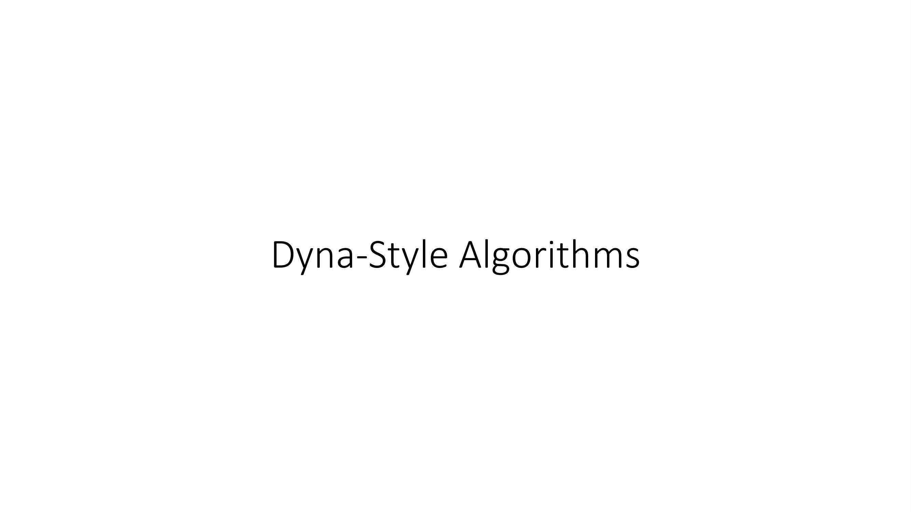
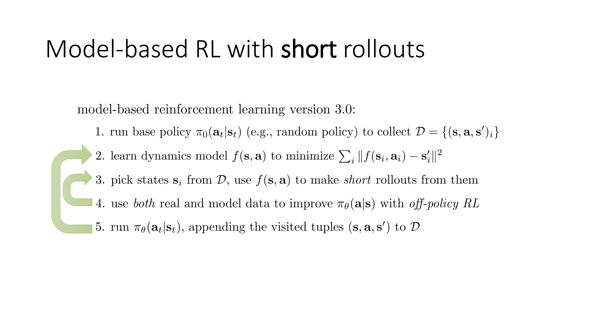
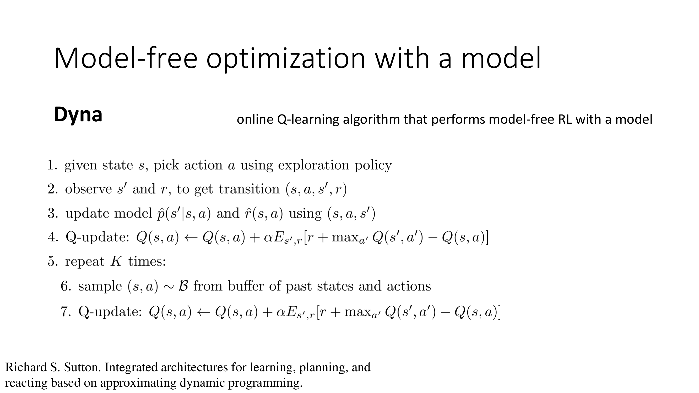
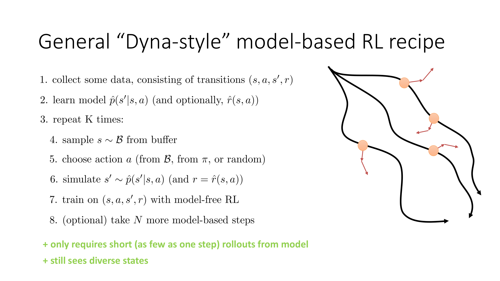
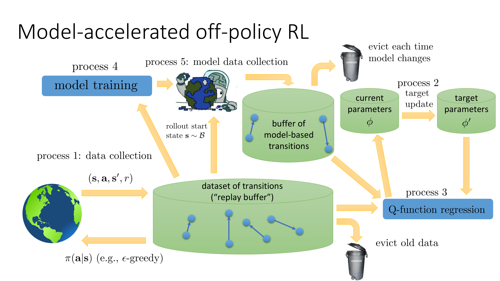
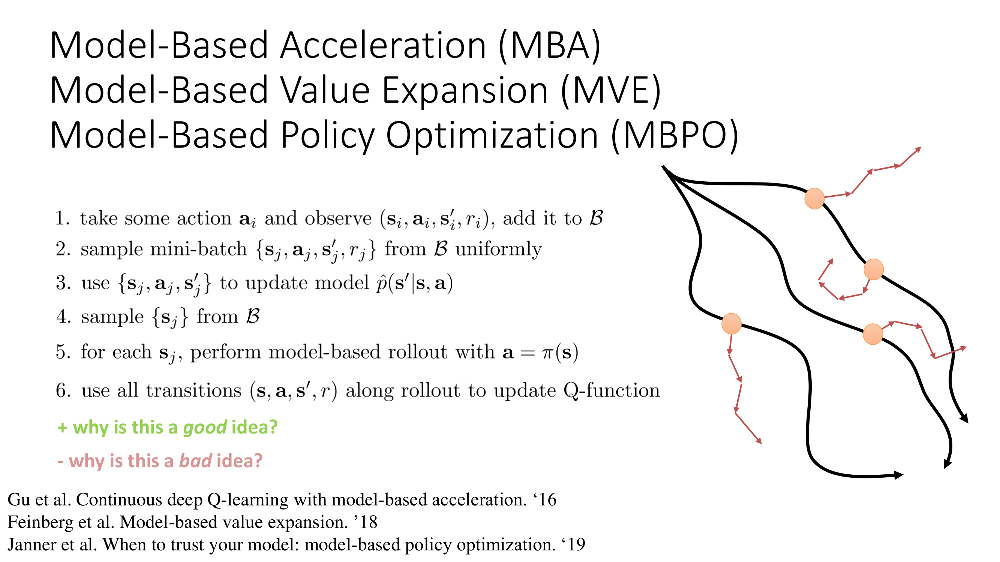

All right, let's talk about some practical model-based RL algorithms that we can build based on the design that I described before.

So, again, to reiterate, this is the design that we're talking about, which I dubbed model-based RL version 3.0.

But there are, of course, a number of design decisions we have to make to turn this method into a reality.

For the discussion in this portion of the lecture, the particular off-policy RL method that we will use for step four will be based on Q-learning.

Although I want to emphasize that everything that I'm going to discuss could just as well be implemented with Q-function actor-critic methods.

And it works in basically exactly the same way.

And basically the way to see this is to recall how in the discussion of Q-learning, we talked about how, for example, training an actor as a learn maximizer basically looks more or less exactly like Q-learning.

And that's the logic that we're going to follow here.

So, the classic algorithm.

And, as far as I know, the method that first proposed this basic concept was something called Dyna, described by Richard Sutton in the, I believe, in the 1990s.

Dyna was a particular version of this kind of recipe, instantiated for online Q-learning, that used very short model-based rollouts.

In fact, it used model-based rollouts that are exactly one time step in length.

But even then, this provides significant benefit if you can learn a good model.

So, essentially, Dyna is online Q-learning that performs model-free RL with a model.

So, here's how Dyna works.

It's very much going to follow online Q-learning, but then with a little modification.

So, step one, in the current state, pick an action a using your exploration policy.

This is exactly the same as online Q-learning.

Step two, observe the resulting next state s' and the reward to get a transition tuple (s, a, s' r).

Now, here's where the new stuff starts coming in.

Use this transition tuple to update your model and your reward function.

Now, Dyna was proposed very much as an online method.

So, in classic Dyna, both the model and the reward function would be updated with one step.

Maybe one step of gradient descent if these are neural networks, or if it's a tabular model, maybe you would mix the old value in the table with some learning rate times the new value.

But one step of update on just that transition.

Then Dyna performs a classic Q-learning update.

So, this is a Q-learning update on the transition that you just observed.

But then here's the new thing.

At this point, Dyna is going to repeat this model-based procedure, K times, where K is a hyperparameter, where it'll sample some old state action from the buffer, basically from previous states and actions that you've seen.

And then it will re-simulate the next state for that state action using the learned model.

So, the expression here is exactly the same as the Q function updated before, except that s' and r, now are going to come from the learned model ^{p} and ^{r}.

So, this is the Dyna procedure.

Now, the Dyna procedure classically makes a few design choices, and those design choices don't have to be set in stone.

For example, Dyna uses the state and action from the buffer.

Now, a very reasonable alternative is to pick the action according to the latest policy, for example, the argmax policy for that Q function.

Dyna also makes only one step on the model, you could make multiple steps.

Now, the choices made in Dyna are a little bit optimized for highly stochastic systems.

If you have deterministic systems, of course, then if you run the same state and action through the model, you should get exactly the s' that you saw before.

But for stochastic systems, this actually makes a difference.

So, Dyna does make a few decisions that are maybe a little bit peculiar, and perhaps don't squeeze the maximum performance out of the model.

Although these decisions are good if you expect your model to be very vulnerable to distributional shift, because for one step and for the action, that was in the buffer, it actually avoids all distributional shift issues.

So, in some statistical sense, this is actually a very safe algorithm.

However, we can derive a generalized version of Dyna, and that's a lot closer to what people actually use.

This is not actually the original Dyna method proposed by Sutton, but we can call it kind of Dyna-style in that it follows a similar philosophy.

So, here's kind of the generalized version.

Collect some data consisting of transitions, and maybe this is just one time step, or maybe you're rolling out many trajectories.

That's a choice that you can make.

Learn your model, and optionally your reward model.

Sometimes the reward model is known, but sometimes you have to learn it.

And maybe you learn this for many gradient steps, or maybe you just update it for one gradient step.

That's kind of up to you.

And then, do a bunch of model-based learning, where every step of model-based learning involves sampling some states that you saw in your buffer, choosing some actions in those states, and again, you can make a choice as to whether that action is chosen from the buffer as well, from your latest policy, or even with some exploration strategy, or even entirely at random.

And then simulate the next state from your model, and if you don't know the reward, then simulate the reward from your reward model, and potentially do this for multiple steps.

And then you can use this to train your model-free RL algorithm, your Q-learning algorithm, using simulated data.

So this is kind of a generalization of the Dyna procedure from before.

It only requires short rollouts from the model, maybe as few as one step, and it still visits diverse states, because you're sampling the starting states for those rollouts directly from your buffer.

So there's an entire class of modern model-based RL algorithms that are all essentially variants on this basic recipe.

Now, when I describe this recipe in a kind of textual form like this, it might be a little hard to understand what all the moving parts are, so what I want to do on the next slide is actually present a more diagrammatic view of this method.

So let's think back to the diagram of deep Q-learning that we discussed a few lectures ago as a collection of parallel processes.

So if you recall, we talked about how there is a process that collects data from the environment and pushes it into the buffer.

There's a process that evicts old data from the buffer that's gotten too old.

There's a process that updates the target network parameters using the latest network parameters.

And of course, there's the process that performs Q-function regression by loading batches from the replay buffer, making updates on them using the target network, and updating the current parameters.

So this is kind of the schematic diagram of Q-learning that we saw in a previous lecture.

And now what we can do is we can take this schematic diagram and we can add model-based acceleration into this.

So this is basically exactly the process on the previous slide.

I'm just going to visualize it graphically.

So we're going to have another process that performs model training.

And that process is going to load transitions from the buffer of real transitions.

So you have one of these real transitions to train your model.

You don't want to train the model on its own synthetic data because that would be very circular.

Then there's a process that collects data using the model.

So this process is going to sample a state from your buffer.

It's going to take your trained model.

And it's going to run a short model-based rollout from that state.

And there's a choice you can make here.

You can either use your latest policy or the policy that collected the data or something else.

The most common choice would be to use your latest policy.

So you would actually use your current parameters ϕ and do the argmax or use the corresponding actor.

And then you would take these transitions you're collecting from the model and you would push them into the buffer of model-based transitions.

And now when you're doing your Q function regression, you would sample some data from your model-based buffer and some data from your real buffer.

You want to keep them separate because you want to be able to modulate how much real data versus how much synthetic data you use.

And typically you would use a lot more synthetic data because the synthetic data is much more plentiful.

So the figure is actually a little bit misleading.

It looks like the real buffer is bigger, but typically the model-based buffer is actually much larger.

You would also have a different eviction strategy for the model-based buffer because typically if you are mostly constrained by samples rather than compute, you would actually want to evict your model-based buffer each time you change your model.

So if you improve your model, you might as well flush your model-based buffer and collect entirely new data.

It costs you compute, but it doesn't cost you any real-world sample collection.

Although if you are concerned about compute costs, and these kinds of methods do tend to be very computationally expensive, you could also reuse some of the model-based data even if your model is changing.

But typically you would have a slightly different eviction strategy for these algorithms.

So it looks like there's a lot going on here, but really this additional model-based process that we've added is just a way to populate an additional buffer that we're going to be using to load up our batches for the Q-learning process.

So hopefully this diagram makes it a little clearer how these methods really work under the hood, kind of at a systems level.

Now there have been a variety of algorithms that have actually been proposed in the literature that make use of this idea.

These are just a few examples.

They differ a little bit in some of the design decisions, especially in regard to which data is actually used for the Q-learning process and how it's used.

So the procedure I described here, this is probably closest to model-based policy optimization or MBPO, but you could also imagine algorithms that use the model-based rollouts to get better target value estimates.

But don't use them for training the Q function itself.

And that's what, for example, model-based value expansion does.

So there are a few design choices to make here.

I won't go into great detail about what exactly each of those design decisions are.

If you want to learn more about them, you can read the three papers that I have mentioned at the bottom.

But at a high level, they all have this basic recipe.

Take some action and observe a transition, add it to your buffer, sample a minibatch from your buffer uniformly, use that to update your model, sample some states from the buffer.

For each of those states, perform a model-based rollout with actions coming from your policy, and those are those branched rollouts.

And then use all the transitions along the rollout to update your Q function, perhaps in combination with a little bit of real-world transitions.

Okay, so why is this a good idea?

Well, generally the benefit of these kinds of methods is that they do tend to be more sample efficient, because they're using their samples to train this model, which is then being used to amplify the data set.

So it's being used to construct even more data than what you collected in the real MDP.

And that additional data is then included in the Q-learning process, and if the model is good, then it will make Q-learning go better.

Why might this be a bad idea?

Well, there are a number of additional sources of bias that this kind of method incurs.

Of course, the most obvious one is your model might not be correct.

So if your model is not correct, then when you perform those model-based rollouts, then your policy will optimize the wrong thing.

We can mitigate these issues by using some of the ideas that we discussed for model-based RL before.

So for example, if you use ensembles of models, the additional stochasticity can help average out errors and reduce exploitation.

There's another reason why this could be a bad idea, which is that when we make these short rollouts starting from buffer states, well, an off-policy algorithm can in principle handle the fact that it has the wrong state distribution, but in the end, you still need to visit states where you're going to need your Q function to be correct.

So if you've never seen some state before, and you're going to enter that state when you actually run in the real world, well, then you're going to be in a lot of trouble, potentially, if that state is very different from anything you trained on.

And the state distribution that you end up training on when you use these kinds of methods is kind of weird, right?

As I mentioned before, the states that you see along these short rollouts originating from buffer states might come from neither the state distribution of the policy that collected the data, nor the latest policy you're using.

It's kind of a mix of the two.

And, you know, oftentimes it actually works out okay, but in principle, it can get you a state distribution that is very strange and very far from what you want.

In practice, what that usually means is that you can't go too long without collecting more data.

So you do need to refresh the buffer by collecting more real-world data so that the states that you sample in step 4 are not too far away from the states that you would actually see if you were to run in the real world.

And, of course, the model bias issues, that come from having the wrong model, can cause these methods to be a little bit problematic.

In practice, the trade-off that we tend to get with these kinds of model-based approaches is that they tend to learn significantly faster because they use the model-based acceleration, but they will sometimes plateau to a lower level of performance because the additional model bias basically puts a ceiling on how tightly they can fit to the real-world dynamics.

Although with shorter rollouts and with careful design decisions, this gap has been, to a large extent, limited in many practical benchmark tasks.