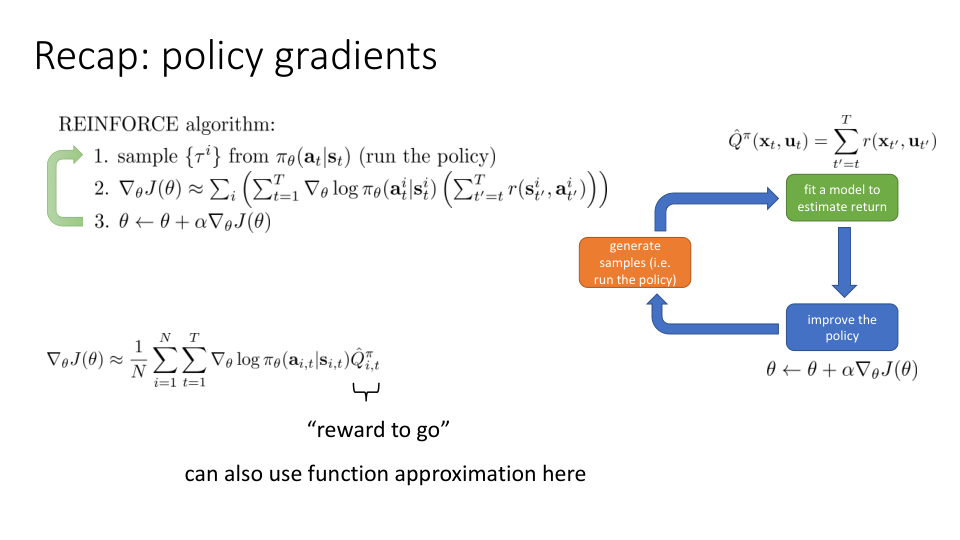
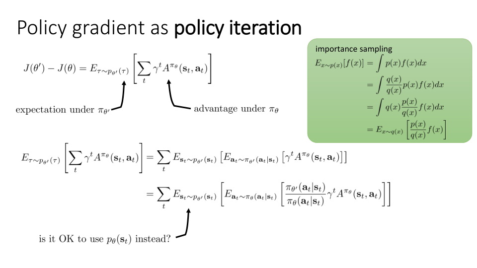

All right.

So today's lecture is going to be on advanced policy gradient algorithms.

And this is probably going to be one of the more technically nuanced lectures in the course.

So if this material goes by fast, if it's a little difficult to follow, please make sure to ask questions in the comments.

And don't be concerned if you have to go through it a couple of times to really get the full gist of it.

So the goal in today's lecture is going to be to combine some of the policy gradient ideas that we discussed before with some more recent concepts that we cover in the course, like policy iteration, to provide a new perspective on policy gradient methods and a little bit of analysis about when and why we would expect policy gradients to work.

Now, this lecture is primarily about policy gradients.

But the insights that I think we get from this type of analysis can also be used for things like Actor-Critic algorithms and more generally, to gain a deeper understanding of RL methods.

So if you have an interest in reinforcement learning theory, in understanding how and why to design algorithms in a certain way, and if you just want to get more in-depth knowledge about policy gradients, this is the lecture for you.

All right, so let's just recap the policy gradient material that we had before.

So initially, we covered the basic REINFORCE algorithm, where the procedure is that we sample some trajectories from our current policy, our current suboptimal policy.

Then for every one of those trajectories and every time step along each of those trajectories, we calculate the reward to go and then multiply the ∇log π's by the reward to go to get an estimate of the gradient.

And then we perform gradient ascent.

And then we saw, for instance, in the Actor-Critic lecture that this reward to go could be computed in various ways, using the Monte Carlo estimator as shown here or with more sophisticated methods that involve actually learning value function estimators.

So of course, like all of the algorithms that we cover, policy gradients follow the same basic recipe.

They generate samples in the orange box, fit some estimate to the reward to go, either with a learned value function or just with Monte Carlo estimates in the green box, and then perform gradient ascent in the blue box.

So this is kind of the most generic form of the policy gradient, where you have many choices about what goes in for ^{Q}.

So that's our reward to go.

So that's just a recap of what we covered before.

The question we're going to ask now is, why is it that policy gradient actually works?

Why is it that we can count on policy gradient to improve our policy?

Now, the obvious answer is that, well, you just calculated a gradient, and then you're doing gradient ascent.

So if gradient ascent works, then you can get a policy gradient should work, too.

But there's a bit more to it.

And if we do a little bit of analysis, we can actually get some idea of how and why we should expect the policy gradient procedure to work.

So one of the ways that we can think of policy gradient more conceptually, so there was this kind of REINFORCE method on the previous slide, which is a particular instance of policy gradient.

But conceptually, we can think of a more general way of looking at policy gradient, where we have one step, which is to estimate the approximate advantage for state action tuples for our current policy π.

And there are many ways to perform that estimate, using Monte Carlo returns or using learned value functions.

And then use this advantage estimate, ^{A}, to somehow improve the policy and get a new and improved policy π'.

And then repeat this process.

Now, this way of looking at policy gradient is basically equivalent to what I had to do in the previous slide.

So on the previous slide, we were estimating ^{A} by generating samples and summing up the rewards to go.

And then we were using ^{A} to improve the policy by calculating the policy gradient and doing a step of gradient ascent.

But it's important to recognize that what we were really doing is, in some sense, alternating these two steps, alternating the estimation of ^{A} and using the ^{A} estimate to improve the policy.

And when I write it out in this way, then it perhaps becomes a little bit more apparent.

That policy gradients are themselves very related to another algorithm that we learned about when we discussed value-based methods last week.

Take a moment to think back to the discussion from last week and what kinds of algorithms we covered.

What algorithm do you remember that had this type of structure, where we alternate between estimating the value of the current policy and then using that estimated value to improve that policy?

So that was basically the idea behind the policy iteration algorithm.

And we covered the policy iteration algorithm when we discussed value-based methods, primarily as a way to set the stage for what will come next, which was Q-learning.

But if we think back to policy iteration, we might recognize that policy gradients and policy iteration actually look very similar.

One of the main differences is that in policy iteration, when we calculated the new policy π', we use this argmax rule.

Remember that we would always pick the policy π' that assigns a probability of 1 to the action that is the argmax of the current advantage.

In some sense, policy gradients makes a much gentler update.

It doesn't immediately jump to the argmax, but it improves a little bit in the direction where the advantages are large.

Right?

Because if you look at the policy gradient expression at the top of the slide, we take ∇log π times ^{A}, which means that actions with a large ^{A} will get larger probabilities, and actions with a lower ^{A} will get lower probabilities.

So you could almost think of policy gradients as a kind of softened version of the policy iteration procedure we discussed before, where the policy iteration procedure from last week would simply immediately assign a probability of 1 to the highest advantage action, whereas policy gradients changes the policy parameters to move towards parameters that give higher probabilities to the argmax and lower probabilities to actions with worse advantages, but it doesn't immediately jump all the way to 1 and 0.

And that might be desirable if you think that your advantage estimator is not perfect.

If your advantage estimator is not perfect, perhaps what you would like to do is just slightly change your policy in the direction suggested by your advantage estimator, and then collect some more transitions, some more samples, and improve your advantage estimator.

So, in a sense, what we're going to discuss today is how to formalize this notion and explain why we should expect this kind of softened policy iteration procedure, which is policy gradients, to work well.

Okay, so let's try to reinterpret the policy gradient as policy iteration.

To get started on this, I'm going to show you a little calculation.

I'm going to show you how we can write this expression, the difference between the RL objective for some new parameter θ' minus the objective for some old parameter, as an expression that describes the expected advantage under the new policy where the advantage is taken from the old policy.

So, J(θ) here represents the reinforcement learning objective, which is the expected value under the trajectory distribution induced by a parameter, vector θ, of the total reward under that distribution.

And we'll just go with discount rewards for now, just to keep everything complete.

And this is the version where the discount starts from step one.

I know that's not the version that we actually use in practice, but this will make the calculations much more accessible.

And the claim that I'm going to try to show is that the difference between J(θ') and J(θ) is the expected value under the trajectory distribution of the previous...

sorry, under the trajectory distribution of the new policy of the advantage of the previous policy.

Okay, let's unpack this statement a little bit to try to get some intuition for why we even want to care about this.

So, J(θ') minus J(θ) represents the improvement in the RL objective that we get from going from some old parameter θ to some new parameter θ'.

So you could think of this as, maybe we're doing policy iteration, and θ' represents the parameters of the new improved policy, and θ represents the parameters of the old policy.

So, if we can make J(θ') minus J(θ) large with respect to θ', then we're improving the policy a lot.

Now, those of you that are paying close attention might realize that there's something a little strange with that statement, because if we're maximizing J(θ') minus J(θ) with respect to θ', the J(θ) is actually irrelevant.

And that's absolutely true.

So maximizing J(θ') with respect to θ' is exactly the same as maximizing J(θ') minus J(θ) with respect to θ'.

So, of course, the real goal of this derivation is to show that if we maximize the right-hand side of this equation, the expectation under π_{θ'} of the advantage of π_θ, then we're actually maximizing J(θ') minus J(θ), which means that we're actually maximizing J(θ'), which is actually what we want.

Okay, so the left-hand side is the improvement in the return of the policy in going from θ to θ', which is what we'll want to optimize with respect to θ'.

The right-hand side of this equation is expressing the expected value under the trajectory distribution induced by the new policy, the one that you're optimizing, of the advantage of the old policy.

And why do we care about this quantity?

Well, because that's essentially what policy iteration does.

Policy iteration computes the advantage of the old policy, A^{π_θ}, and then uses that advantage to find a new improved policy, π_{θ'}.

So if we can show that maximizing the expected value of the advantage of the old policy with respect to a new policy in fact actually optimizes the improvement in the RL objective, then we will have proven that using the advantage of the old policy and maximizing it under the new policy is a correct way to optimize your new policy.

So that's why we would like to show this claim.

Okay, take a moment to think about this.

Make sure that it makes sense to you why this claim is important, why we want to show this.

If it's not clear why this is an important claim to prove, please write a question about it in the comments.

Okay.

So let's get started with our proof.

So our goal is to prove this claim.

And to start on the path there, I'm going to substitute in the equations for the RL objectives.

So remember that one way that we can express the RL objective is as the expected value of the value function under the initial state distribution.

Because the value function captures the expected reward that π_θ would get if it starts in some state s_0.

So if we averaged over all the s_0, then we'll get the RL objective.

And the reason that I want to write it this way is because now, p(s_0) doesn't depend on θ.

So everything that depends on θ is inside the expectation.

The distribution with respect to which the expectation is taken does not depend on θ.

So what that means is I can change the distribution under which the expectation is taken to be any distribution whose marginal over the initial state is p(s_0).

And this includes p_θ(τ), p_{θ'}(τ), and p_{any θ}(τ).

Basically, the trajectory distribution for any policy must have the same initial state marginal.

So what I can do, going from the first line to the second line, is I can replace p(s_0) with any trajectory distribution that has the same initial state marginal.

And the one that I'm going to pick is p_{θ'}(τ).

Why am I putting in p_{θ'}(τ)?

Well, because my goal ultimately is to turn this into an expectation under p_{θ'}(τ).

That's the right-hand side of our claim.

And I can put in p_{θ'}(τ) here because it has the same initial state marginal and the quantity inside the expectation only depends on s_0.

So in a sense, that value doesn't change if I take the expectation with respect to different policies.

And now, what I'm going to do is I'm going to use a little telescoping sums trick.

So I'm going to replace V^{π_θ}(s_0) with this funny quantity.

So let's look at this quantity.

This is a difference of two sums.

The first sum is a sum from 0 to infinity, and the second sum is a sum from 1 to infinity.

And what I'm summing in both cases is γ^t times V^{π_θ} evaluated at s_t.

So I'm summing the same thing in both cases, just that one sum runs from 0 to infinity and the other runs from 1 to infinity.

So that means when I take the difference of these two sums, all the elements in the first sum from 1 to infinity get cancelled out by the second sum.

So that means that the difference of these two infinite sums is just V^{π_θ} evaluated at s_0.

Okay, so take a moment to think about this.

Make sure that it's clear to you why V^{π_θ} at s_0 is equal to the difference between these two infinite sums.

Okay, so let's proceed.

So next what I'm going to do is I'm going to rearrange the term in these sums a little bit.

So what I would like to do is I would like to write this sum essentially as a bunch of terms that look a little bit like advantages.

So I'm going to take all of the terms that are getting subtracted off on the right hand side.

So first notice that the sign is switched.

So I switched the minus to a plus.

So when I switch the minus to a plus, then that becomes the sum from 1 to infinity minus the sum from 0 to infinity.

And then i'm going to group the terms so for every one of those steps step 1 step 2 step 3 step 4 the term from the second sum, the one from 1 to infinity, has an extra factor of γ.

The term from the first sum lacks that factor.

And the term from the second sum is evaluated at time step t plus 1.

The term from the first sum is evaluated at time step t.

So if I switch the sign, notice that it's plus expectation under p_{θ'}.

Now that means that the terms inside the parentheses now become a sum from 1 to infinity minus a sum from 0 to infinity.

And then I'm going to pair off these terms.

So for the first term in the first sum, that's evaluating s_1.

For the first term in the second sum, that's evaluating s_0.

And they're off by one factor of γ.

So the first term becomes γ V(s_1) minus V(s_0).

The second term becomes γ^2 V(s_2) minus γ V(s_0).

And I'll take the γ^t term out so that I get an expression that looks like this.

So it's just a little bit of algebra and rearrangement.

But if this rearrangement is unclear to you, please take a moment to think about it and write about it in the comments.

Okay.

And what I'm going to do next is I'm going to substitute in the definition for J(θ').

And this definition is taken from the thing in the top right corner of the slide.

So all I've done on this slide is I've simply replaced J(θ') with the definition of J(θ').

So now at this point, if you look at these two equations, it might be apparent to you what I'm about to do, right?

I have two expectations, both under p_{θ'}(τ), both from zero to infinity, both have a γ^t in front of them.

And one of them has an r, and the other one has γ V(s_{t+1}) - V(s_t).

So I can group these two expectations together.

I can distribute the expectation out, and I get a sum from zero to infinity, γ^t, and then a quantity inside the parentheses, which is exactly the advantage function.

And crucially, because the value function here is the value for π_θ, the advantage is the advantage for π_θ as well.

So that means that this is equal to the expected value under p_{θ'}(τ) of the sum from zero to infinity of γ^t of the advantage of π_θ(s_t), a_t.

So this proves the claim that we want to prove.

And just to make sure everyone is on the same page, concretely what this proves is that if we maximize the expected value of the advantage of an old policy with respect to an expectation for the new policy, then we will optimize J(θ').

We'll actually optimize the reinforcement learning objective.

So essentially this proof shows that policy iteration does the right thing.

Okay.

So what does this all have to do with policy gradients?

Well, so what we've shown is that the RL objective, maximizing the RL objective is the same as maximizing this equation, where the advantage is taken under π_θ and the expectation is taken under π_{θ'}.

So this is our equation.

And this equation can be written out as a sum over all of our time steps of the expectation under the state-action marginal, of the advantage of θ'.

And the state-action marginal itself can be written as an expectation with respect to states distributed according to π_{θ'} of s_t and actions distributed according to π_{θ'}(a_t|s_t).

Now at this point, if we wanted to actually write down a policy gradient procedure for optimizing this objective, we could recall the importance sampling derivation that we had before in the policy gradient lecture.

And write the inner expectation as an expectation under π_θ, under our old policy, but with the addition of these importance weights.

And now we're getting to something that's very close to the policy gradient expressions that we had before.

Because remember, we could get policy gradient just by differentiating an equation very similar to this with respect to θ' at the value θ equals θ'.

The only difference is that our states are still distributed according to θ', not according to p_θ.

See, we have access to p_θ.

We can sample from p_θ.

We can't sample from p_{θ'} because we don't yet know what θ' will be.

So it's a big problem here that the expectation over states is with respect to θ' and not θ.

If we could just use θ instead of θ', then we would recover the policy gradient expression that we had before.

So that's the problem that we're left with.

Essentially, we need to somehow ignore the fact that we need to use state sampling from p_{θ'}(s_t) and instead get away with using state sampling from p_θ(s_t).

So this is our problem.

If we could only get rid of that θ, then the only remaining θ' would be in the importance weight.

And then if we differentiate it, we would recover the policy gradient and show that policy gradient and policy iteration are in fact equivalent.

So why do we want this to be true?

Well, we want this to be true because if we take this quantity and we call it bar{A}(θ'), and we can show that J(θ') minus J(θ) is approximately equal to bar{A}(θ'), that means that we can find θ' by taking the argmax of bar{A}.

And that means that we can use ^{A} to get an improved policy π'.

So is this true, and when is this true?

The claim, which I'm going to show in the next part of this lecture, is that p_θ(s_t) is close to p_{θ'}(s_t) when π_θ is close to π_{θ'}.

Now that might seem like a kind of obvious statement, but it's actually not quite obvious to prove this statement in a non-vacuous way.