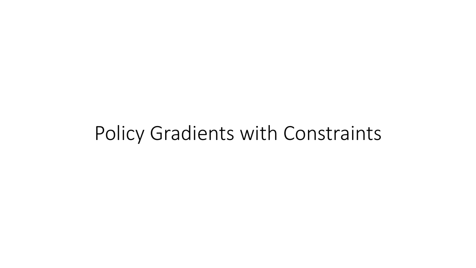
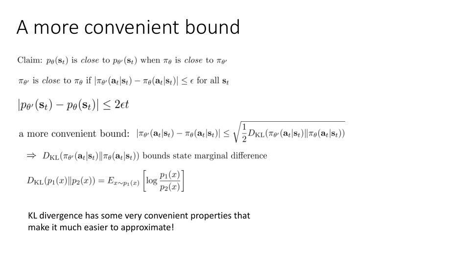
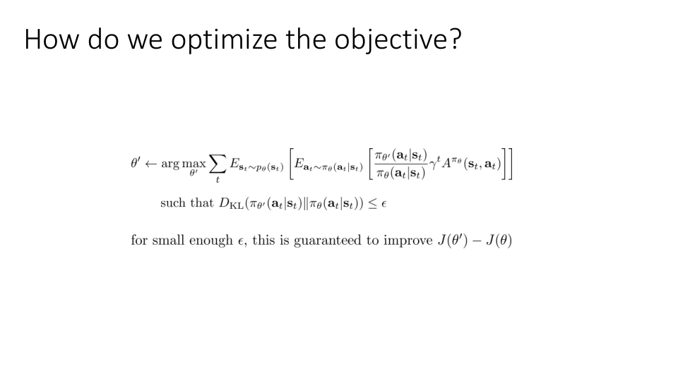
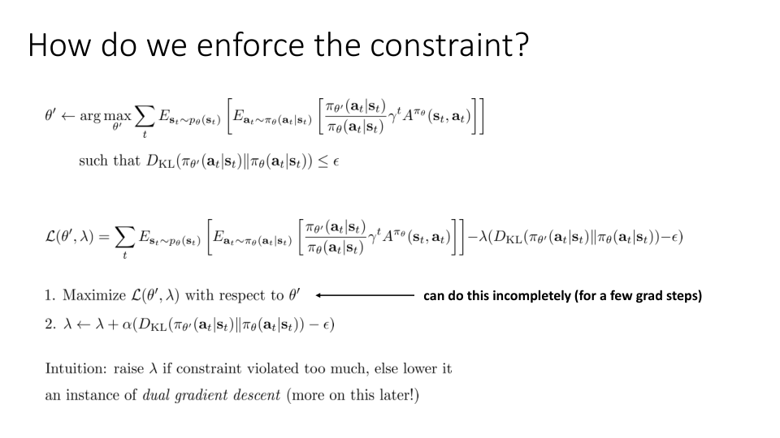

Alright, let's talk about how we can actually implement policy gradients with constraints to instantiate the algorithm that we derived in the previous section.

So the claim that we had was that p_θ(s_t) is close to p_{θ'}(s_t) when π_θ is close to π_{θ'} and close here was defined in terms of total variation divergence.

Now it would help us to get a slightly more convenient bound because for some policy classes imposing total variation divergence constraints is actually pretty difficult.

So a more convenient bound that we could derive, you can use the fact that total variation divergence is actually related to KL divergence via an inequality.

So if you bound the KL divergence between π_{θ'} and π_θ, that also bounds the total variation divergence as per this equation.

So that means that the KL divergence between π_{θ'} and π_θ bounds the state marginal difference.

But for those of you that aren't familiar with the KL divergence, it's a basically the most widely used type of divergence measure between distributions and it can be very convenient because it has tractable expressions expressed as basically expected values of log probabilities and many continuous value distributions have tractable closed form solutions for the KL divergence.

So this makes the KL divergence very convenient to use.

So the expression for a KL divergence is the expected value of the log of the ratio between the distributions and one way to get some intuition for why this class of divergences is a little bit more manageable is that the total variation divergence is expressed in terms of absolute value which means that it's in general not differentiable everywhere whereas the KL divergence is differentiable so long as the two distributions have the same support.

So the KL divergence has some very convenient properties that make it much easier to approximate and much easier to use in an actual reinforcement learning algorithm as we'll see in the remainder of this lecture.

So in practice if we actually want to have a constrained policy gradient method we're going to express our constraint as a KL divergence rather than as a total variation divergence but since the KL divergence bounds the total variation divergence this is a legitimate thing to do and it preserves our bound.

Okay so then the objective that we're going to want to optimize is our usual important sampled objective with the constraint that the KL divergence between π_{θ'} and π_θ is bounded by ϵ and if ϵ is small enough this is guaranteed to improve J(θ') minus J(θ) because the error term will be bounded.

So how can we enforce this constraint?

Well, there are a number of different methods to do this.

And you know one very simple one is to actually write out an objective in terms of the Lagrangian of this constrained optimization problem.

So the Lagrangian for those of you that don't remember your convex optimization is formed by simply taking the constraint, taking the left-hand side of the constraint minus the right-hand side and multiplying it by a Lagrange multiplier and we have one constraint and one Lagrange multiplier which I'm calling λ.

So if you want to solve a constrained optimization problem one of the things you can do is you can alternate between maximizing the Lagrangian with respect to the primal variables which are θ and then taking a step on the dual variables, a gradient descent step.

So the intuition is that you raise λ if the constraint is violated too much otherwise you lower it.

Right?

Because if the KL divergence is much larger than ϵ then you're going to add D_{KL} minus ϵ which is a positive number to λ.

So λ will get bigger if the constraint is much lower than ϵ you'll add a negative number and λ will get smaller.

So you essentially alternate between solving an unconstrained problem and adjusting your Lagrange multiplier to enforce the constraint more or less strictly depending on whether it's being violated or not.

This procedure is called dual gradient descent and we'll actually talk about dual gradient descent in much more detail in a subsequent lecture but for now you can sort of take my word for it that this procedure will asymptotically find the right Lagrange multiplier which means that it will actually solve your constrained optimization problem.

Now this is sort of the theoretically principled solution.

You could imagine an even more heuristic solution.

Maybe you could just select a value of λ manually and just treat that KL divergence as a kind of regularizer and intuitively that also makes a lot of sense.

You're basically penalizing your policy for deviating too much from the old policy.

And you can do this maximization incompletely for a few gradient steps because of course in practice running the optimization of convergence might be very expensive or impractical.

So this is a complete algorithm for doing constrained optimization with your policy.

You can calculate the gradient of the objective and you get something that looks basically like an important sample policy gradient and you can calculate the gradient of the KL divergence.

That's also very straightforward to do.

And you will get a derivative and you can use it to maximize this.

And this will allow you to have a reinforcement learning algorithm that actually enforces a constraint.

And there are a number of algorithms that use some variant on this idea including actually the original Guided Policy Search Method and PPO.

And these methods tend to work quite well.