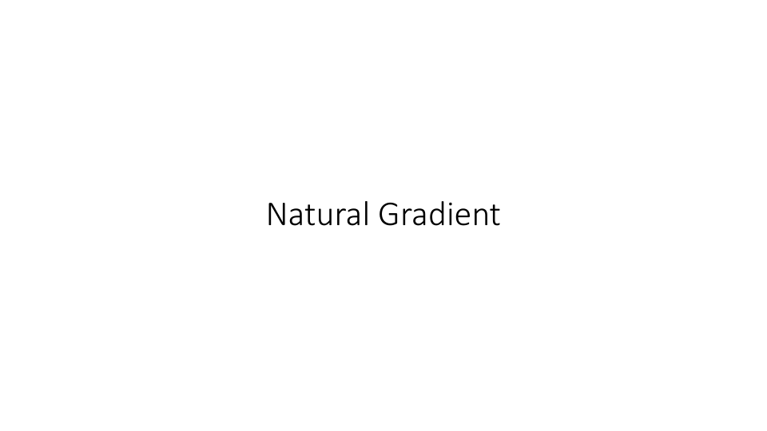
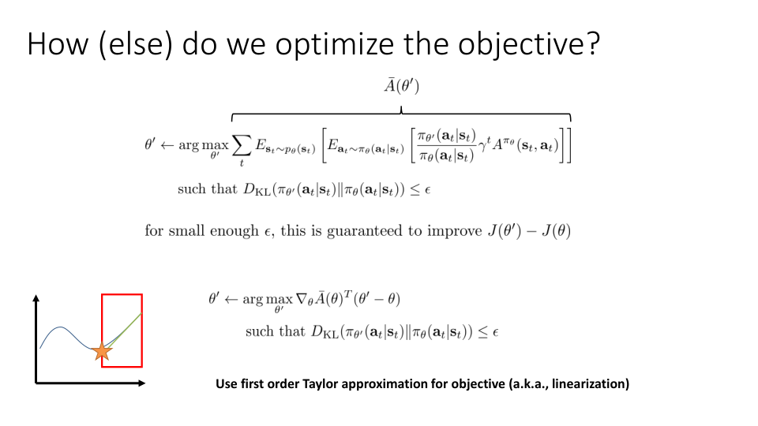
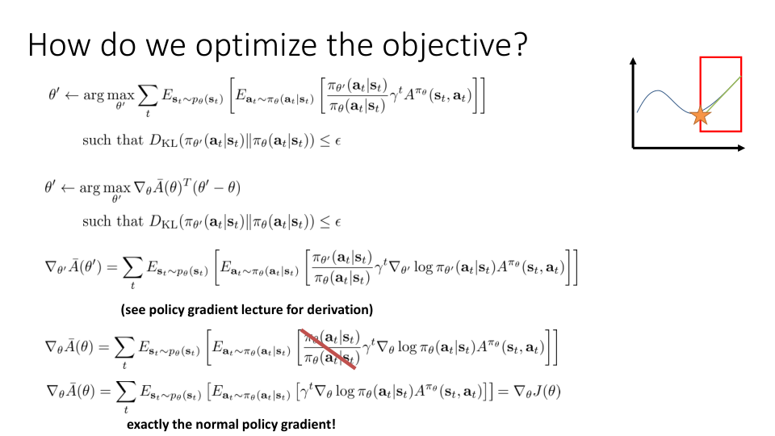
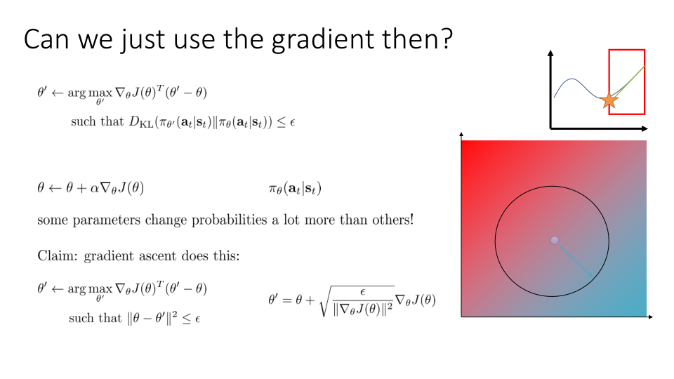
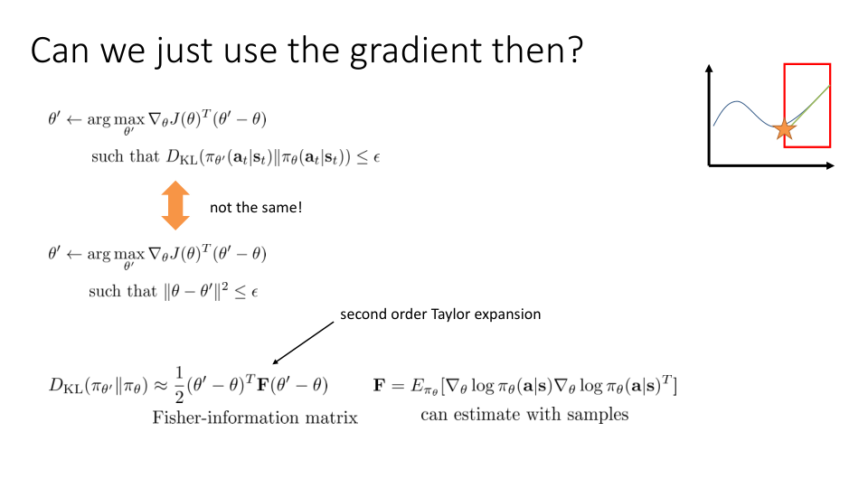
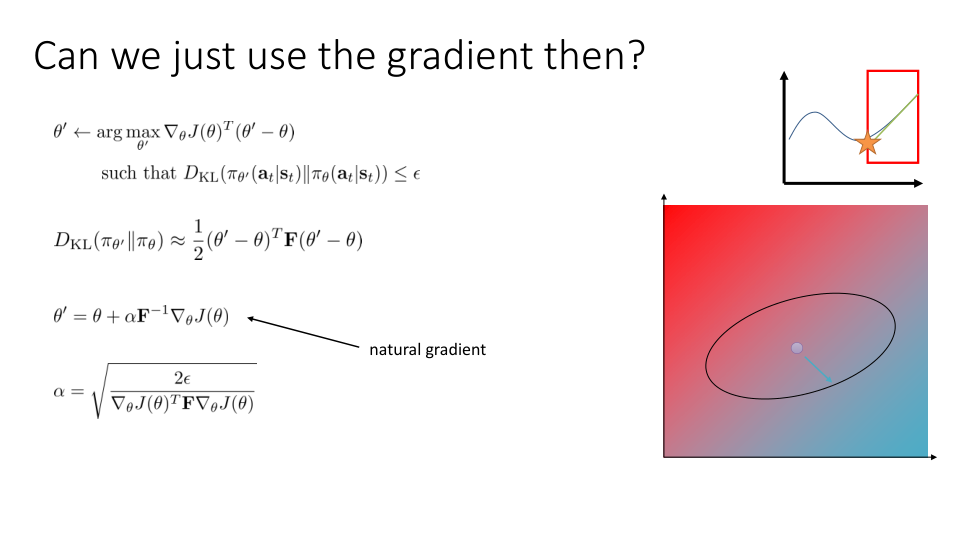
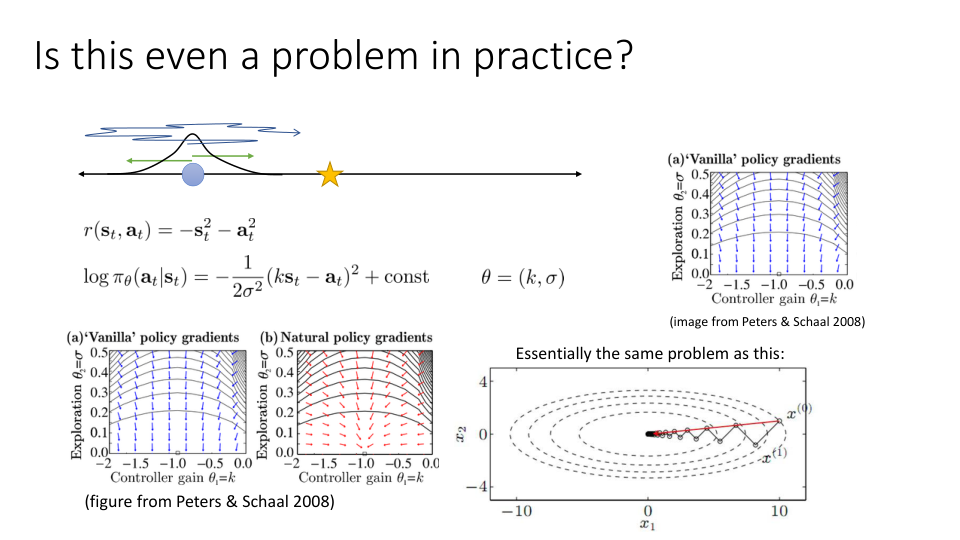
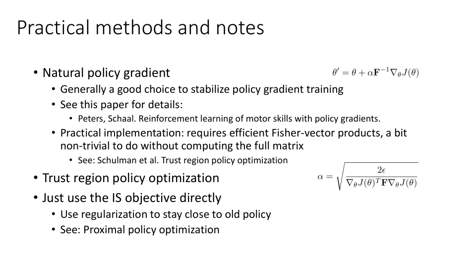
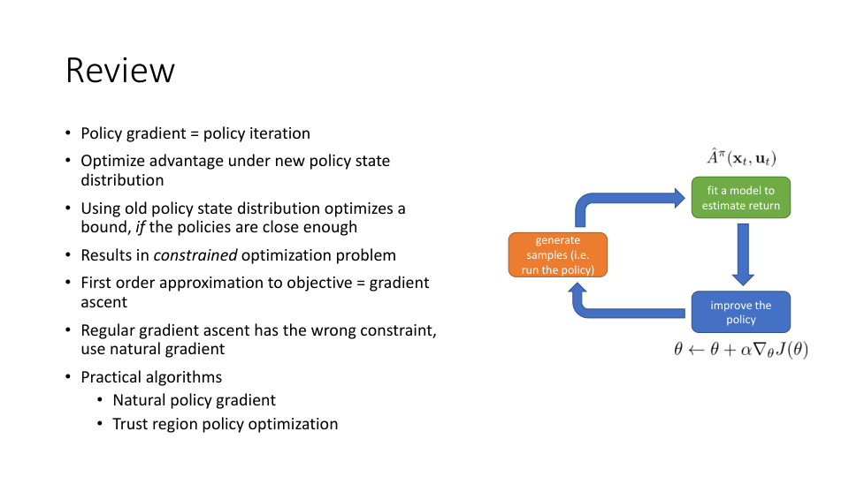

Alright, in the last portion of today's lecture we're going to go over another way to impose the constraint which is a little more approximate but leads to a pretty simple algorithmic framework called natural gradient.

Okay, so so far we discussed this optimization problem maximize the expected value under the old policy state distribution of the expected value under the old policies action distribution of the important sampled estimator subject to a constraint that the KL divergence between π_{θ'} and π_θ is bounded by ϵ and we saw how if you can enforce this for a small enough ϵ then this is guaranteed to improve J(θ') minus J(θ).

In the previous section we saw how we could impose this constraint by using something like a dual gradient descent method typical Lagrange multiplier and then essentially optimize the Lagrangian as a kind of penalized objective to find the new policy parameters.

Now we're going to talk about a more approximate way of doing this which at first will seem a little bit worse because we're going to make a lot of approximations but in fact is actually highly desirable because it allows us to recover a very simple method that doesn't require any additional penalties and simply applies a linear transformation to the standard policy gradient that we saw back in lecture 3.

Okay so as before I'm going to use bar{A}(θ') to denote this whole objective.

When we calculate the gradient of some objective and we use gradient ascent or gradient descent that can be interpreted as optimizing a first-order Taylor expansion of that objective.

This might seem like a slightly silly statement because a first-order Taylor expansion is just a gradient.

But when there's a constraint present it actually has some meaning.

So essentially if we want to optimize some complicated function like this blue curve here one way we could do it is we could pick a region compute a very simple approximation, a linear approximation to that function shown here with this green line and that's obtained by taking the gradient and then instead of optimizing the blue curve which is really complicated we optimize the green line which is very very simple.

Of course, if we don't impose any constraint the green line goes to positive and negative infinity so this only makes sense if we impose a constraint which is essentially the region within which we trust the degree to which the green line approximates the blue line, a trust region.

And that's what this red box represents.

So if you find the best value of the green line within the red box if the red box is chosen to be small enough you might hope that that point is also going to improve the blue curve which is what you really want.

So if we are minimizing then we would pick this point.

We'd pick the point on the edge of the red region, where the green function has the lowest value, which will hopefully also be a point where the blue function has a lower value.

And if we were maximizing it would go the other way.

So what this means is that if you approximate your complicated nonlinear function with a first-order Taylor expansion, essentially a linear function, you could optimize that linear function so long as you impose a trust region, so long as you limit your optimization to just the region where that linear approximation is a good approximation to the true nonlinear function.

So we could do that with our optimization problem and we could change it to take the argmax of ∇A transpose (θ' - θ) subject to this constraint and the constraint is what's imposing the trust region.

And now this is very very easy to do of course in terms of the objective because the objective is simply linear and θ' which is our optimization variable.

The constraint is still kind of complicated so that makes things a little more complex.

Okay so the basic intuition behind what I'm going to describe next is that we're going to approximate that constraint in some very tractable way which will actually give us a closed-form solution for θ' where we won't actually have to do any complicated nonlinear optimization procedure with multiple gradient steps but in fact a single step of policy gradient will actually take care of this entire constrained optimization problem.

And the intuition for why that's possible is because once our objective is linear optimization becomes easy.

So our objective turned into a first-order Taylor approximation.

By the way just as an aside why do we want to do all this?

Well the reason we want to do all this is because we're going to get a very very simple algorithm.

So we're going to introduce these additional steps of approximation but the payoff that we'll get is a simpler algorithm that still works quite well.

Okay so there's our new simplified constraint problem.

And one really appealing thing about simplifying it in this way is that our gradient ∇_θ A θ is going to essentially become exactly the normal policy gradient.

So here's the equation for ∇_{θ'} A θ' and since only the importance weight depends on θ'.

We just get the importance sampled policy gradient.

But if we evaluate it at the point θ' equals θ then the importance weights actually cancel out, because we get the same thing in the numerator and the denominator.

So here I just wrote it out for ∇_θ bar{A} θ and when they cancel out you're just left with the standard policy gradient equation which we saw in the previous lecture.

And this is very simple.

This is essentially exactly the policy gradient that we had back in REINFORCE, except that we have some choice of advantage estimator for A^{π_θ}.

And we can use anything we want there.

Okay.

So that's nice.

And that's just the thing that we're going to plug into our objective.

That's just the regular policy gradient.

Now, could we just use gradient ascent then?

If we're just calculating the policy gradient, our objective is ∇_θ J(θ) transpose θ'.

Does gradient ascent do something similar to this constraint optimization problem?

So gradient ascent, we'll just take θ and set it to be the old θ plus α times ∇_θ J(θ).

One problem with doing this is that as we change θ, the probabilities of the new policy, the π_θ(a|s), will change by different amounts.

Because some parameters, some entries in θ affect the probabilities more than others.

So in general, taking a step like this will usually not respect the KL divergence constraint, because you might have some very, very small change in some parameter, but that parameter might have a very, very large influence on the probabilities.

But what does gradient ascent do?

Well, my claim is that gradient ascent actually solves this constraint optimization problem, which is very similar to our original one.

So the difference is that our original constraint optimization problem had ∇J (θ' - θ) as its objective, but the constraint was the KL divergence between π_{θ'} and π_θ.

In gradient ascent, the constraint is the square Euclidean distance between θ' and θ.

So, the original problem asks for θ' to result in a policy whose distribution is close to the policy π_θ, gradient ascent instead produces parameters that are close to the parameters θ.

Geometrically you can think of it like this, that in gradient ascent we have our parameter space which here is represented by this 2D region, so there's two axes corresponding to two policy parameters.

When we linearize our objective, we can visualize our objective as this kind of gradient field, as a colored gradient over the space, so lower right is better values, upper left is worse values, and this constraint corresponds to a circle in this space.

So all the points that are ϵ away from the dot in the center all satisfy that constraint.

So because your objective is linear and your constraint is a circle, then the solution will always lie on the surface of that circle in the direction of the objective.

So in the direction of ∇ J(θ).

So that means that when you do gradient ascent, you will take a step in the direction ∇ J(θ), and the length of that step will be determined by ϵ.

In fact, the learning rate in gradient ascent can actually be obtained as the Lagrange multiplier for this constraint, and you can also derive a closed form equation for it.

So if you perform gradient ascent like this, where your learning rate is given by the square root of ϵ divided by the squared length of ∇ J.

You can actually prove that you will exactly satisfy that constraint.

And the way that you prove this is you take that equation for θ', substitute that into the constraint, the θs will cancel, and you'll be left with the square root of ϵ divided by ∇ J squared, and then that whole thing's squared.

So then the square root goes away, and you're left with ∇ J squared at the top, ∇ J squared at the bottom, those cancel out, and you're just left with ϵ, and ϵ is less than or equal to ϵ.

If this is unclear to you, then what I would encourage you to do is to take a piece of paper, take this equation that I wrote for θ', plug that into the constraint, and do the algebra, and you'll be able to show that the result is that ϵ is less than or equal to ϵ.

Okay, so where do we get to with all this?

The conclusion from all this is that gradient ascent does actually solve a constrained optimization problem, but it's the wrong constraint.

The constraint is in θ space instead of distribution space.

And because different entries in θ might affect the distribution to different degrees, in general a constraint in θ space will not enforce the constraint in KL divergence space because some parameters θ might change a tiny bit but produce very big changes in the corresponding distribution.

So intuitively the constraint shape is a circle for gradient ascent but we want it to be a kind of ellipse.

We want the ellipse to be squished along the highly sensitive direction so we want a tighter constraint in the direction of θ that results in big changes in probability and we want the ellipse to be elongated in the directions where large changes in θ result in small changes in probability.

So that's what we're going to try to get next.

So what we're going to do, we're going to recognize that these are not the same and we're going to construct a tractable approximation to the KL divergence constraint which is the one that we actually want.

So the way that we're going to do this is by doing the same thing to the constraint that we did to the objective.

So for the objective we calculated a Taylor expansion, specifically a first order Taylor expansion.

For the constraint we're actually going to use a second order Taylor expansion around the point θ' equals θ.

We don't want to use a first order Taylor expansion because the KL divergence has a derivative of zero at θ' equals θ.

It's actually flat but its second derivative is not zero.

The second order Taylor expansion is a quadratic form with some matrix F and it turns out that the matrix that goes in there is something called the Fisher information matrix.

The calculation for this is a bit involved but you basically start with a formula for the KL divergence and if you take the second derivative you can show that the correct thing to use for that matrix is the Fisher information matrix which is given by this equation.

So the Fisher information matrix is the expected value under π_θ of the outer product of the ∇log π.

And one very convenient thing about the Fisher information matrix is that you can approximate it using samples.

Because it's the expected value of some quantity you could simply use the same samples that you drew from π_θ to estimate your policy gradient to also estimate the Fisher information matrix.

Now if we're going to use this second order Taylor expansion as an approximation for our KL divergence constraint something that we can note is that gradient ascent actually also has a quadratic constraint.

(θ - θ') squared can also be interpreted as (θ' - θ) transpose times identity times (θ' - θ).

And now we have the same thing only instead of identity we have F.

So we can estimate our Fisher information matrix with samples and then we can plug that in as a quadratic constraint just using the matrix F instead of identity.

And visually you can think of it as turning that circle into some ellipse where the shape of the ellipse is determined by the matrix F.

The matrix F basically describes which directions in θ space around the point θ lead to large changes in probability and which ones lead to small changes in probability.

And you can actually show that if your constraint is quadratic like this and you write out the Lagrangian if you know the Lagrange multiplier then the solution will be given by this equation.

The reason for that of course is that the Lagrangian will have a linear term ∇ J transpose θ' and a quadratic term given by the quadratic KL divergence expansion and a second order polynomial function like this has a closed form solution which uses the inverse of the quadratic term times the linear term.

So this is the closed form solution when the constraint is given by one half (θ' - θ) transpose times F times (θ' - θ).

And furthermore if we want to enforce the constraint that this second order expansion be less than or equal to ϵ we can use the same general idea as we used in gradient descent and figure out the step size that satisfies that constraint.

And again you can check that the step size is correct by plugging in this equation for α then plugging in the resulting equation for θ' into our KL divergence approximation and then you will be able to show that you end up with the constraint being satisfied.

So this expression is called the natural gradient so you take the regular gradient and you multiply it by the inverse of the Fisher information matrix and you get the natural gradient.

Okay, so take a moment to look over the slide.

If something here is unclear, please make sure to write a question in the comments.

All right, now here what I want to do is I want to back up a little bit and just ask, well, is this even a problem in practice?

Like, it kind of seemed like regular gradient ascent, regular vanilla policy gradient, already enforces some kind of constraint.

Maybe that constraint is just good enough.

I mean, it does keep θ' close to θ.

Maybe not quite in the right way, but maybe that's a reasonable approximation.

Well, let's think back to that example that we had in the policy gradient lecture, where we had a one-dimensional state space and a one-dimensional action space, where you get to choose to go left or right.

Your reward was given by - s^2 - a^2, and you had two policy parameters, k and σ, where the probability of the actions is normally distributed, where the mean is k times s, and σ is the variance.

So here your parameters are k and σ.

In that setting, you're basically adding some Gaussian noise and walking left and right, in that setting we saw that the regular policy gradient actually looks very unfortunate.

The regular policy gradient does have to point in the right direction, it always does, but it's extremely ill-conditioned.

Essentially, as σ decreases, the gradient with respect to σ becomes much, much larger than the gradient with respect to k.

So even though the optimal solution is that k equals negative 1, you might never reach that solution because you'll be too busy decreasing σ.

Intuitively, the reason this is happening is that k and σ affect the probabilities to different degrees.

And because σ affects the probabilities so much more when it's small, then the corresponding gradient component is much larger.

And, simply, staying within a fixed ball in θ space, even in this very simple 2-dimensional space, is just not enough.

So it's essentially the same as a very ill-conditioned optimization problem.

The natural policy gradient largely resolves this issue.

So if you just multiply the gradient by F inverse, then that correctly accounts for the fact that σ affects the parameters a lot more, and actually prioritizes k large, it actually increases the gradient component with respect to k and gets you to point to work in the right direction.

So this really is a problem in practice, especially for continuous distributions like Gaussians.

So in practice natural gradient really does give you a much more well-conditioned gradient direction and it makes it a lot easier to adjust learning rates.

Alright, a few practical notes.

So natural policy gradient as classically described in the literature is an algorithm where you calculate the Fisher information matrix F approximately using samples and then manually select a step size α.

It's generally a good choice to stabilize policy gradient training and if you want to learn more about this, check out this paper by Peters and Schall called Reinforcement Learning of Motor Skills with Policy Gradients.

Practical implementations require computing this product between F inverse and ∇ J, which is a little bit non-trivial to do without computing full matrix.

But if you want to implement this in practice, check out this paper called Trust Region Policy Optimization.

There are a few tricks that are very useful.

So one trick is that you can actually solve for the step size α, which actually respects a particular value of ϵ.

So if instead of picking α you want to pick ϵ, here's the formula.

But even more importantly, one of the things you could do which makes this much more efficient to calculate is you can use the conjugate gradient method to calculate F inverse ∇ J and in the process of running conjugate gradient, you're actually going to get the step size α given by this equation automatically as a byproduct.

I'm not going to go into details about this and I would encourage you to check out the Trust Region Policy Optimization paper for details, but it's a fairly straightforward application of CG of conjugate gradient.

Now, of course, you could just use the importance sampled objective directly with something like dual gradient descent, or even a heuristic selection of the Lagrange multiplier, and that works fairly well.

So that can be interpreted as a kind of regularization to stay close to the old policy.

And that's what I covered in the previous section.

If you want to learn more about this, check out Proximal Policy Optimization.

Okay, so to review, we talked about how policy gradient can be interpreted as policy iteration.

How you can optimize the advantage of the old policy under the new policy state distribution, and that is exactly policy iteration.

But furthermore, if you use the old policy state distribution, then you're optimizing a bound if the policies are close enough.

And this results in a constraint optimization problem.

You can enforce this constraint explicitly, or you can impose the constraint approximately by doing a first-order approximation of the objective, which gives you gradient ascent, but regular gradient ascent has the wrong constraint, so you use natural gradient, which gives you an approximation to the KL divergence constraint.

So to summarize, regular policy gradient is a constraint procedure, but it has the wrong constraint.

Natural policy gradient replaces it with an approximation to the KL divergence, or you could actually optimize the original importance sampled objective for many gradient steps with an additional regularizer to stay close to the policy, the previous policy, multiplied by Lagrange multiplier.

Practical algorithms that use this, natural policy gradient, trust region policy optimization, and proximal policy optimization.