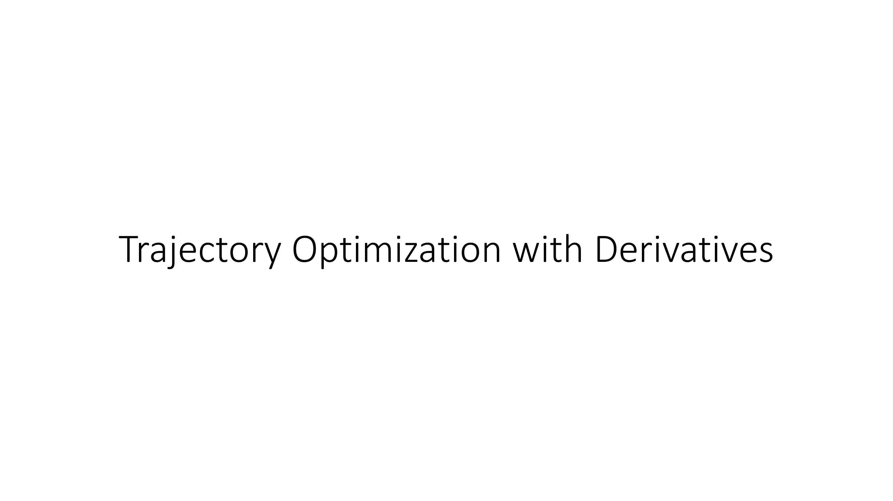

Okay, so far we've covered black box optimization methods for planning and Monte Carlo tree search, which is suitable primarily for kind of discrete actions and stochastic environments.

Next we're going to talk about trajectory optimization with derivatives.

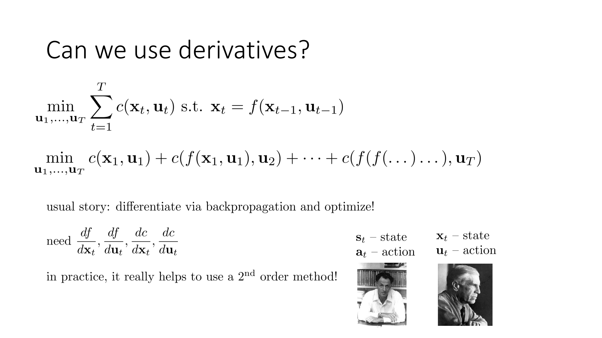

So far the methods we've discussed don't actually use derivatives of the dynamics, but in many cases in continuous environments we might actually know what the derivatives of the dynamics are.

And as a bit of notation I mentioned before that in reinforcement learning and dynamic programming we like to use s_t and a_t to denote the state of action, and we like to use r for rewards.

In optimal control it's much more common to use x_t and u_t for the state and action, and to use costs instead of rewards.

Since this part of the lecture deals with trajectory optimization and optimal control methods that are most commonly studied in the optimal control community I like to use xs and us.

Uh, just so that you know the notation is more similar to what you might find in a textbook don't be confused by this and uh it's probably a good mental exercise  to try to mentally substitute s's for x's and a's for u's and think about what these methods would look like if we're maximizing rewards instead of minimizing costs.

But the basic principles are exactly the same is just the difference of a sign and some letters.

Okay, so to think about how we can use derivatives for planning let's go back to our original constrained optimization problem.

So back when we defined the model-based planning problem, we said, well, we want to minimize your cost or maximize your reward with respect to a sequence of actions.

But just that isn't enough.

You have to also incorporate your dynamics into this, which you can think of as a constraint.

So you could say, well, I'm minimizing my sequence of actions, u_1 through u_T, subject to the constraint that x_t = f(x_{t-1}, u_{t-1}).

And when you have a constrained optimization problem with equality constraints, you could always substitute in the constrained value for the variable and get an unconstrained optimization.

So this constrained optimization problem I've written here is the same as minimizing c(x_1, u_1) + c(f(x_1, u_1), u_2) + c of f of f of x_1, u_1, u_2, u_3, and so on and so on and so on.

It's just a huge pain to write this out, but it is an unconstrained optimization problem.

So if we want to optimize this using derivatives, we could do kind of the obvious thing.

We could say, well, we have an unconstrained optimization problem.

We know how to solve those.

You just compute derivatives via backpropagation and optimize.

So specifically, the derivatives that you need in order to apply chain rule, which is what backpropagation is, to this minimization problem, you need to know df/dx_t, you need to know df/du_t, and you need to know dc/dx_t and dc/du_t.

So you need to know the derivatives of both the cost and the dynamics with respect to both of their inputs.

And in practice, just using first-order gradient descent on these kinds of objectives while possible tends to work very very poorly.

So in practice, it actually really helps to use a second-order method for solving these kinds of optimization problems.

And it turns out that if you want to use a second-order method, essentially Newton's method, there's a very convenient structure to this problem that provides us with a very efficient algorithm that does not require computing giant Hessian matrices.

You could use first-order gradient descent, and first-order gradient descent will typically produce quite poor solutions, because since you are, you know, for something like the last term in the sum, since you're multiplying many many many Jacobians together, unless all those Jacobians just happen to have eigenvalues close to 1, you will end up with either vanishing or exploding gradients.

But second-order methods can effectively compensate for this.

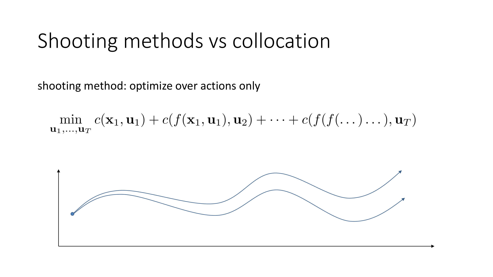

One aside that I want to mention before I get into describing how second-order methods for trajectory optimization work is the difference between shooting methods and collocation.

So if you study trajectory optimization, you might hear these terms being thrown around a fair bit.

A shooting method is a method that optimizes over actions.

So this equation describes a shooting method.

If you want to minimize the sum with respect to the actions, the reason this is called a shooting method is that you can think of the actions in the beginning of the trajectory as having a big effect on the result later on.

So it's like when you pick the first action, you're sort of shooting into the state space, and seeing where the result will land.

And this also describes why shooting methods can be so numerically unstable with first-order optimization algorithms.

Because while that last action has a minimal effect on your objective, the first action has an enormous effect.

Essentially the sensitivity of your objective to that first action is very large, and for nonlinear objectives, you know, most objectives will be at least quadratic, the sensitivity translates into very poor numerical condition, meaning that you have some very large eigenvalues in your Hessian and some very small eigenvalues.

And we have a mix of very small eigenvalues for those later actions and very large eigenvalues for those earlier actions.

The result is poor numerical stability, which first-order gradient descent methods struggle with.

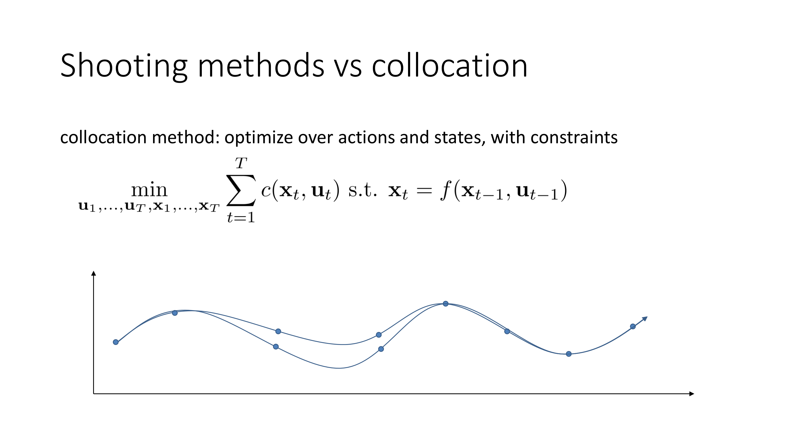

A collocation method is a method that optimizes over actions and states with additional constraints.

So in a collocation method, you would go back to the original constrained optimization problem, which is to minimize the sum of costs subject to the constraint that x_t = f(x_{t-1}, u_{t-1}), but now you would optimize over either both states and actions, or sometimes you would optimize over only states with the actions themselves determined by an equality constraint.

This is sometimes referred to as inverse dynamics.

But the simplest way to think about this is if you're optimizing over states and actions.

So in that case, you can imagine your optimization variables are all the dots along this trajectory, and you can move any of them however you please, so long as the constraints are obeyed.

Now for this kind of problem, the conditioning tends to be a lot better, because now you don't have actions having these enormous effects to the end of the trajectory, but it of course depends very much on how you choose to enforce that constraint.

So there are different methods of constraint enforcement, some of which act as relaxations, some of which are exact, some which act as linearization, and they all have different effects on the difficulty of this problem.

So I won't discuss collocation methods too much in today's lecture.

They tend to be a little bit more complex, but they do tend to be more numerically well conditioned, and typically would work better with first-order methods than the shooting algorithms.

What I'm going to do instead, however, is I'm going to talk about a very classic shooting method that is a second-order method, which is based on the linear quadratic calculator.

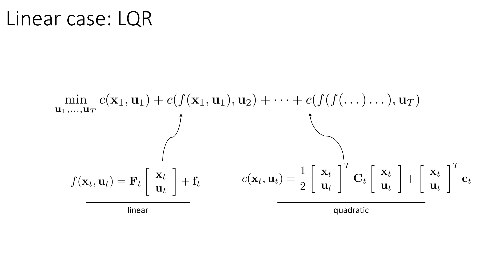

So in presenting the linear quadratic calculator, I'll actually start with a special case of a linear control problem, and then I will tell you what happens in the nonlinear case.

So this is our optimization problem, minimize the sum of costs with respect to the actions, and it really corresponds to that original constraint optimization problem, but I've just substituted in the variables for the constraints, just to make it clear to you that it really is an unconstrained problem, and the constraints are really to help us write it.

So the linear case refers to a setting where f(x_t, u_t) is a linear function, meaning that you can express f(x_t, u_t) as some matrix times the vector where you stack x_t, and u_t plus some constant vector f_t .

Notice that this is a deterministic dynamics.

We'll talk about how LQR can be extended to the stochastic case by introducing the Gaussian quadratic, sorry, the linear quadratic Gaussian regulator, later, the LQG setting, but for now this is deterministic.

And we're going to assume that our cost function is quadratic.

It's important for the cost to be quadratic because if the cost was linear, then we would have a minimization of a fully linear objective without constraints, which in general has its solution at infinity, and that's not useful.

So we need our cost to be at least quadratic, which means that it can be written as 1/2 times a quadratic form with some matrix C_t plus the quadratic, plus the linear term with c_t.

So in the same way the dynamics is linear, the cost function is quadratic.

Linear and quadratic.

And that's why this is called the linear quadratic regulator.

What are we regulating?

Well, we're regulating our trajectory and we have a linear dynamics and a quadratic cost.

So this goes in for f and this goes in for c.

Notice that we are allowed to have a different f matrix and f vector and a different c matrix and c vector for every time step.

So even though we have a linear dynamics, we might actually have a different linear dynamics every single time step.

And that's going to be important later when we try to extend this to the nonlinear case.

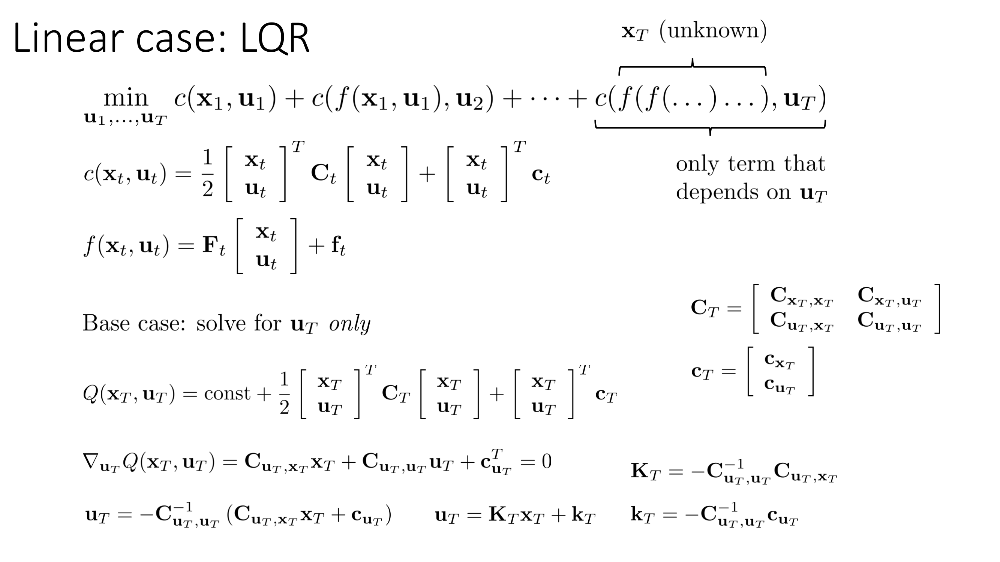

Okay, so here's our problem set up.

And the question that we're going to start with is the base case.

We're going to solve for just the last action, and we're going to solve for the action u_t as a function of the last state x_t.

So the last state x_t is unknown, but what we can do is we can express the optimal u_t for this linear quadratic system as an expression that depends on the last state x_t.

So here's how we can do it.

The total portion of the objective that depends on the last action is the Q function at the last time step, right?

Because changing the last action won't change the reward or the cost at time step T-1.

So we know that the only portion of the subject that is influenced by u_t is the cost of the last time step.

And that's given by some constant plus the quadratic cost function.

So really choosing u_t is just a matter of choosing the value of u_t that minimizes this expression.

And this expression is quadratic in u_t.

Now, it also depends on x_t.

So in order to solve this quadratic equation, it'll help us to break up capital C and lowercase c into parts that influence u and parts that influence x.

So x_t can be written as a matrix consisting of four parts a top-left corner C_{xx} and a bottom-right corner C_{uu} and then a bottom-left and top-right C_{ux} and C_{xu}.

We would in general assume that the cost is symmetric, so C_{xu} would be C_{ux} transpose.

Now, the objective is a quadratic form in u_t where the quadratic term is just C_{uu}, and then all the other terms add up to make a linear term that also depends on the x.

And then the linear term can also be broken up into an x-dependent term and a u-dependent term.

So if we take the derivative of this with respect to u, we would get the component of the quadratic form that depends only on x, so its derivative is 0.

We would have the cross term, which would be uCuxx and xCxuu.

And since we assume these are symmetric, the sum of the derivatives of those would just be Cuxx.

So it's actually 1 half Cuxx plus 1 half Cxux transpose Cxu transpose, but if you add those up and assume symmetry, then together it's just Cuxx.

Then you have the derivative of the quadratic term, which is u transpose C_{uu} times 1 half, and if you take the derivative of that, the 1 half goes away and you're left with C_{uu}.

And then you have the constant component that comes from u transpose Cu.

So you take the derivative of that and you get Cu.

So now you have an expression that has some terms that are linear in u and some terms that don't depend on u.

So what you're going to do is you're going to take all the linear terms to the right-hand side of this equation and hit them by Cu inverse and you get the solution, which is that u equals negative Cu inverse times C_{ux}x plus c_u.

So this is the solution where the gradient is equal to 0 and that's the optimum.

There goes the quadratic function and we know the quadratic functions are convex.

So this is the optimal choice for the last action.

The trouble is that it's not a fixed value.

It's actually a value that depends on x.

You can simplify this by writing u_t as some matrix Kt times x plus some vector little-k, where the matrix big K is negative Cu inverse C_{ux}, and the vector little-k is negative Cu inverse little-cu.

So there are a lot of symbols and a lot of linear algebra, but the actual derivation is very very simple.

You have a You have a quadratic objective for the last action.

You solve that quadratic function by setting the derivative to 0.

And you get this rule for selecting u_t.

Of course, the trouble is that it depends on x_T.

So in order to actually get a number for u_t, you have to figure out what x_T should be.

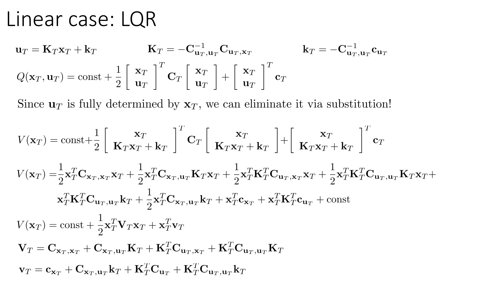

So here's our Q function for the last time step.

And since u_T is fully determined by x_T, we can eliminate it by a substitution.

So what we can do now is we can just plug in the rule for u_T that we derived on the previous slide.

And now we get an expression that doesn't depend on u_T.

So this is the value function.

This is the total cost that you'll get if you start in state x_T and then follow the optimal action, the action that minimizes cost.

So it's a complicated expression, but it's still quadratic.

So it has only linear, quadratic, and constant terms.

And it depends only on x_T.

If you want to expand this out, here is the expansion of this.

So all I did is I just crunched the matrix algebra.

And after crunching the matrix algebra, I'm left with a mess of an equation.

But if you look at this equation carefully, you'll notice that this equation only has terms that are quadratic in x or terms that are linear in x.

So that means that I can collect all the quadratic terms into some matrix that I'm going to call V_T.

And I can collect all the linear terms into some vector that I'm going to call little v_T.

Now the expressions for capital V and lowercase v are pretty complicated, but they're all just multiplications of matrices and vectors that we saw on the previous slide.

So while it takes a long time to write, it's actually very, very simple to derive.

So long story short, I'm left with an expression for V(x_T) that has one quadratic term, one half x^T Vx, and one linear term x^T little v.

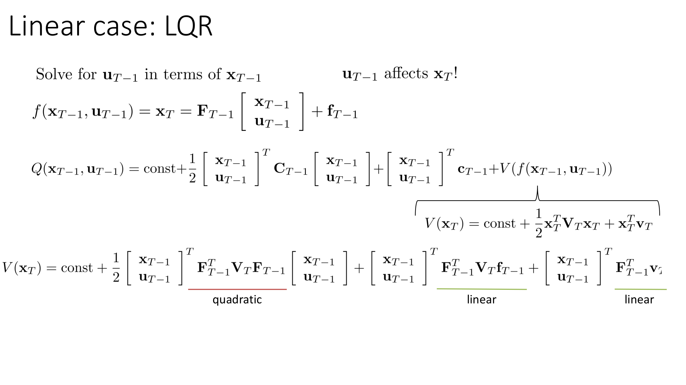

So now let's think about the previous time step.

Let's think about the time step T-1.

My objective here will be to express the value for u_{T-1} in terms of x_{T-1} and the expression for the value at x_T that we derived previously.

So u_{T-1} affects x_T.

In turn, it also affects u_T, but we've eliminated u_T from our calculation.

So the way that u_{T-1} affects x_T, of course, is governed by the dynamics.

So x_T is equal to f(x_{T-1}, u_{T-1}), which from our linearity assumption is just given by the matrix F_{T-1} times the vector x_{T-1} u_{T-1} plus the constant vector f_{T-1}.

So that means that the Q value at time step T-1 is our quadratic cost at time step T-1, plus the value evaluated at f(x_{T-1}, u_{T-1}).

And now what I'm going to do is I'm going to substitute my linear equation for x_T in place of this f, and I'm going to substitute my quadratic expression for the value function at x_T for this function V.

So I know that V is some constant plus this quadratic form, which means that I can substitute that in there, and I can express my V in terms of x_{T-1} and u_{T-1}.

So all I've done is I've taken my expression for v, and everywhere that x_T occurs, I replaced it with the expression for x_T that I obtained from my dynamics.

And again, it's an expression that takes a long time to write, but it's actually very simple, because it just has a collection of linear and quadratic terms.

So here are the quadratic terms, and here are the linear terms.

Everything here is either quadratic or linear in x_{T-1} and u_{T-1}.

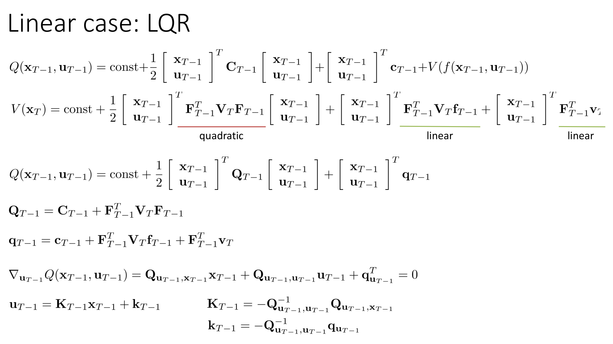

So here's what I'm left with.

I have my Q function at time step T-1, which consists of the cost, which is quadratic, and the value function, and for the value function, I can plug in the expression from the dynamics, and I get something that's quadratic, that's also quadratic and linear, in x_{T-1} and u_{T-1}.

So then I can collect all the quadratic and the linear terms from both the cost and the value function, and I can express my Q(x_{T-1}, u_{T-1}) as a quadratic term and a linear term.

If you're getting lost in the linear algebra at this point, what I would recommend is to actually get out a sheet of paper and follow along with these derivations.

So again, these derivations are very simple mathematically, but they take a long time to write.

So if it's unclear to you, you can get excellent clarity on the LQR algorithm by just following along with the lecture and writing out the derivation, making sure that each step of the derivation is completely clear to you.

So the expression for the quadratic term and the linear term are given here.

They have the quadratic and linear term from the cost, plus this second set of terms, which comes from the value function.

And the form of these is actually pretty elegant.

So the quadratic term for the value function is just hit on either side by the dynamics matrix.

And the linear term has a term that comes from the quadratic value function term, which is dynamics matrix transpose times v little f, plus the linear term, which is just the dynamics matrix, times little v.

So it actually intuitively kind of makes sense.

But if it's not clear to you, please follow along on a sheet of paper and work this out.

Okay, so just like before, we can write the derivative of this Q function with respect to u_{t-1}.

Notice that its form is exactly identical to what we had for u_t, only now instead of having capital C and lowercase c, we have capital Q and lowercase q.

But the form is exactly identical, which means that the solution is exactly identical.

So the solution for u_{t-1} is just some matrix K_{T-1} times x_{T-1} plus some vector little k_{t-1}.

And big K is negative Q_u^{-1} Q_{ux}, and little k is negative Q_u^{-1} times little q_u.

Okay, so the derivation here was actually pretty much the same as for the case of u_t, with the main difference that we have a different matrix and vector, which we derived by combining the cost, and the value function of the next time step.

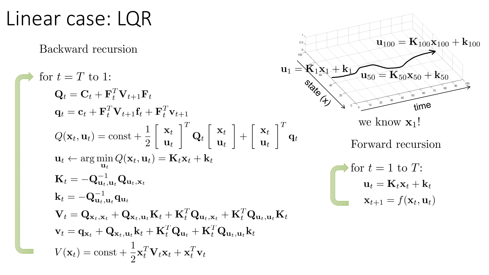

Alright, so what this suggests is that we can express our solution as a kind of recursive algorithm, where we start at the very last time step, and from time step capital T all the way back to time step 1, we calculate a Q matrix and a q vector, where at the last time step capital T, the v's are just 0, because there is no capital V_{t+1}, and there's no lowercase v_{t+1}.

But at all others, we calculate them using this formula.

We express our Q function as this quadratic form, and we choose our action u_t as the argument of this Q, which is a linear expression in terms of x, where capital K is negative Q_u^{-1} Q_{ux}, and lowercase k is negative Q_u^{-1} q_u.

Then we express our value function as a quadratic form in terms of these Qs, and the expression for the value function is a little bit complicated, but it's still very easy to derive.

Just by plugging in the expression for u in place of u in that formula for the Q function, and then collecting all the quadratic and linear terms to express the value function as a function only of V(x) with a quadratic term and a linear term.

Again, if at this point you're having a little bit of trouble following the algebra, it's a very good idea to get out a sheet of paper and just re-derive this, following along with the slides.

It's quite easy to re-derive, it just takes a long time to write.

Alright, so now we have a value function at time step t, which means that we can repeat and go to time step T-1 and use that value function to compute the preceding Q function.

When we're all done with this, what we've produced is an expression for capital K and lowercase k at every single time step.

So, going backwards through time, we've expressed our action at every time step as a function that is linear in the state and has this constant term.

And when we get all the way to u_1, the nice thing at time step 1 is that we actually know x_1.

x_1 is the one thing that we are given, which means that we know x_1 and therefore we can compute an numerical value for u_1.

And once we know both x_1 and u_1, then we can use our known transition dynamics to calculate x_2.

And once we know x_2, then we can calculate u_2 as capital K_2 times x_2 plus lowercase k_2.

So once we know, once we get to the beginning, then we can perform a forward recursion where for every time step from t equals 1 to capital T, we can compute u_2 as K_t x_t plus little k_t, and we can calculate x_{t+1} by using our dynamics.

And then repeat this process.

So, you can think of it as kind of unzipping everything, going backwards, expressing it in terms of x_t, and then zipping it back up going forward, plugging in those x_t as you compute them.

And then we'll get you numerical values for a sequence of x's and u's that describes the optimal trajectory in this linear quadratic system.

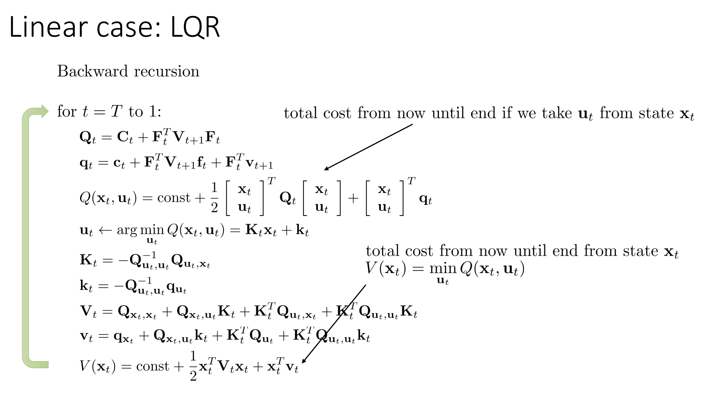

And remember that the Q function here really is the Q function.

It's the total cost from now until the end if you take the action u_t and state x_t and then follow the optimal policy.

And this is the value function, the total cost from now until the end if you start in x_t and then follow the optimal policy.

Okay, so that's it for the basic LQR derivation.

But again, if something here is unclear to you, the linear algebra is actually pretty simple.

It just takes a long time to write.

So, if it's not clear, I would highly encourage you to go back through the slides and redo the derivation following along on a sheet of paper.