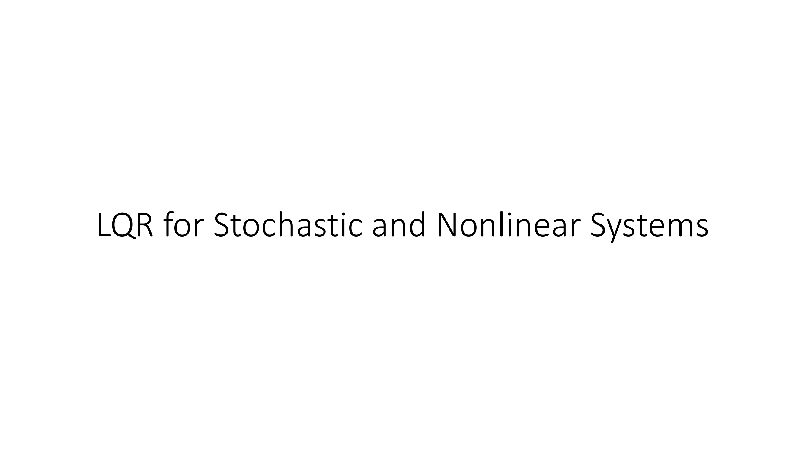
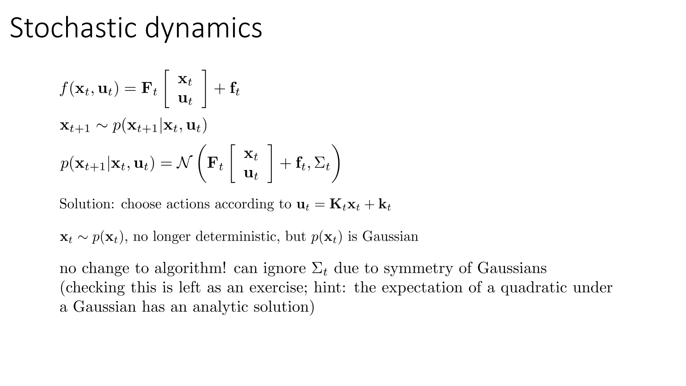
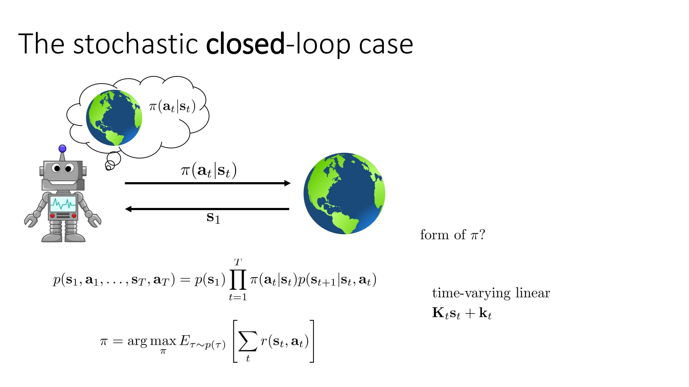
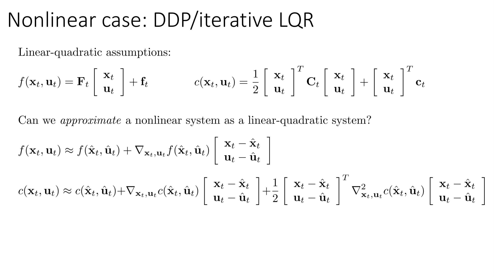
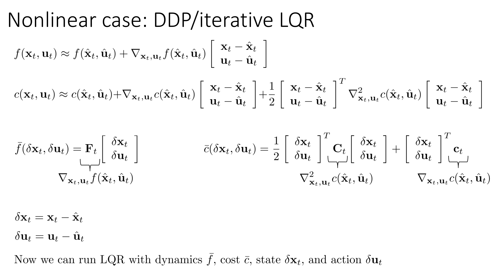
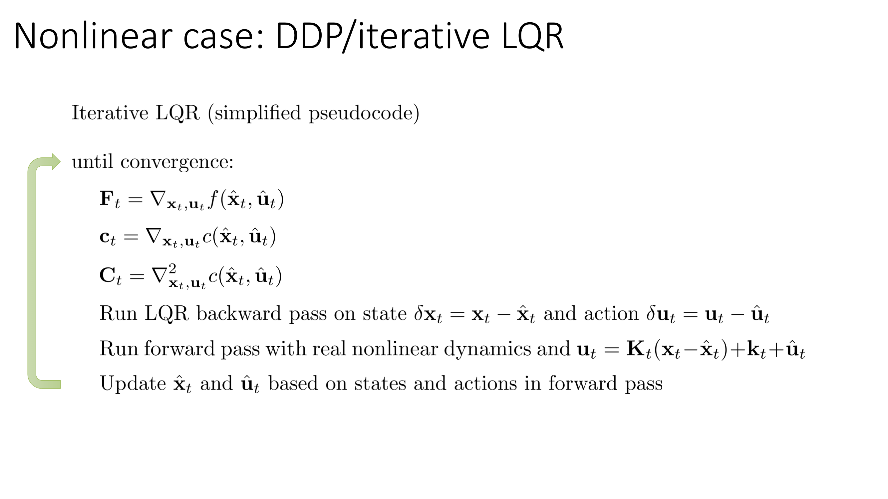
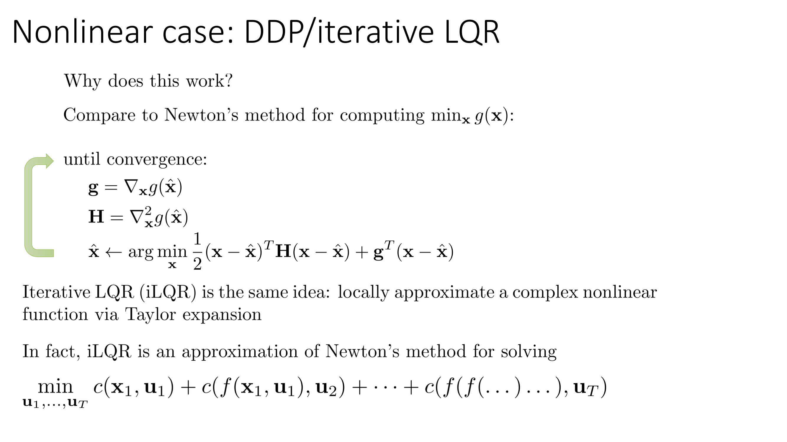
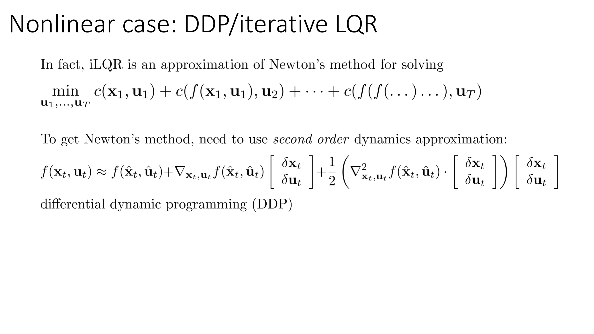
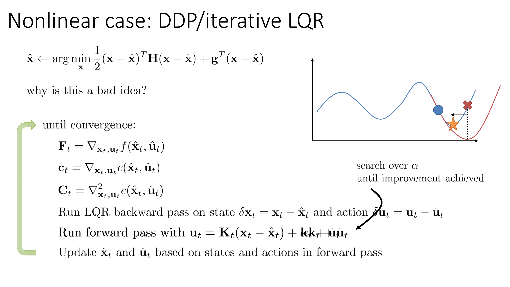

All right, so in the next part of today's lecture, we're going to extend the discussion of LQR that we had in the previous part to stochastic dynamics and also to nonlinear systems.

So let's start with stochastic dynamics because that's actually a pretty easy one.

Before we had linear dynamics that are deterministic, if we have stochastic dynamics, in the special case of the stochastic dynamics are Gaussian, meaning that p(x_{t+1} | x_t, u_t) is a multivariate normal distribution with a mean given by the linear dynamics and a constant covariance.

Then it turns out that exactly the same control law that we had before, it turns out to still be optimal.

I'm not going to derive this, although you can derive it as a homework exercise on your own, but the intuition for why that's true is that a Gaussian is symmetric, which means that if your mean is at a particular value of x_t, if you go a little to the left and a little to the right, those differences will actually cancel out in your quadratic cost and you'll end up with the same value.

So adding Gaussian noise turns out to not change the solution for u_t.

However, there is a little bit of a nuance to this, which is that adding Gaussian noise does change the states that you end up visiting.

So remember in LQR, we had this backward recursion and the forward recursion computes the states that you visit.

Now the states that you visit are actually stochastic, which means that you can't produce a single open-loop sequence of actions, but you can treat that expression for the optimal action, Kx + k, as a controller, as a policy.

And it turns out that if you use that policy, that turns out to be the optimal closed-loop policy in the linear quadratic Gaussian case.

That's quite an interesting result.

So there's no change to the algorithm.

You can ignore the Σ due to symmetry.

And if you want to check this on your own, the hint is that the expectation for quadratic function under a Gaussian actually has an analytic solution.

You can look this up.

And once you can express the expected value of your quadratic functions under these Gaussians, you can calculate their derivatives, set the derivative to zero, and you will find that the control law is the same.

But the important difference here is that now you are not getting a single sequence of states and actions.

You're really getting a closed-form control law out of LQR.

So that's kind of interesting because it turns out that LQR actually does produce closed-loop plans, not just open-loop plans.

So x_t is now sampled from some distribution, and it's no longer deterministic.

It turns out to actually still be Gaussian, which is very convenient.

Okay, so this is basically the stochastic closed-loop case.

And the particular form of π that we ended up with after using LQR is a time-varying linear controller.

So our action is now linear in the state as capital K times the state plus little k, but it's potentially a different capital and lowercase k at every time step.

So this maybe gives us some idea of an alternative to global neural net policies.

All right, so that's kind of the easy part.

Now, the main thing I'm gonna talk about in this portion of the lecture is actually what happens in the nonlinear case.

And in the nonlinear case, we can extend LQR to get something that is sometimes called differential dynamic programming, or DDP, and also sometimes called iterative LQR or iLQR, also sometimes called ILPG if you have the linear Gaussian setting.

So before we had these linear quadratic assumptions, which were the assumption that our dynamics is a linear function of x and u, and our cost is a quadratic function of x and u.

So can we approximate some nonlinear system as a linear quadratic system locally?

Take a moment to think about this question.

What are some mathematical tools that you know of that can allow us to do this?

Well, one thing we can do is we can employ a Taylor expansion.

So if you have some nonlinear function and you want to get, let's say, a first-order function or a second-order function that approximates it in some neighborhood, what you can do is you can compute its first and second derivatives and then employ the Taylor expansion.

So if we have some current sequence of states and actions, maybe the best states and actions we've found so far, which I'm denoting with ^{x}, so you have ^{x_1}, ^{x_2}, ^{x_3}, ^{u_1}, ^{u_2}, ^{u_3}, then you can express the dynamics approximately as the f evaluated at ^{x} and ^{u}, which is just ^{x_{t+1}} , plus the gradient of the dynamics with respect to the state and action.

And similarly, you can express the cost with a linear term depending on the gradient and a quadratic term depending on the Hessian.

So now we've approximated our dynamics and our cost as linear and quadratic in the neighborhood of some sequence of states and actions denoted by ^{x} and ^{u}.

And if you do this, then you can express this linear quadratic system, I'm going to call it bar{f} and bar{c}, in terms of the deviations of x from ^{x}.

So this δ x and δ u represents x - ^{x} and u - ^{u}.

So these are deviations, these are differences from ^{x} and ^{u}.

And now we're back in the linear quadratic regime, which means that we can simply plug in this thing into the regular LQR algorithm and solve for the optimal δ x and δ u.

So δ x and δ u are the deviation from ^{x} and ^{u}.

You can use LQR to solve for the optimal δ x and δ u and then add them to the old ^{x}s and ^{u}s to find new x's and u's.

So here is the, here is the iterative LQR algorithm based on this idea.

We're going to repeat the following process until convergence.

For all the time steps, we're going to calculate the dynamics matrix as the gradient of the dynamics around ^{x} and ^{u}.

And we're going to calculate a linear quadratic term for the cost.

Then we're going to run the LQR backward pass using δ x and δ u as our state.

And then we're going to run the forward pass, but for the forward pass, we're actually going to use the original nonlinear dynamics.

So we're not going to actually use the linearized dynamics to get x_{t+1}, we're going to use the original nonlinear dynamics.

And the reason that we do this is because we want to get the x_{t+1} that will actually result from taking that actual u_t, not just an approximation to that.

So we'll do the forward pass with linear dynamics and u given by capital K times δ x plus lowercase k plus ^{u}, which we just get from substituting in the δ x and δ u equations.

And then we will update ^{x} and ^{u} by simply setting them to be the x's and u's that we got from our forward pass.

And then repeat this process.

So essentially the backward pass computes a controller expressed in terms of δ x and δ u that will give you better costs than we had so far.

The forward pass checks how good that controller actually is and checks which states you'll get from running it and then updates ^{x} and ^{u} to be those new states and actions.

Alright, so why does this work?

Well, let's compare this procedure to a well-known optimization algorithm, which is Newton's method.

So Newton's method is a procedure that you might use for minimizing some function g(x).

In Newton's method, you repeat the following process until convergence.

Compute the gradient at some initial ^{x}, compute the Hessian, and then set ^{x} to be the argmin of the quadratic approximation to the function formed by that gradient in Hessian.

And then repeat.

This is very much like what iterative LQR does.

So iterative LQR is basically the same idea.

You locally approximate a complex nonlinear function via its Taylor expansion, which leads to a very simple optimization problem in the LQR linear quadratic problem.

And then you repeat this process multiple times until you arrive at a local optimum.

In fact, iLQR can be viewed as an approximation of Newton's method for solving that original optimization problem we posed.

The main way in which iLQR differs from Newton's method is that it doesn't consider the second derivative of the dynamics.

It's not too hard to derive a version of LQR that does consider quadratic dynamics.

And if you do that, you get exactly Newton's method, and you still have an elegant recursive formulation for it.

And that is what differential dynamic programming, or DDP, is doing.

So Newton's method needs to use second-order dynamics approximations, which is reasonable, although it requires a tensor product, because the second derivative of the dynamics now is a 3D tensor.

And that's what differential dynamic programming does.

So if you really want to consider a full Newton's method, check out DDP, although in practice just linearizing dynamics tends to be pretty good.

Okay.

Now, the connection to Newton's method allows us to derive a little improvement to the iterative LQR procedure that I presented so far that ends up being very important for good practical performance.

So let's go back to regular Newton's method to gain some intuition.

Here is the optimization that Newton's method does in the inner loop.

And we could ask, why is this a really bad idea?

Think about this for a minute.

If you actually do this repeatedly, I would posit that for many real functions, you will really struggle to find a local optimum

Think about why that might be the case.

So here's a picture that illustrates that point.

Let's say that the blue line represents your function, and you're currently located at this point.

Now, Newton's method approximates your complicated function with a quadratic function.

And let's say that the first and second derivative of your blue function results in this quadratic approximation.

If you actually go to the optimum of this quadratic, you will end up at this point.

And this point is actually worse than the point that you started at.

So what you want is you want to kind of backtrack and find a point that is close to your starting point where this quadratic approximation is still trustworthy.

This notion of trustworthiness is very related to the trust regions that we discussed in the advanced policy gradients lecture last time.

So using this intuition, let's go back to our iterative LQR algorithm.

Where in the iterative LQR algorithm can we perform this backtracking?

So essentially what we want to do is we want to compute our solution, and then we want to check if the solution is actually better than what we had before.

And if it's not better, then we want to somehow move closer to where we were before.

It turns out that the forward pass is a very convenient place to do this.

And a very simple way to modify the forward pass to perform this line search is to modify the constant term, the little k, by some constant α between 0 and 1.

So this is the only change that we've made.

This constant α allows us to control how much we deviate from our starting point.

So imagine what would happen if I set α to 0.

If I set α to 0, then at the first time step, my action would be x_1 minus ^{x_1}, but x_1 is always the same, so that's just 0.

α is 0, so that means that my first action is just ^{u_1}.

And because my first action is ^{u_1}, my second state is ^{x_2}, which means that x_2 minus ^{x_2} is also 0.

α is 0, which means my second control is also ^{u_2}.

So if α goes to 0, I will execute exactly the same actions that I executed before.

And in general, as I reduce α, I will come closer and closer to the action sequence that I had before.

So you can search over α until you get improvement.

Essentially, you can run the backward pass and then run the forward pass repeatedly with different values of α until you find one that you're happy with.

Now in practice, you actually want to be a little more ambitious.

So a very simple way to do it is to just reduce α until the new cost is lower than the old cost.

But the other thing you could do is you could calculate how much improvement in cost you would anticipate from your quadratic approximation, and you could actually reduce α until you get some fraction of that anticipated improvement.

You could also do a bracketing line search where you basically assume that the true function looks roughly quadratic in between basically the blue circle and the red cross.

And a bracketing line search will basically find the optimum of that function.

So there are many other ways to do line searches, but if you want to implement this in practice, look up something like a bracketing line search, and that can be a pretty good choice.

