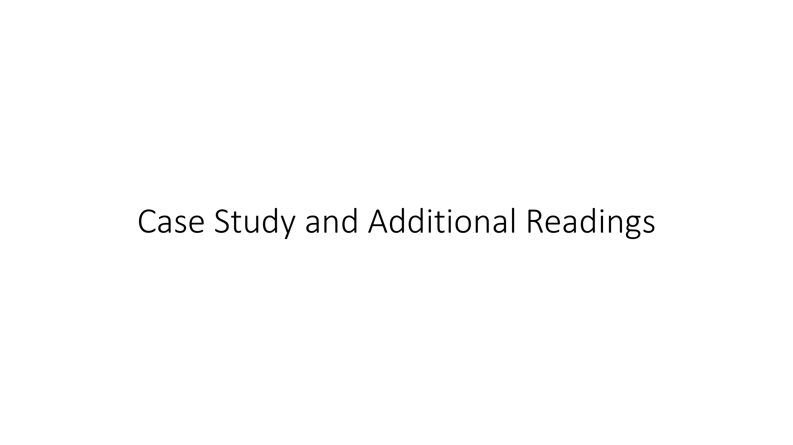
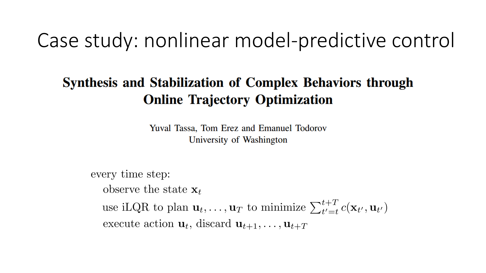
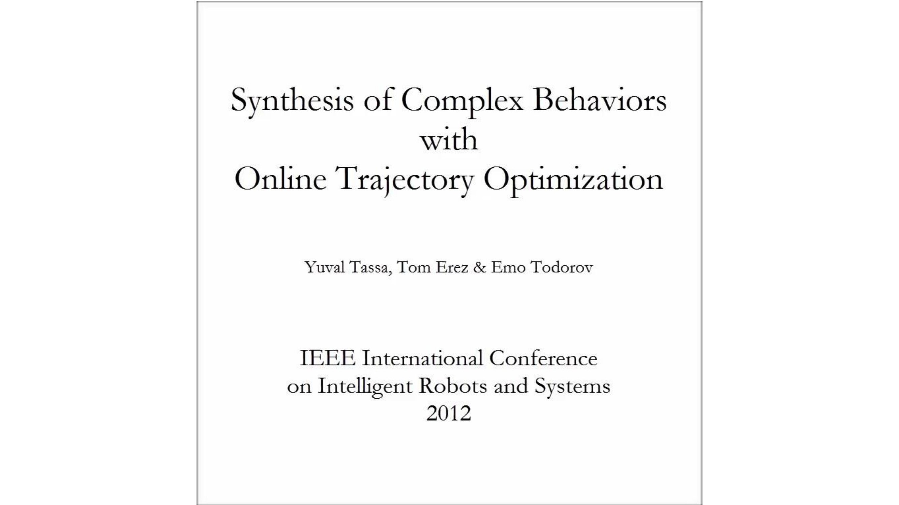
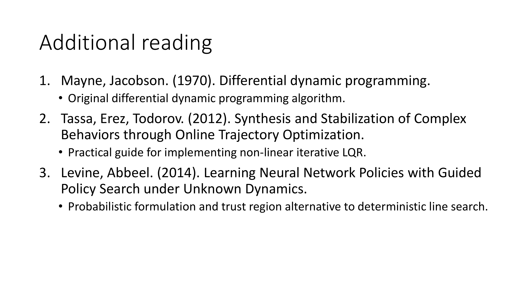
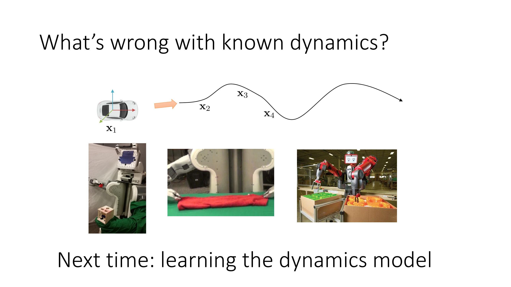

Alright, in the last portion of today's lecture I'm going to go over a little case study that demonstrates the power of optimal control algorithms in the case where we know the true dynamics.

And the point that I want to make with this is just kind of partly to motivate why we want to study model-based RL and partly to show that these things really do work and they really do things that are pretty impressive compared to even the best model-free RL methods.

So the case study that I'm going to talk about is this paper called Synthesis and Stabilization of Complex Behaviors through Online Trajectory Optimization by Yuval Tassa, Tom Erez and Emmanuel Todorov.

What this paper describes is a fairly simple, almost textbook algorithm, but implemented quite well, that uses iterative LQR as an inner loop in something called model predictive control.

So model predictive control is a way to use a model-based planner in settings  where your state might be unpredictable and the the main idea in model predictive control is very simple.

Every time step you observe your current state x_t, then you use your favorite planning or control method to figure out a plan, a sequence of actions u_t, u_{t+1}, etc. all the way out to u_T, and then you execute only the first action of that plan, discard the other actions, observe the next state that occurs, and replan all over again.

So model predictive control is a fancy way of saying replan on every single time step.

And that's what this paper does.

Most of the contributions in this paper are actually in the particular implementation of iterative LQR, and if you want to kind of know all the bells and whistles, all the tips and tricks for implementing iterative LQR effectively, I would encourage you to check it out.

What I want to show you today is the video of the result from that paper.

So I'm going to play the video and narrate a little bit.

So here what they're showing is a simple Acrobot system using iterative LQR.

They're going to show a swimmer and a little hopper, as well as a more complex humanoid.

So here's the acrobot, two degrees of freedom and only one control dimension, a very simple cost.

And first they just run it passively, so no controls at all, and then they turn on the controller.

And you can see that in real time the controller actually discovers how to swing up the acrobot.

So there's no learning at all, although you do have to know the dynamics.

But the impressive thing is that this behavior is actually discovered completely automatically and completely in real time.

And because they're using model-creative control, when they apply perturbations to the system, the robot successfully recovers from those perturbations.

Here they have a little swimming snake, and its goal is to get to the green dot while avoiding the red dot.

And again, kind of the interesting thing here is that this undulating swimming gate is actually discovered by the controller automatically just through optimization, without needing to know or learn anything in advance, except of course for the system dynamics.

Here is the hopper system.

So here what they're going to do is, they're going to first apply some perturbation forces to it, just to show off their physics engine.

And then having applied those perturbation forces, they'll show what happens when you actually ask the hopper to stand up.

So it figures out on its own how to jump up and stand.

And then when they apply perturbations to it, it reacts to those perturbations and and manages to stay upright.

And here they show that it can react to even very extreme perturbations.

Here they're showing what happens if they give it the wrong dynamics.

So because they're reclining every step, they can actually get somewhat sensible results, even when the dynamics are misspecified.

So here the true robot has half the mass that the controller thinks it does, and here it has double the mass that the controller thinks it does.

So you can see with double the mass it kind of struggles a little bit, but still does something seemingly reasonable.

Here they're going to be controlling a 3D humanoid.

The cost function here is, I should say, pretty heavily engineered, so it's still a fairly short-horizon control, or it's not planning far into the future, and the cost function therefore needs to be quite detailed.

So here they turn it on, and it figures out how to stand up.

It's a little bit slower than real time, so they had to speed up this video to play it back, but it manages to do some rudimentary stepping, balancing, and pretty intelligent reactions, even in the face of fairly extreme perturbations.

Okay, if you're interested in additional readings on these topics, here's what I would recommend.

This monograph by Mayne and Jacobson called Differential Dynamic Programming is the original description of the DDP algorithm from which iLQR is inspired.

This is the MPC paper for which I just presented the video.

This is a paper that provides a probabilistic formulation and transfusion alternatives to the deterministic line search for LQR, so if you want to know how to handle these kind of LQR things in stochastic settings, this could be something to check out.

And in next week's lectures, we will extend this to the case where the dynamics are perhaps not known.

So what's wrong with known dynamics?

Well, known dynamics are great if you're controlling some system that is easy to model, like the kinematics of a car, but if you're trying to get a robot to fold a towel, or sort some objects in a factory, maybe modeling all those exactly is very difficult or even impossible.

And in those cases, maybe we can learn our models.

So that's what we'll talk about next.

