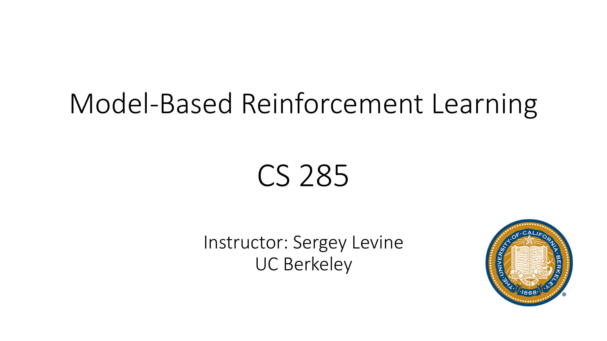
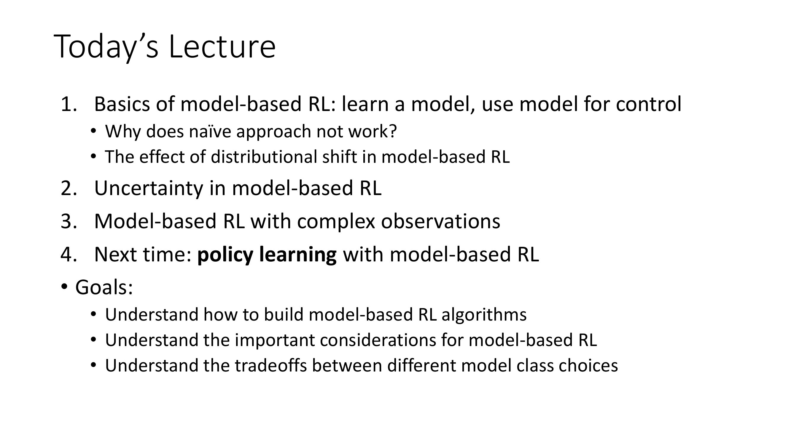
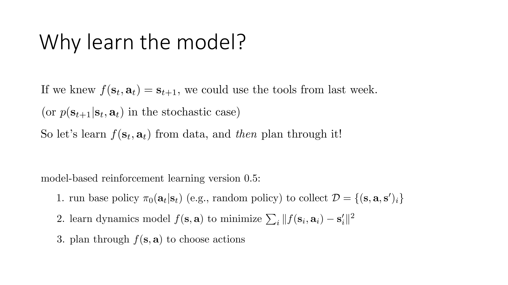
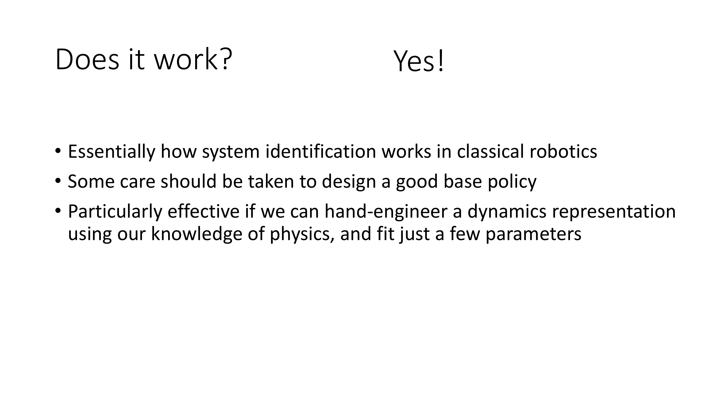
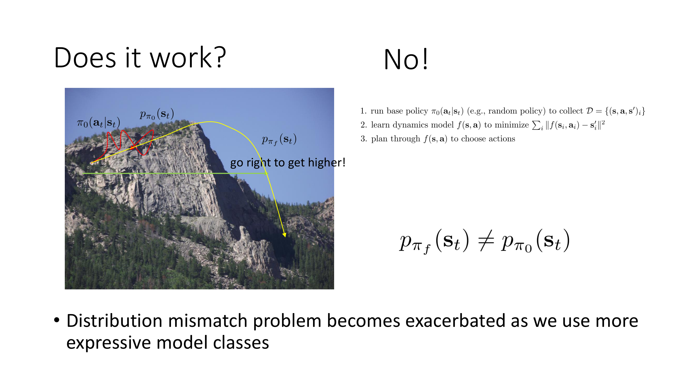
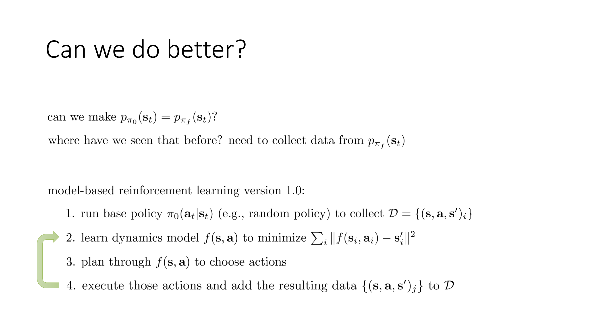
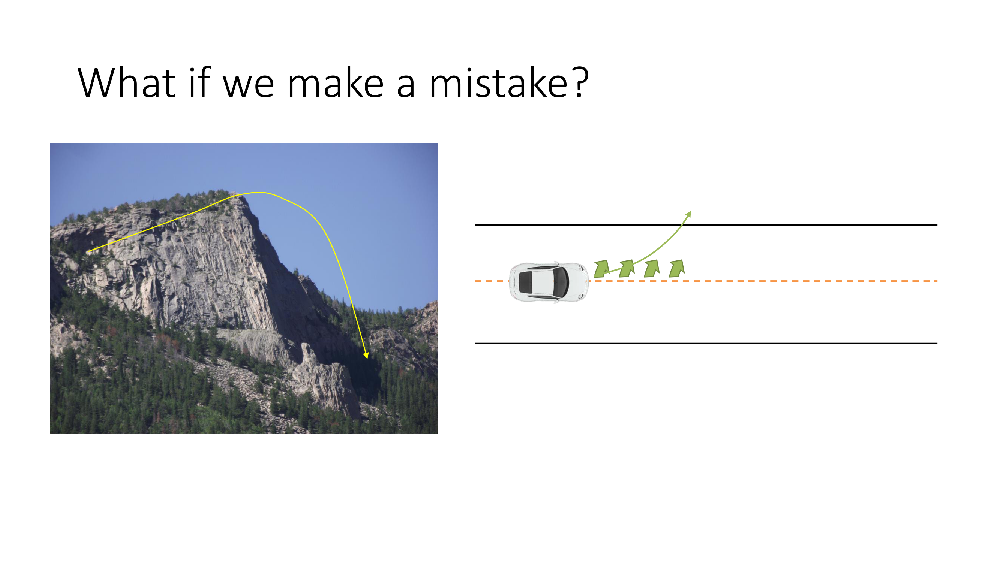
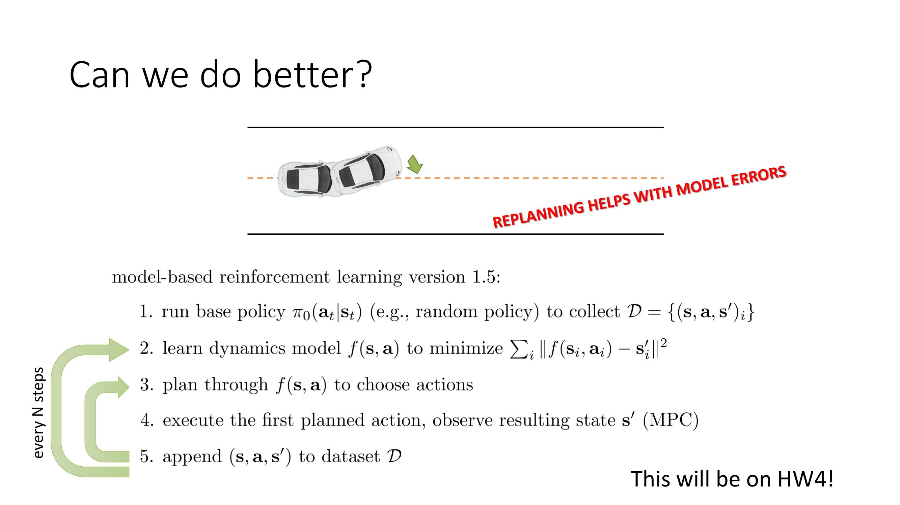

Welcome to Lecture 11 for CS285.

In today's lecture we're going to talk about model-based reinforcement learning algorithms.

So first we'll discuss the basics of model-based RL, where we learn a model and then use this model for control.

We'll talk about a naive way of approaching this problem, discuss a few candidate algorithms, and then talk about some problems with these algorithms.

We'll talk about the effect of distributional shift in model-based RL, and then we'll discuss uncertainty in model-based RL and how being aware of uncertainty can make a really big difference in the performance of algorithms.

Then we'll conclude with a discussion of model-based RL with complex observations.

And then next time we'll discuss how we can use model-based RL to learn policies.

So all the algorithms we'll discuss in today's lecture learn only a model and then they use algorithms such as the ones in the previous lecture to plan through that model.

Whereas next time we'll talk about how we could also use models to learn policies.

So the goals for today's lecture will be to understand how to build model-based RL algorithms, understand the important considerations for model-based RL, and understand the trade-offs between different model classes.

So why should we learn the model?

Well, if we had some estimate of the dynamics, for example a function f(s_t, a_t) that returns s_{t+1}, then we could simply use all those tools from last week to control our system instead of having to deal with model-free RL algorithms.

In the stochastic case we would learn a stochastic model of the form p(s_{t+1}|s_t, a_t).

For most of the algorithms that I'll discuss in today's lecture, I'll present them as deterministic model algorithms of the form f(s_t, a_t) = s_{t+1}, but almost all of those ideas can just as well be used with probabilistic models that learn a distribution over the next state.

And when this distinction is salient, I'll make a explicit.

So let's think about how we can learn f(s_t, a_t) from data and then plan through it to select our actions.

We could imagine a very simple model-based RL algorithm prototype.

I'm going to call it version 0.5.

It's not quite version 1.0, it's not quite the thing you'd want to use, but it's perhaps the most obvious thing we can start thinking about.

In this model-based RL version 0.5 algorithm, step one would be to run some basic exploration policies to collect some data, and this exploration policy could just be a completely random policy.

It's not a neural network or anything like that, it just selects actions uniformally at random and collects a data set of transitions.

So here our transition is a tuple (s,a,s').

We saw state s, we took action a, and we arrived at state s' and that got us our transition, and we'll have a data set of these transitions.

We can use this data set to then train our model with supervised learning.

So we'll learn a dynamics model f(s,a) that minimizes the average over all the points in our data set of the difference between f(s_i, a_i) and s'_i .

And if your states are discrete, then maybe you'd use some other cross-entropy loss.

If your states are continuous, you could use something like a squared error loss.

Most generally, you would use a negative log likelihood loss, of which squared error is a particular special case for our Gaussian likelihood.

And then once you've trained your dynamics model, you would use your model to go and select actions using, for example, any of the algorithms that we covered last week.

So does this basic recipe work?

Well, in a sense, yes.

So in some cases, this basic recipe will work very well.

In fact, there are many previously proposed methods that have utilized this recipe.

This is essentially how system identification works in classical robotics.

So if you have a robotics background, if you've heard the term system identification, system identification basically refers to the problem of taking some data and using that data to identify the unknown parameters in a dynamics model.

Now typically, the parameters that are being identified in this way are not something like the weights in a neural net.

They might be the unknown parameters of a known physics model.

So maybe you have the equations of motion of your robot, but you don't know the masses or the friction coefficients of different parts, and you would identify those.

This is why this is referred to as system identification instead of system learning.

So you really know a lot already about your system by just identifying a few unknowns.

When you use this kind of procedure, you do need to take some care in designing a good base policy, because that good base policy needs to explore the different modes of your system.

So if your system can react in different ways to different states, you're going to see representative examples of all the states that elicit different reactions.

So if there's some large region that you haven't visited, perhaps you will get an erroneous identification of your parameters that will not model that region well.

But this kind of approach can be particularly effective if you can hand engineer a dynamics representation, maybe using your knowledge of physics or using your knowledge of the system, and then fit a relatively modest number of parameters.

In general, however, this approach doesn't really work well with large high-capacity models like deep neural networks and to understand why that's the case, let's consider a simple example.

Let's say that I'm trying to walk around on this mountain and I'd like to get to the top of the mountain.

So my procedure will be to first run a base policy π_0, like a random policy, to collect my dataset.

So maybe I do essentially a random walk on the mountain.

And I'm going to use the result of this random walk to learn my dynamics model.

So this is my policy π_0 maybe just a random policy that produced some data, and I'm going to use it to learn f.

And I want to get to the highest point on the mountain, so I'm going to ask f to predict how high will I be if I take certain actions, and then I'll plan through that.

Now for this part of the mountain that I walked on, it seems like going further to the right gets me higher up.

So from this random data that I got from this π_0 policy, my model will probably figure out that the more right you go, the higher your altitude will be, which is a very reasonable inference based on that data.

So when I then plan through that model to choose my actions, well what do you think is going to happen?

Right, so I'm going to be in for a bad time.

I'm going to be in for a bad time for a reason that we've actually seen before.

So the data that I use to train my model comes from the distribution over states induced by the policy π_0.

We can call this p_{π_0}(s_t).

Take a moment to think about why using a model trained on p_{π_0}(s_t) can lead to some really bad outcomes when we then use that model to plan.

As a hint, the answer to this is something that we've seen before in several of our previous lectures.

So the issue is basically the following.

The issue is that when we plan through our model, you can think of that planning as executing another policy.

We can call it π_f because f is the model and π_f is the policy induced by that model.

π_f is not a neural net.

π_f is just a planning algorithm run on top of the model f.

So π_f is fully determined by f.

And it has its own state distribution.

Its state distribution is p_{π_f}(s_t).

And in this case, that distribution involves going very far to the right and falling off the mountain.

The reason that the problem happens is because p_{π_f}(s_t) ≠ p_{π_f}(s_t).

So we are experiencing distributional shift.

And the way the problems of this distributional shift manifest themselves is that our model is valid for estimating the outcomes of actions in the region that was visited during data collection, meaning for states with high probability p_{π_f}(s_t).

But when we plan under that model, when we select the actions for which the model produces states with the highest reward, the ones that go the most up, we will end up going to states during our planning process virtually that have very low probability under p_{π_0}(s_t).

And our model will make erroneous predictions at those states.

And when it makes erroneous predictions at those states, then it will choose the best action in that erroneously predicted state, feed that back into itself.

And that make an even more erroneous prediction about the following state.

This is basically exactly the phenomenon that we saw before when we talked about imitation learning.

And, in fact, the two have a very close duality because you can think of the full trajectory distribution as just a product of policy times dynamics times policy times dynamics times policy, etc., etc.

So if you can experience distributional shift by messing with the policy, you can, of course, also experience distributional shift by messing with the model.

So distribution mismatch becomes exacerbated as we use more expressive model classes because more expressive model classes will fit more tightly to the particular distribution seen in the training data.

In the system identification example on the previous slide, if we have, let's say, an airplane and we're fitting three numbers, like some drag coefficient, a lift coefficient, and so on, yeah, we can technically overfit to an error region of training data, but there's only three numbers, and there's only so many ways that those numbers could be chosen to fit the training data.

So if the true model is in the class of our learned models, then we'll probably get those three parameters right.

And that's why system identification basically works in robotics.

But when we use high-capacity model classes like deep neural networks, then this distributional shift becomes a really major problem, and we have to do something to address it.

Otherwise, we fall off the mountain.

So can we do better?

Well, take a moment to imagine how we could modify the model-based RL algorithm version 0.5 to mitigate this distributional shift problem.

So one way we can do this is we can borrow a very similar idea to what we had before when we talked about Dagger.

So in Dagger, we also posed this question, can we make the state distributional of one policy equal to the state distribution of another policy?

And the way we answered that question for Dagger was by collecting additional data and requesting ground truth labels for that data.

Now with Dagger, this was quite difficult because getting ground truth labels required asking a human expert to tell us what the optimal action was.

In model-based RL, this turns out to actually be a lot easier.

In model-based RL, you don't need to ask any human expert what the right next state is.

You can simply take a particular action, a particular state, and observe the next state in nature, which means collect more data.

So from this, we can get kind of model-based RL version 1.0.

The reason I call this 1.0 is because arguably this is kind of the simplest model-based RL method which does work in general, at least conceptually, although there are a lot of asterisks attached to that statement in terms of how to implement it so that it works well.

The procedure goes like this.

Number one, run your base policy to collect data, just like before.

Number two, learn your dynamics model from data, just like before.

Number three, plan through your dynamics model to choose actions.

And number four, execute those actions and add the resulting data to your data set.

And then go to step two again.

So the main loop consists of training the dynamics model on all the data so far, planning through it to collect more data, appending that data to your data set, and retraining.

It's essentially just like Dagger, only for models.

Although there's a little bit of...

That statement is a little bit of an anachronism, because this procedure actually existed in the literature long before Dagger did, but we present it in the opposite order in this class.

So you can think of it as Dagger for model-based RL.

So this recipe does in principle work.

It actually does mitigate distributional shift.

And in principle, you should get a model that works well.

So where have we seen that before?

Well, this is just Dagger for models.

Okay, so at this point you have version 1.0, which is a viable algorithm, and you can actually use that algorithm.

But we can still do better.

So first, let's ask this question.

What if we made a mistake?

Right, so with falling off a cliff, it's rather sudden.

So if you fall off a cliff, you realize you've made a mistake, but at that point it's too late.

And there's nothing more that you could do.

But many real problems are not like that.

Let's say that you're driving a car, and your model is a little bit erroneous.

So your model predicts that you'll go straight, not if your steering wheel is pointed straight, but if your steering wheel is a little bit to the left.

So the model is just a tiny bit off.

It says, well, if you steer like two degrees to the left, then you'll go straight.

Fairly innocent mistake in a complex dynamical system.

So if you do that, then when you actually execute your model, you'll go a little bit to the left.

Instead of going straight, and then you'll go a little bit to the left again and again and again.

Now as you collect more data, that iterative data collection should fix this problem.

So asymptotically, this method will still do the right thing.

However, we can do better, and we can get it to learn faster, by fixing the mistakes immediately as they happen, instead of waiting for the whole model to get updated.

So what we can do is we can re-plan our actions at exactly the moment when you've made the mistake, and perhaps correct it.

So the way that you can do better is look at the state that actually resulted from taking that action, and then ask your model what actions you should take in this new state, instead of continuing to execute your plan.

And this is what we're going to call Model-Based Reinforcement Learning Version 1.5, which is also in the literature often called Model Predictive Control, or MPC, which I alluded to briefly at the end of the previous lecture.

So the idea here is, just like before, run your base policy, train your dynamics model, plan through your dynamics model to choose a sequence of actions, but then execute only the first planned action, observe the actual real state that results from taking that action, and then plan again.

So you append that transition to your dataset, and then, instead of waiting for that whole sequence of actions to finish, you immediately re-plan.

Now this is much more computationally expensive, because you have to repeat the planning every single time step.

But, with this procedure, you can do much better with a much worse model.

Because your model maybe doesn't realize that, you know, steering a little to the left won't cause it to go straight, but once it's actually gone to the left, at that point the mistake is so big, that it can probably figure out that, okay, now I really need to steer to the right to get out of here.

And this kind of Model Predictive Control procedure can be much more robust to mistakes in the models than the naive 1.0 procedure, that I showed on the previous slide.

And then, of course, every N outer loop steps, you repeat this whole process, and retrain your model.

And N here might be some multiple of the length of your trajectory.

So in practice, this version 1.5 procedure pretty much always works better, with the main consideration being that it's considerably more computationally expensive.

So re-planning basically helps avoid model errors.

And your homework 4 assignment will essentially involve implementing an algorithm that basically does this.

So if this procedure is not clear to you, please do make sure to ask a question in the comments, and come to the class discussion, and ask about clarifications, because it's very important to get this particular procedure correct.

Okay.

So now one question we could ask is, well, how should we re-plan?

So how do we plan through f(s,a) to choose actions?

The intuition is that the more you re-plan, the less perfect each individual plan needs to be.

So while the computational cost of re-planning might be very high, in practice, since you're going to be re-planning and fixing your mistakes, you can kind of afford to make more mistakes during this re-planning process.

So a very common thing that people do when they actually implement this procedure, is they use much shorter horizons for step 3, than they would if they were making a standard open loop plan, and they just rely on the re-planning to fix those mistakes.

So even things like random sampling can often work well here, random shooting, whereas they might not work well for constructing a long open loop plan.

And if you remember the demonstration that was shown at the end of class last week, this was illustrating MPC with re-planning, using actually a fairly short horizon, and really relying almost entirely on that re-planning to fix up the mistakes.

