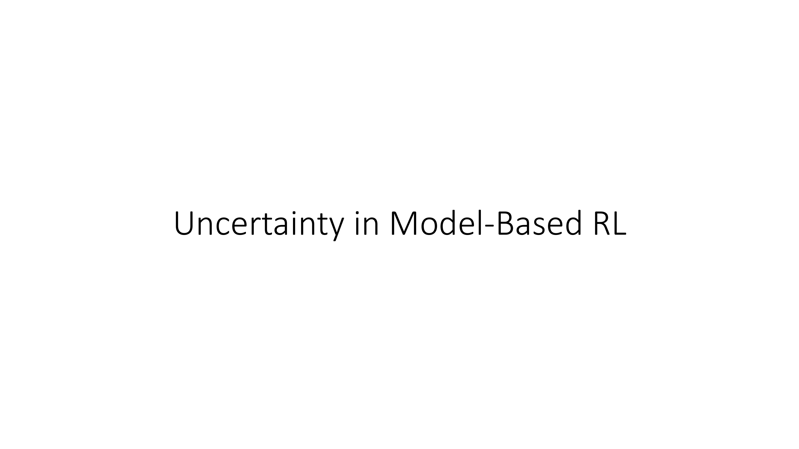
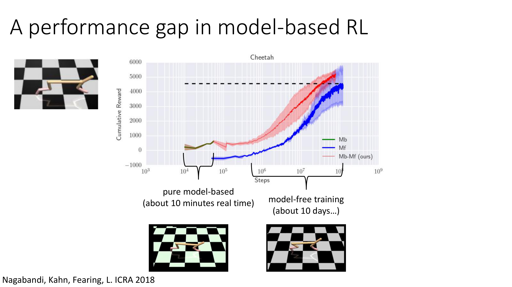
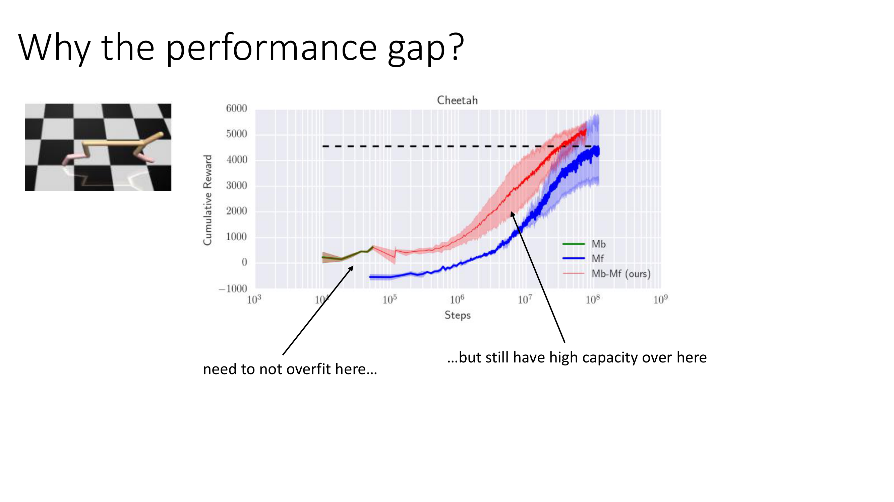
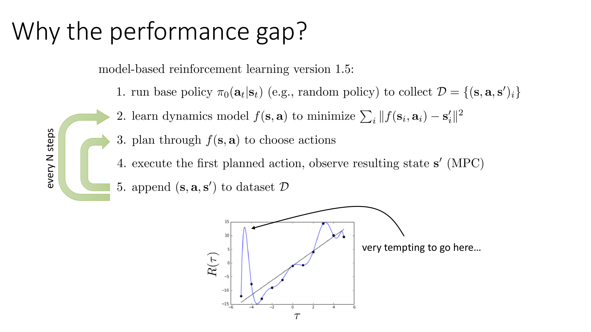
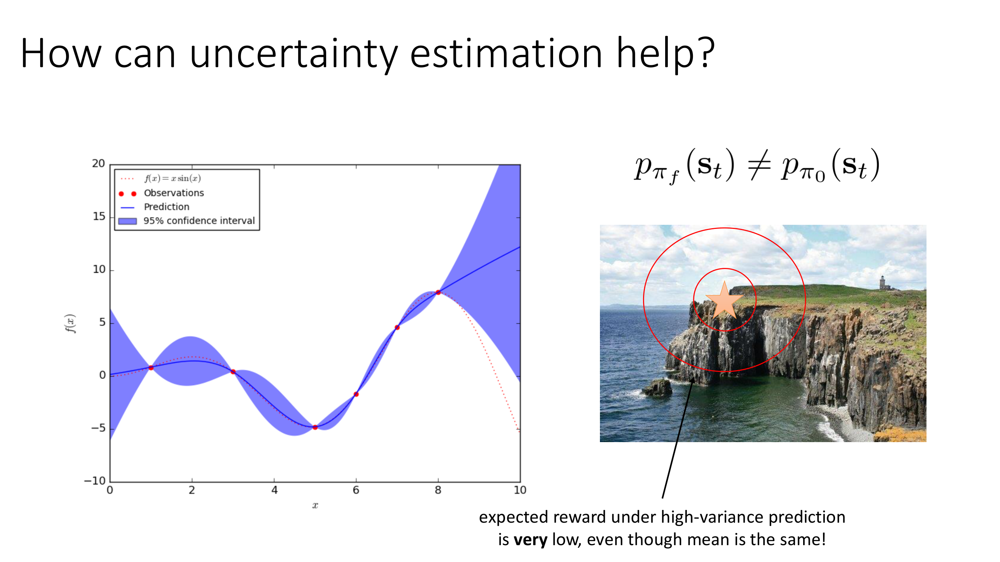
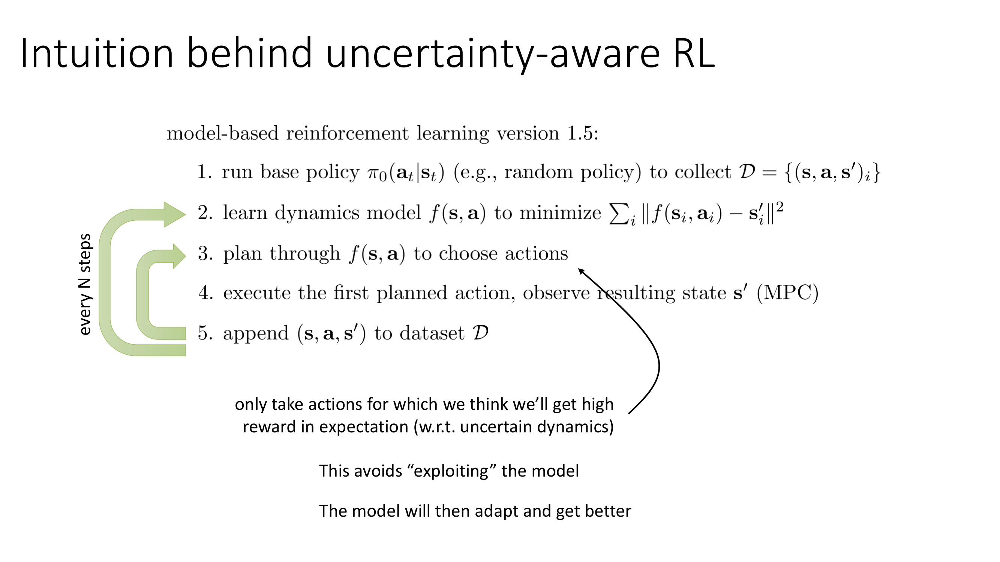
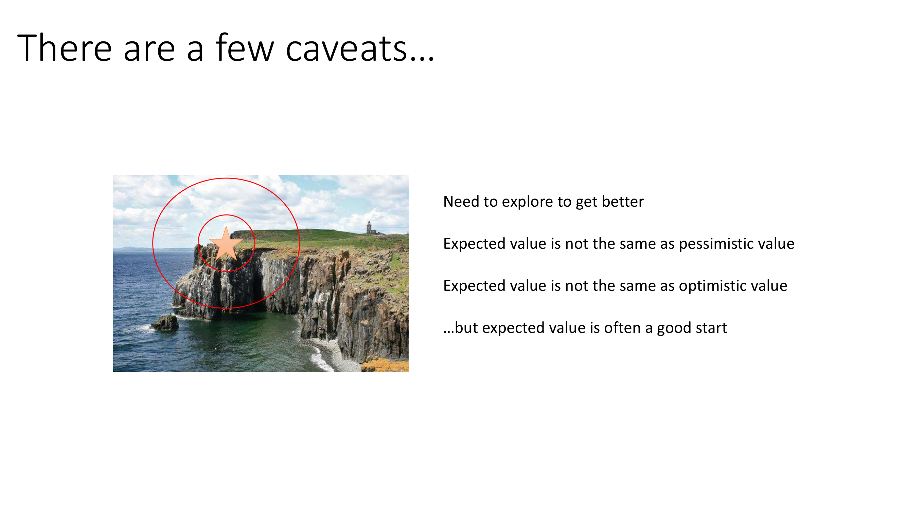

All right, in the next portion of today's lecture, we're going to talk about the role of uncertainty in model-based reinforcement learning.

Uncertainty plays a really important role in model-based RL because even though the model-based RL version 1.0 algorithm in principle can solve the model-based RL problem, in practice, it has some pretty major issues.

So let's try to understand this with an example.

Here is an experiment that we actually did here at Berkeley a couple of years back.

Studying deep model-based reinforcement learning methods, essentially methods like model-based RL version 1.5, which I presented before using a deep neural net model.

So these experiments were conducted on that half cheetah simulation task, which you guys tried in homework one.

And what this first little orange part of the curve shows was what we got from running just the basic model-based RL version of the 1.5 algorithm starting from scratch.

So this is the algorithm that replans every step and iteratively collects additional data.

And then what we did is we used that to bootstrap a model-free RL learner and ran it for a lot longer, obviously.

And the red part of the curve shows what the model-free learner then did.

So a couple of things jump out at us here.

First, the model-free learner gets to much better final performance.

Second, perhaps more optimistically, the model-based learner can get to some slightly better than zero performance relatively quickly.

So the x-axis here is a log scale.

The reward for the model-based learner here is about 500.

The reward for the model-free learner was about 5,000.

Here's what 500 reward looks like.

So it's not completely terrible.

It is actually moving forward just slowly.

And here is what a reward of 5,000 looks like after the model-free training.

So what's going on here?

Why is it that the model-based learner is so much worse than the model-free learner?

Well, in contrast to regular supervised learning problems, the model-based RL problem with this iterative data collection poses kind of a unique challenge to the neural net training algorithm.

See, the trouble is that we need to not overfit when we have small amounts of data over here in the beginning, but we still need to have enough capacity to do well once we have large amounts of data.

And that turns out to be very difficult.

See, the thing is, we're mitigating the distributional shift problem by using our model to collect additional data.

But that means that our model needs to be pretty good even early on when it doesn't have very much data.

And high-capacity models like neural nets are very good in the high-data regime, but they don't really struggle in the low-data regime.

So for this reason, they'll do pretty poorly in the early stages.

And when they do poorly in the early stages, they essentially don't produce effective exploration, which means they end up actually getting stuck.

So why do we have this performance gap?

Well, it really comes down to something like an overfitting problem exacerbated by distributional shift.

So this is sort of the classic picture that we think of when we think of overfitting.

We have a collection of points formed by a straight line plus noise, and we fit some really powerful function approximator into it, and we get something like the blue line.

Now, in reality, in model-based RL, things are not quite that clear-cut, and distributional shift also plays a really big role.

But, basically the issue is along these lines.

So in model-based RL, since we're actually planning through our model, if our model makes mistakes that are kind of in the positive direction, so for instance, if the y-axis here is the predicted reward for different trajectories, it'll be very tempting for the planner to select those trajectories that result in the largest mistakes in the positive direction.

So the planner will essentially exploit mistakes in a model, and if the model overfits, then it has lots of these little holes, lots of these little spurious peaks for the planner to exploit.

So it's not quite as simple as the regular overfitting problem.

It's actually in some ways worse, because the planner is going to exploit all those holes in our overfitted model.

Okay.

So what I'm going to discuss in this part of the lecture is how appropriate uncertainty estimation can help us fix this problem.

So how can uncertainty estimation help?

Well, with uncertainty estimation, what you could imagine we'll be doing is, for every state-action pair, we will be predicting not just a single next state, s', but actually a distribution of possible next states that you could reach under your uncertainty about the model.

So the reason this might be a good idea is, let's say that you'd like to walk up to the edge of the cliff to get a beautiful view of the ocean.

So your goal is here, right at the edge of the cliff.

Now, if you are very confident in your model, you might say, well, if I plan actions that get to the edge of the cliff, I'll be standing right on the edge and I'll get the highest reward.

But if you're extremely uncertain about your model, and you understand this uncertainty, then when you take the expected value of the reward under your highly uncertain model, you'll realize that walking right up to the edge of the cliff has a pretty high probability of causing you to fall over the edge, which would incur a very large negative reward.

So you will automatically choose to stay further back, because as you get closer, the probability of accidentally falling off increases due to your model uncertainty, due to the fact that maybe you don't know exactly where the cliff is.

Now, crucially, this phenomena can emerge even if we don't do anything special, even if we don't specifically plan to be, let's say, pessimistic under the model or avoid the worst case.

That's not what we're doing here.

Even if we just reason about the expected value of the reward under an uncertain model, we'll already get this kind of behavior that avoids highly uncertain regions if they can negatively impact the reward.

So what this does is it forces the planner to essentially hedge its bets.

It forces it to take a sequence of actions that would be good in expectation, which sort of means that in all possible futures that are represented by your model uncertainty, that sequence of actions is a pretty good one.

Now, an important implication of this statement is that the way that you model your uncertainty really needs to consider the possible worlds in which you could be in.

So this is not really about the setting where the dynamics are noisy.

This is about the setting where you don't know what the dynamics are.

So there are many possible worlds that could be consistent with your data, and you'd like to take actions that are good in expectation under the distribution of those possible worlds given your data set.

This is a fairly special kind of uncertainty.

So we would expect the reward under high variance predictions to be very low when we approach the edge of the cliff if we're modeling the uncertainty correctly, even if the mean is the same.

Okay.

So the only real change we're going to make is in step three, we'll only take actions for which we think we'll get high reward in expectation under our uncertain dynamics.

And this is going to avoid that exploitation problem, which is going to result in our algorithm doing much more sensible things, particularly in those early stages in training when model uncertainty is very high.

And then the model will adapt and get better, and hopefully it'll become more confident in those regions where we're seeing high rewards.

So then eventually we'll approach right to the edge of the cliff because we'll gradually refine our model.

So intuitively you can think of this as you don't know quite where the cliff is, you walk a fairly safe distance to it, but you collect a little bit more data, refine your understanding, and then you can walk a little closer to it next time.

Now there are a few very important caveats.

I mentioned before this is a very special kind of uncertainty.

So one caveat is that you do need to explore to get better.

So if you're very cautious, if you draw a really big kind of an interval around your target and you have a particularly nasty reward structure, you might end up never going anywhere near high reward regions, and then your exploration might be hampered.

So you have to make sure that this uncertainty-aware exploration is not harming exploration too much.

And we'll talk about exploration much more in a few lectures from now.

The other thing to remember is that the expected value is not the same as a pessimistic value.

So this is not an algorithm that tries to, you know, maximize worst-case error or be robust or anything like that.

You could derive robust algorithms based on uncertainty estimation, for example, by using a lower confidence bound instead of the expected value, but that is not what we're talking about here.

That's a very reasonable thing to do if you're especially concerned about safety, but here we're just talking about taking the expected value.

The expected value is also not the same as an optimistic value.

So you could be optimistic with respect to your uncertainty, and then you'd expect more exploitation, but you would also expect to see some, you know, better optimistic exploration strategies.

And again, we'll talk about that a few weeks from now.

So the expected value is a pretty good place to start, and that's what we're going to do for now.