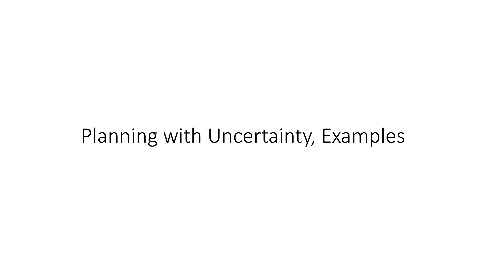
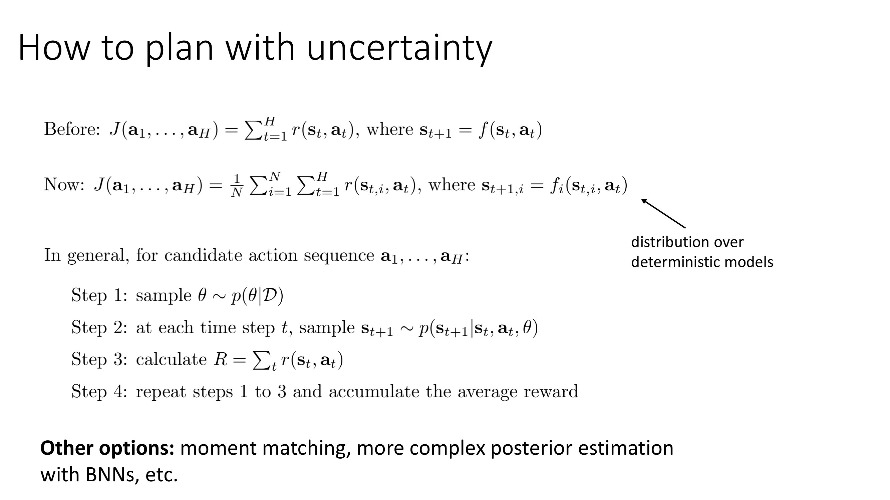
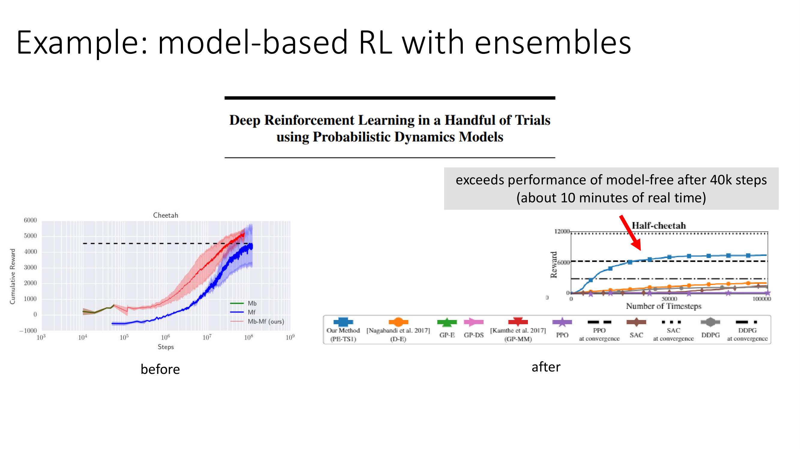
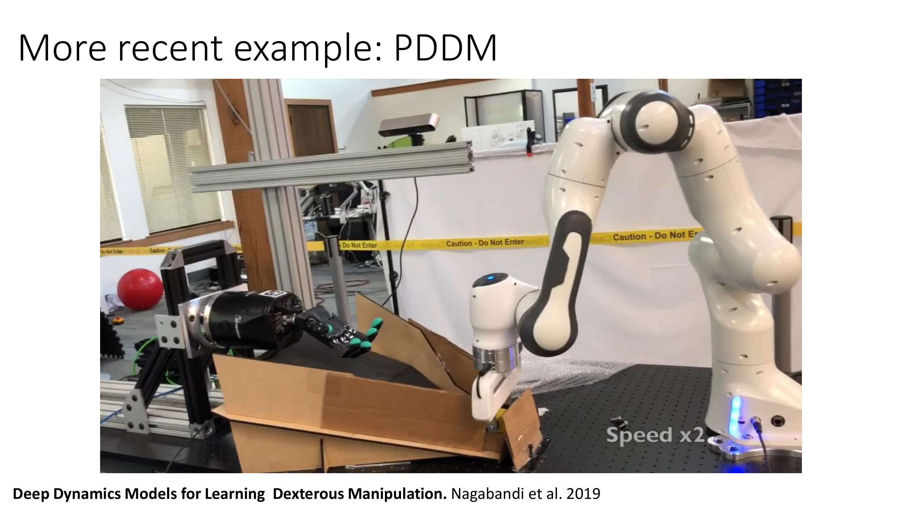
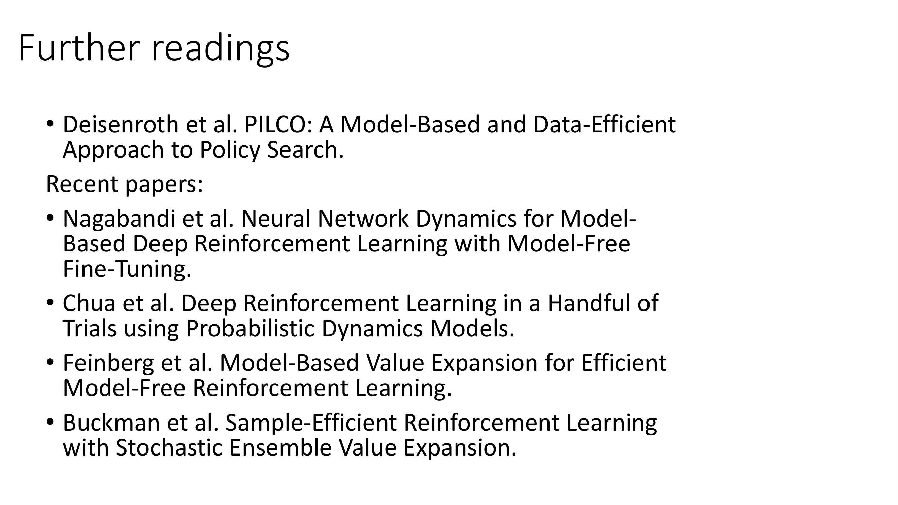

All right, next let's briefly discuss how we can use these uncertainty-aware models for control, and go through a few examples of some papers that have actually used things like this.

All right, so let's say that we've trained our uncertainty-aware model, perhaps by using a bootstrap ensemble, and now we'd like to use it in our model-based RL version 1.5 algorithm to actually make decisions.

So before, when we were planning, we were essentially optimizing the following objective.

We were optimizing the sum from t=1 to H of the r(s_t,a_t), where s_{t+1} = f(s_t,a_t).

So whether you use random shooting, CEM, whatever, this is essentially the problem that you're solving.

Now we have N possible models and what we would like to do is choose a sequence of actions a_1 through a_H that maximizes the reward on average over all the models.

So now our objective is the sum over the models times 1/N of the sum over the time steps for the rewards for the states predicted by that model, where s_{t,i} is given by the dynamics for model i.

So this is the case if you learn a distribution over deterministic models.

If you have stochastic models then you would have an expectation for each model with respect to its distribution.

So in general for some candidate action sequence a_1 through a_H, step one is to sample a model from p(θ|D), which if you have a bootstrap ensemble amounts to just choosing one of the N models randomly.

Step two, at each time step sample s_{t+1} from p(s_{t+1}|s_t,a_t) and that parameter vector that you sampled from the posterior.

Step three, calculate the reward as the sum over all the time steps for those predicted states.

And then step four is to repeat steps one through three to accumulate the average reward as necessary.

So this would be the recipe for any general representation for the posterior p(θ|D), if you have a bootstrap ensemble.

You can also sum over all the models instead of sampling them.

That can be simpler if you have a small number of models.

If you estimate your posterior with some other method like a Bayesian neural net, then you can sample multiple different random parameter vectors and estimate the reward for each one.

Now this is not the only option that you could have.

This is a sampling procedure for evaluating the reward.

You could imagine other procedures.

For instance, you could evaluate possible next states from every model at every time step and then perform something like a moment matching approximation to figure out an estimate of the actual state distribution, of the actual distribution p(s_{t+1}), for instance by estimating its mean and variance.

And other methods have done things like that as well.

But a simple procedure is to use this process that I have on the slide to evaluate the total reward of every candidate action sequence, a_1 through a_H, and then optimize over the action sequences using your favorite optimization method, like random shooting or cross-entropy method.

It's also possible to adapt continuous optimization methods like LQR to this setting.

In that case, something called the reparameterization trick can be very useful, which we will cover next week.

Okay.

So take a moment to look over the slide, make sure that this really makes sense to you.

This is a pretty important slide to understand if you want to know how to implement model-based RL with epistemic uncertainty.

Okay.

So does this basic scheme work?

Well, here are some plots I'm going to show.

These are from a paper called Deep Reinforcement Learning in a Handful of Trials.

So before we saw on the half cheetah task how this model-based RL version 1.5 algorithm, could get us from a reward of 0 to about 500, if we actually implement epistemic uncertainty using bootstrap ensembles, then we can get model-based RL to get a reward over 6000 in about the same amount of time as the 1.5 algorithm.

So especially in low data regimes, these epistemic uncertainty estimates really do make a really big difference in performance.

Here's a more recent illustration of a model-based RL method with an ensemble of models.

This is actually a real-world robotic experiment where this robotic hand is manipulating objects in the palm.

This is using essentially model-based RL version 1.5 with a particularly sophisticated model and an ensemble for uncertainty estimation.

And this hand learns directly by interacting with these objects.

In about three hours, they can perform a full turn with both objects in the palm.

So this is 1.5 hours.

And there's two hours.

And it can do a full 180 turn.

And then after four hours, it can do it pretty reliably.

So something about the uncertainty estimation really does seem to work, and it does seem to be quite important for these model-based RL methods.

So if you want to implement model-based RL, highly recommend it to consider epistemic uncertainty estimation.

If you want to learn more about epistemic uncertainty and model-based RL, here are a few suggested readings.

This paper by Mark Deisenroth called, PILCO.

This is an older paper from around 2011.

This paper uses Gaussian processes rather than neural nets for model learning.

But this was sort of one of the foundational papers in really establishing the importance of epistemic uncertainty estimation in model-based reinforcement learning.

And it has some good discussion of why it matters.

So I would encourage you to read this if you're interested in the topic.

More recent papers.

This is the model-based RL version 1.5 paper that I mentioned before.

That does kind of okay but not great on half cheetah.

This is the paper that introduced the ensembles for model-based RL and managed to get comparable results to model-free RL.

This is a paper that I would encourage you to check out if you're especially interested in the intersection of model-based and model-free RL.

It uses models for estimating value functions.

And this is another closely related paper that also integrates epistemic uncertainty at multiple different points in the previous method.

