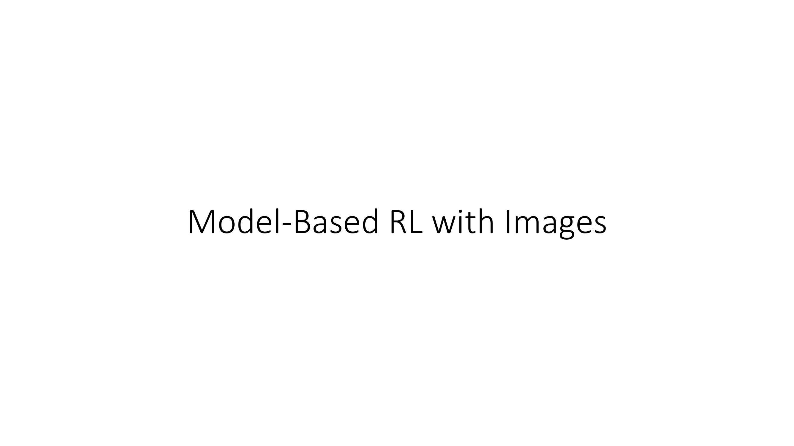

All right, in the last portion of today's lecture, we're going to shift gears a little bit and talk about how we can do model-based reinforcement learning with images.

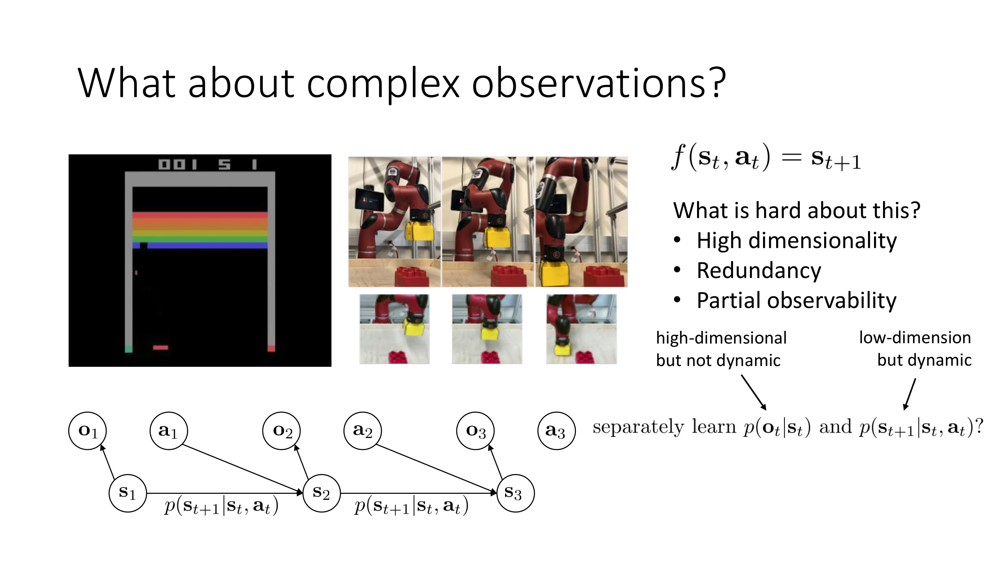

So what happens with complex image observations, things like images in Atari or pictures from a robot's camera performing some manipulation task?

Well, with the algorithms that we talked about before, they all have some form of model that predicts the next state from the previous state in action and then plans over these states.

What is hard about doing this with images?

Well, first, images have very high dimensionality, which can make prediction difficult.

Images also have a lot of redundancy.

So, you know, the different pixels in the image for the Atari game are very similar to each other.

And that means that the state contains a lot of redundant information.

Image-based tasks also tend to have partial observability.

So if you observe one frame in an Atari game, you might not know how fast the ball is moving in breakup, for instance, or in which direction.

So when we're dealing with images, we typically deal with a POMDP model.

And this is the graphical model illustration for a POMDP.

It has a distribution of next states given previous states in actions and distribution of over observations given states.

And typically, when we're doing RL with images, we know the observations and actions, but we do not know the states.

So we would like to learn the transition dynamics in state space, p(s_{t+1}|s_t,a_t), but we don't even know what s is.

So perhaps we could separately learn p(o_t|s_t) and p(s_{t+1}|s_t,a_t).

And that could be quite nice because p(o_t|s_t) handles all the high dimensional stuff.

But it doesn't have to deal with the complexity of temporal dynamics.

Whereas the p(s_{t+1}|s_t,a_t) has to deal with the dynamics, but doesn't have to deal with the high dimensional stuff.

And maybe this separation of roles can give us some viable model-based RL algorithms for image observations.

I'll discuss such algorithms briefly and somewhat informally.

But then at the end, I'll also talk about how maybe some of this is not actually true.

Maybe it is not too bad to actually learn dynamics directly on images.

So that'll come at the end.

But first, let's talk about these kind of state-space models.

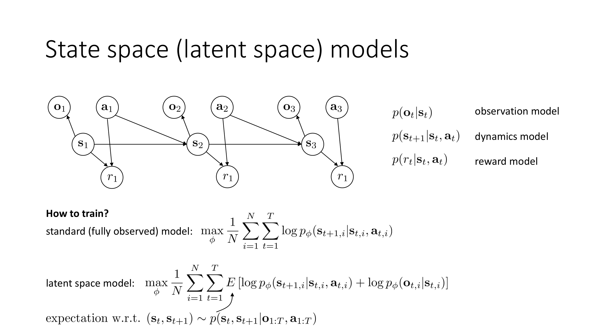

So these are sometimes referred to as latent space or latent state models.

In general, they're state-space models.

So here we're going to learn two objects.

We're going to learn a p(o_t|s_t).

Basically, how does our state map to an image?

That's the observation model.

And a p(s_{t+1}|s_t,a_t), which is our dynamics model.

In our unobserved state space.

We will typically also need to learn a reward model, p(r_t|s_t,a_t), because our reward depends on the state.

And since we don't know what the state is, we don't know how the reward depends on it.

So we typically also add a reward node to this and learn a reward model.

All right.

So how should we train one of these things?

Well, if we had a standard fully observed model, we would train it with maximum likelihood.

We would basically take our data set of N different transitions.

And for each transition, we would maximize the log probability of (s_{t+1,i}|s_{t,i},a_{t,i}).

If we have a latent space model, now we have a p(o_t|s_t) and a p(s_{t+1}|s_t,a_t).

So we have to maximize the log probabilities of both of those, and potentially also the reward model, if we want to add that in.

If we knew the states, then this would be easy.

Then we would just add together log p_ϕ(s_{t+1,i}|s_{t,i},a_{t,i}) to log p_ϕ(o_{t,i}|s_{t,i}).

The problem is that we don't know what s is, so we have to use an expected log likelihood objective where the expectation is taken over the distribution over the unknown states in our training trajectories.

Those of you that are familiar with things like hidden Markov models, it's basically the same idea.

So we would need some sort of algorithm that can compute a posterior distribution over states given our images and then estimate this expected log likelihood using states sampled from that approximate posterior.

So the expectation is taken with respect to p(s_t,s_{t+1}|o_{1:T},a_{1:T}) at every time step.

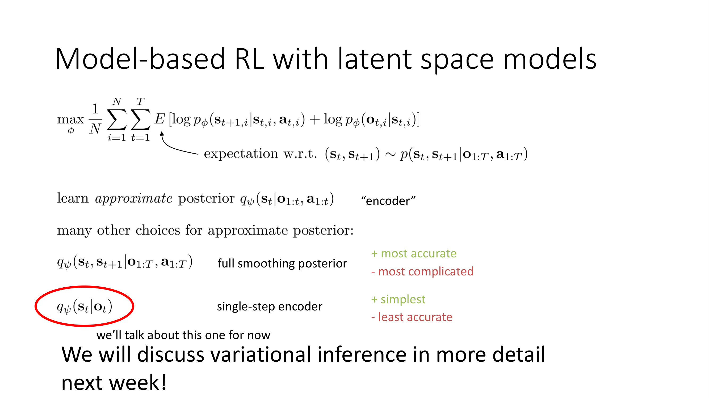

Okay.

So how can we actually do this?

Well, one thing we could do is we can actually learn an approximate posterior, and I'm going to say this approximate posterior has parameter ψ, and I'm going to note a q_ψ, and the approximate posterior will be another neural network that gives the distribution over s_t given the observations and actions seen so far.

And there are a few choices that you could make.

So we call this approximate posterior the encoder, and you can learn a variety of  different kinds of posteriors which one you pick will have some effect on how well your algorithm works.

So you could learn kind of a full smoothing posterior you could learn a neural net that gives you q_ψ(s_t,s_{t+1}|o_{1:T},a_{1:T}).

So this posterior gives you exactly the quantity you want it's the most powerful posterior you could ask for.

But it's also the hardest to learn on the other extreme you could imagine a very simple posterior that just tries to guess the current state given the current observation, for example if the partial observability effects are minimal.

And this is the easiest posterior to train, but also the worst in the sense that using it will be the furthest away from the true posterior that you want, which is p(s_t,s_{t+1}|o_{1:T},a_{1:T}).

So you could ask for a full smoothing posterior or a single-step encoder.

The full smoothing posterior is the most accurate in the sense that it most accurately represents your uncertainty about the states, but it's also by far the most complicated to train.

The single-step encoder is by far the simplest, but provides the least accurate posterior.

In general, you would want a more accurate posterior in situations that are more partially observed.

So if you believe that your problem is such where the state can be pretty much entirely guessed from the current observation, then a single step posterior is a really good choice.

Whereas if you have a heavily partially observed setting, then you want something closer to a full smoothing posterior.

And there are of course a lot of in-between choices, like estimating (s_t|o_{1:T},a_{1:T}).

Now in terms of how to actually train these posteriors, this requires an understanding of something called variational inference, which we'll cover in more detail next week.

I'll gloss over how to train these probabilistic encoders in this lecture, and I'll instead focus on a very simple limiting case of the single step encoder.

So we're going to talk about the single step encoder, and we're going to talk about a very simple special case of the single step encoder.

So if we were to really do this right, then for every time step we would sample s_t from q_ψ(s_t|o_t).

And s_{t+1} from q_ψ(s_{t+1}|o_{t+1}).

And then using those samples, maximize log p_ϕ(s_{t+1,i}|s_{t,i},a_{t,i}) and log p_ϕ(o_{t,i}|s_{t,i}).

But a very simple special case of this, if you believe that your problem is almost fully observed, is to actually use a deterministic encoder.

So instead of outputting a distribution over (s_t|o_t), we would just output a single s_t for our current o_t

The stochastic case requires variational inference, which I'll discuss next week, but the deterministic case is quite a bit simpler.

So the deterministic case can be thought of as a δ function centered at some deterministic encoding g_ψ(o_t).

So that means that s_t = g_ψ(o_t).

And if we use this deterministic encoder, then we can simply substitute that in everywhere where we see an s in the original objective, and we can remove the expectation.

So now our objective is to maximize, with respect to ϕ, ψ, the sum over all of our trajectories of the sum over all of our time steps of log p_ϕ(g_ψ(o_{t+1,i})|g_ψ(o_{t,i}),a_{t,i}) + log p_ϕ(o_{t,i}|g(o_{t,i}))

So the second term can be thought of as a kind of autoencoder.

It just says that if you encode o_t, you should be able to reconstruct it back out again.

And the first term, it enforces that the encoded states should obey the learned dynamics.

Then you could optimize both ϕ and ψ jointly by back-propagating through this whole thing.

If the dynamics is stochastic, then you want to use something called the reparameterization trick to make this possible to solve with gradient descent, which I'll cover next week.

But you could also use deterministic dynamics in this case and have a fully deterministic state-space model of this sort.

So the short version is write down this objective, and then optimize it with back-propagation and gradient descent.

So everything is differentiable, and you could train everything with back-prop.

All right.

So take a minute to think about this formulation.

Look over the slide and think about whether everything here makes sense to you.

If you have a question about what's going on here, it would be a very good idea to write a comment or question in the comments, and then we could discuss this in class.

But to briefly summarize, we talked about how if you want to learn stochastic state-space models, you need to use an expected log likelihood instead of a standard log likelihood, where the expectation is taken with respect to an encoder, which represents the posterior.

There are many ways to approximate the posterior, but the absolute simplest one is to use an encoder from observations to states and make it a deterministic encoder, in which case the expectation actually goes away and you can directly substitute the encoded observation in place of states in your dynamics and observation model objectives.

And of course the reward model would work the same way.

So if we had a reward model, we would also add a log p_ϕ(r_{t,i}|g_ψ(o_{t,i})) in here.

Okay.

So there's our state-space model.

You can think of g_ψ(o_{t,i}) as an additional virtual edge that maps from o to s.

And we also have the reward model.

So we add that in there and then we have a latent space dynamics image reconstruction and a latent space reward model.

There are many practical methods for using a stochastic encoder to model uncertainty, and in practice those do work better.

But for simplicity of exposition, if you think about this as a deterministic encoder, I think that makes a lot of sense.

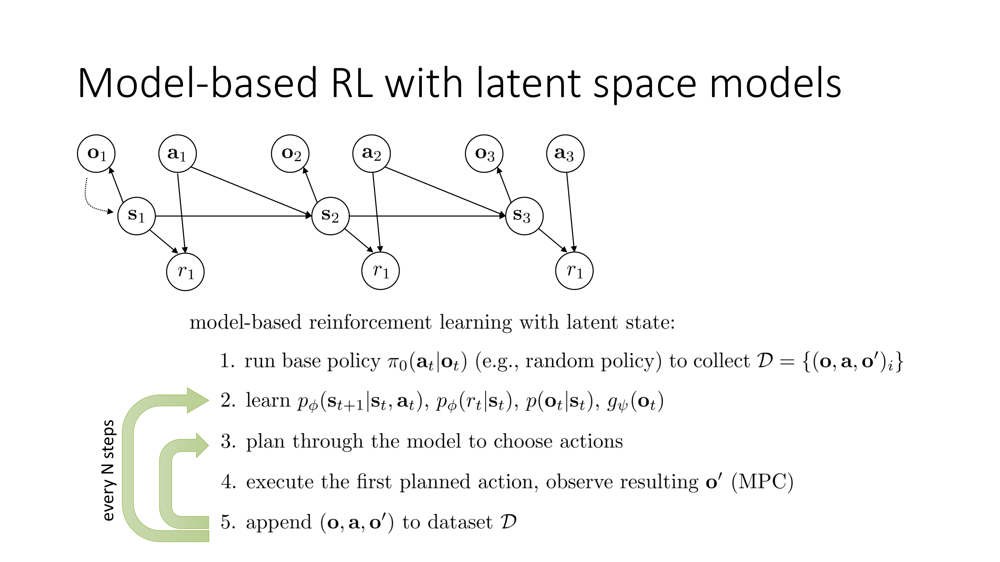

Okay.

So how do we use this in an actual model-based RL algorithm?

Well, it's actually fairly straightforward you can just substitute this directly into the model-based RL version 1.5 algorithm that I discussed before.

You can run your base policy π_0 to collect the data set of transitions.

Now, these transitions consist of observation, action, and next observation tuples.

Then you train your dynamics, reward model, observation model, and encoder together with back propagation.

Plan through the model to choose actions that maximize the reward.

Execute the first planned action.

And observe the next resulting observation o' append that transition to D and re-plan and that's your inner MPC loop.

And then you have the outer data collection loop where every N steps you collect more data and retrain all of your models.

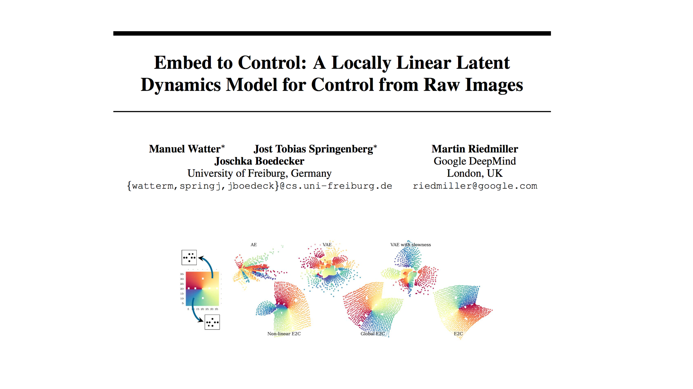

All right.

A few examples of actual algorithms in the literature that have used this trick.

So here is an example by Watter et al. called Embed to Control.

This paper used a stochastic encoder.

But otherwise, the idea is fairly similar.

And then they used LQR to construct their plans through the state-space model.

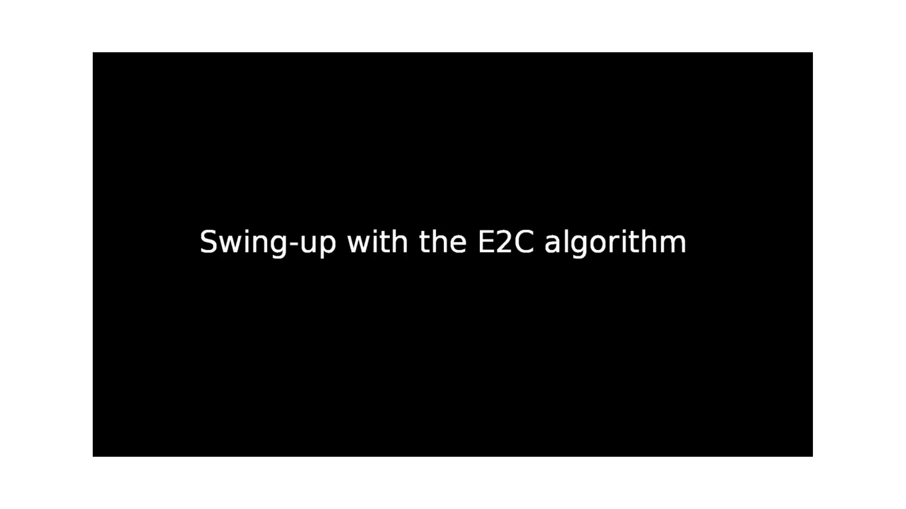

So here's a video.

First, they're showing their state-space.

This is for a kind of a point-mass 2D navigation task where you just have to avoid those six little obstacle locations.

And what they're showing on the right is an embedding of the state-space learned by their model.

And you can see that it kind of has a 2D decomposition that reflects the 2D structure on the task, even though the observations are images.

Here is an inverted pendulum task where they're training on images from the inverted pendulum.

And you can see that the state-space model has this kind of cool 3D structure reflecting the cyclical nature of the pendulum task.

Here is the actual algorithm in action for pendulum swing-up.

So on the right, they're showing basically one-step predictions from their model.

And on the left, they're showing the real image.

And you can see that it's kind of fuzzy but has some reasonable idea of what's going on.

Here is another task which is Cartpole balancing.

So here again you can see the images on the right are a little fuzzier but they generally have a similar rough idea.

And here is a simple reaching task with a three-link muscular arm and it's trying to reach a particular goal image.

So you can see that it kind of reaches out and more or less goes to the right goal image.

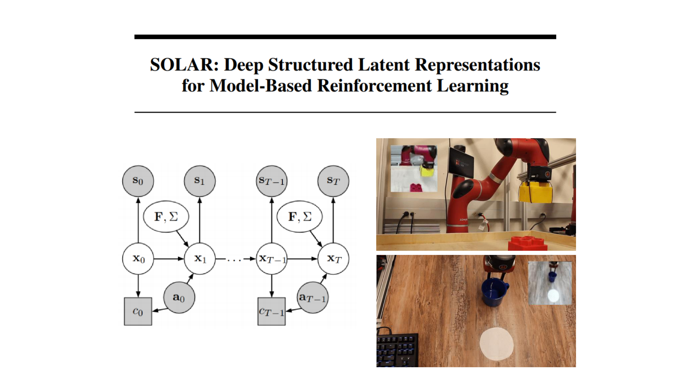

All right, here's a more recent paper that builds on these ideas to develop a more sophisticated state-space model.

So here the state-space model actually is regularized to be locally linear which makes it well suited for iterative linearization algorithms like iterative LQR.

And this method is tested on some robotics tasks.

This was actually done by a student who was an undergraduate here at Berkeley at the time.

And here the observations that the robot are seeing are shown in the top left corner.

And then it's using LQR with this learned state-space model to put the Lego block on the other Lego block.

And here's another example of a task where the robot has to use images to push this cup to the desired location.

And Laura here, who is one of the authors on this paper, is in real time giving the robot rewards to supervise this reward model by hitting that button on the keyboard.

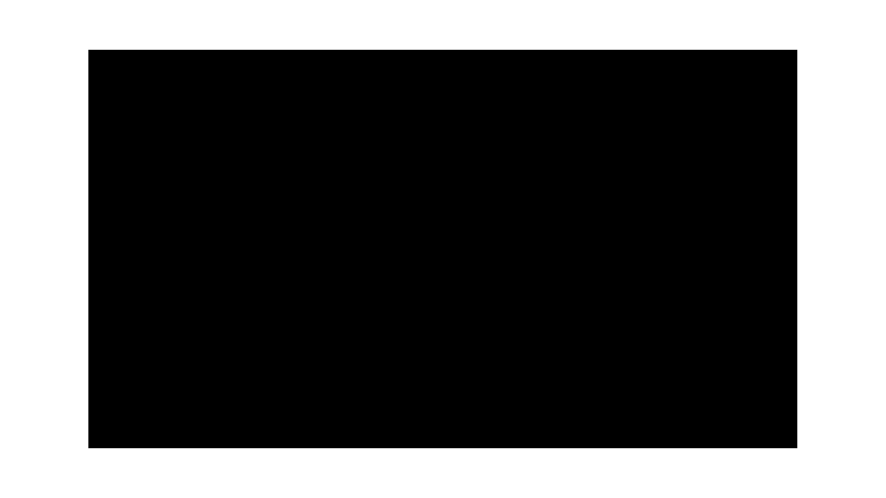

All right.

So here's a little bit more of an illustration.

This is essentially running π_0.

This is the initial random data collection.

From here on out, the model will be trained and then will be used for testing in different positions.

So here are some tasks where the object starts in different locations.

So here you can see on the left is the encoder and decoder, so this is basically evaluating the observation model.

And you can see the observation model reconstructs the images fairly accurately.

And on the right is what the robot is actually doing.

And this is after about 20 minutes of training.

So these kinds of algorithms tend to be quite a bit more efficient than model-free algorithms that we discussed before.

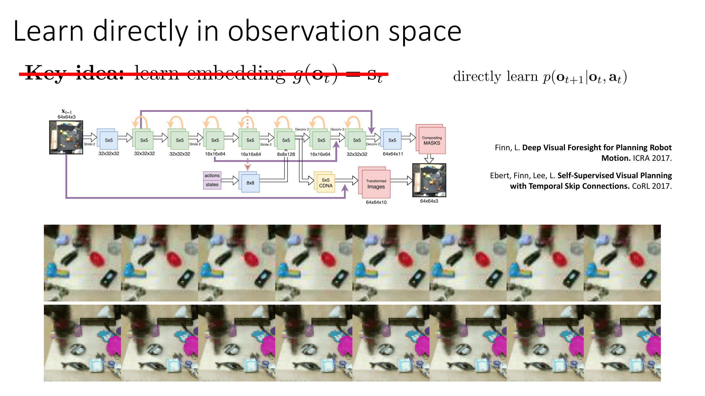

Okay.

Now, so far, we've talked about algorithms that learn a latent state-space model.

They learn some sort of encoder with an embedding g(o_t) = s_t.

What if we dispense with the embedding altogether and actually go back to the original recipe and model-based RL, but in observation space?

So what if we directly learn p(o_{t+1}|o_t,a_t)?

If we have partial observability, then we probably need to use a recurrent model.

So we need to make o_{t+1} also depend on old observations.

But as long as we do this, we can actually do a pretty decent job of modeling dynamics directly in image space.

And there's been a fair bit of work doing this.

This is an example, actually, from a somewhat older paper now, three years ago, showing a robotic arm.

And each column shows a different action starting from the same point.

So you can see that for different actions, the arm moves left, right, up, and down.

And when it contacts objects, it pushes those objects.

These kinds of methods can work fairly well in more complex settings where learning a compact latent space is very difficult.

So if you have dozens of objects in the scene, it's not actually clear how to build a compact state-space for them.

But predicting directly an image space can actually work very well.

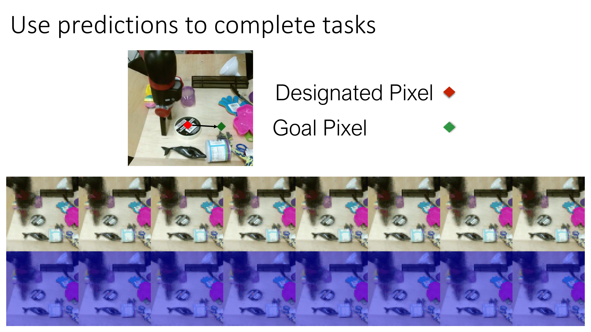

And then you could direct the robot to do a particular thing by, for example, telling it this particular point in the image, move it to this location.

And then it figures out actions that lead to that outcome.

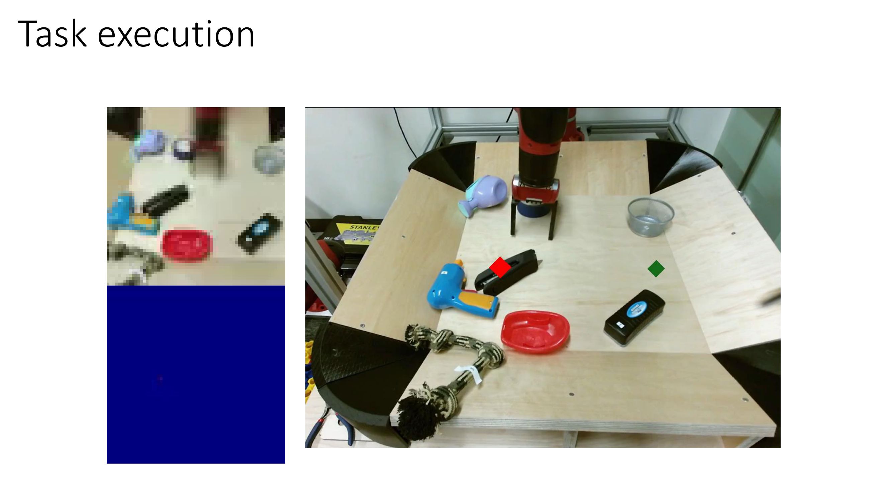

And you can do things like reach out and grab a stapler.

So here is the animation of what the model thinks is going to happen.

And when it actually goes and does it, it reaches out, puts the hand on the stapler, and then pushes it to the desired location.