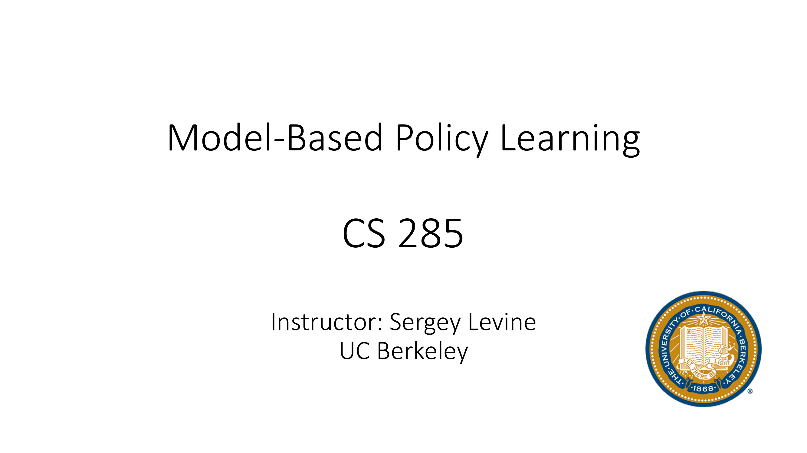
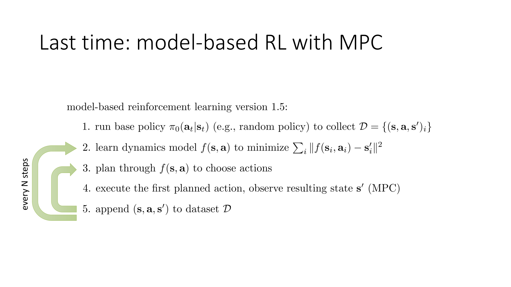
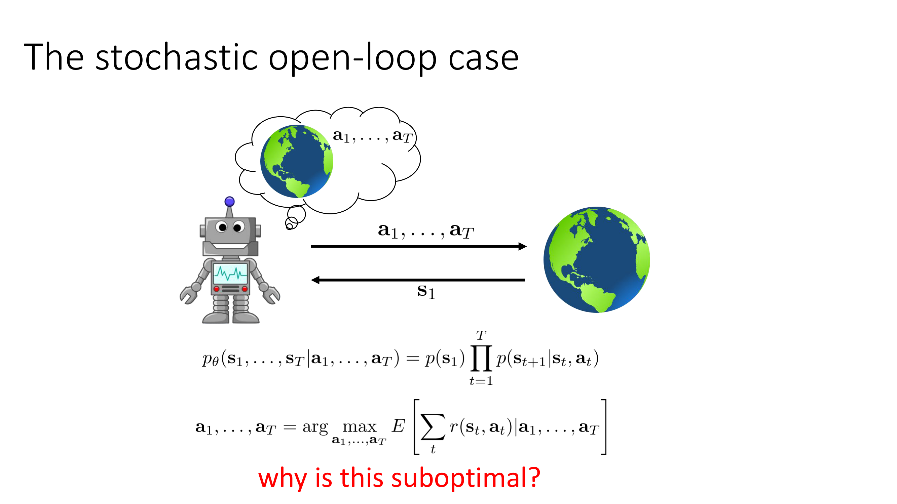
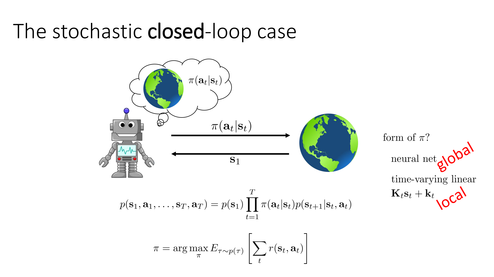
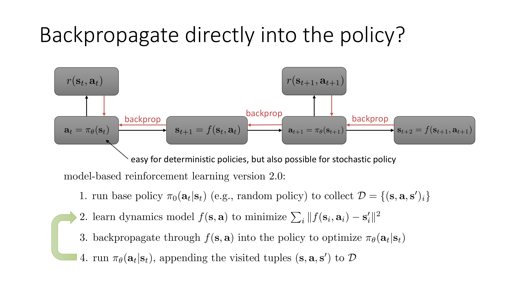
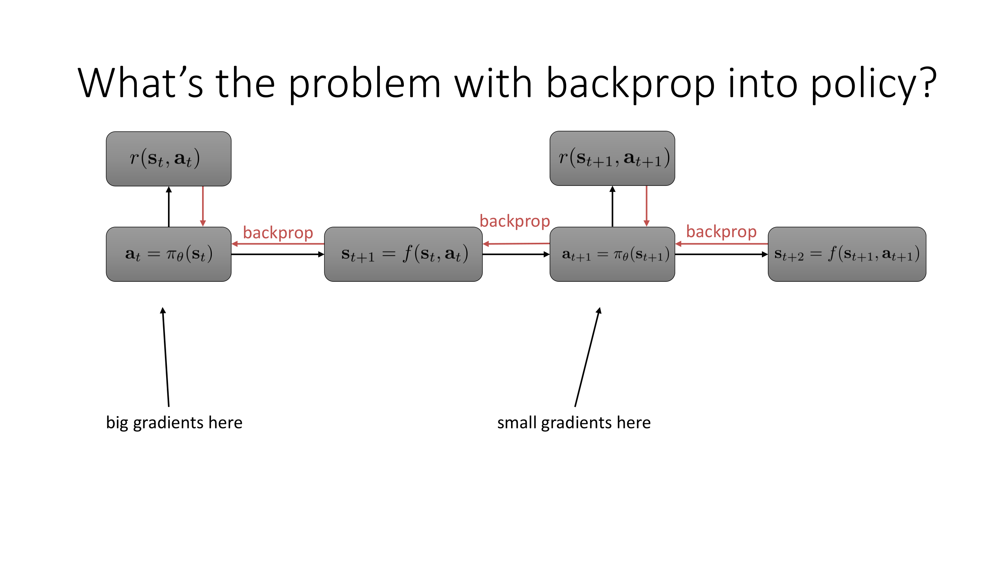
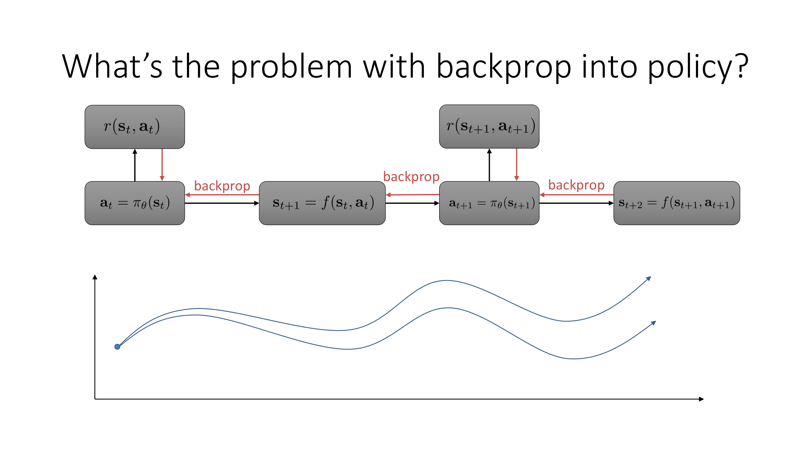
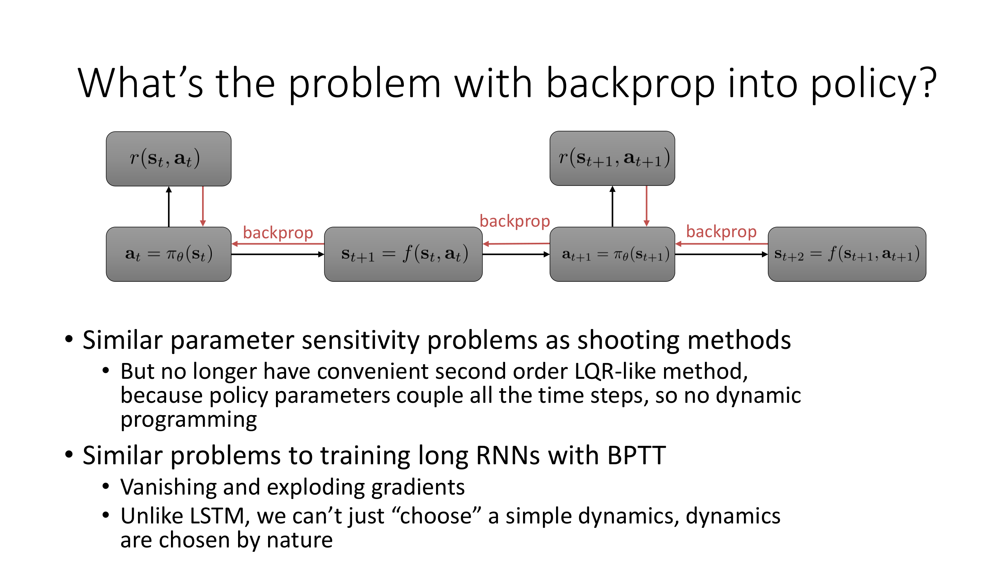
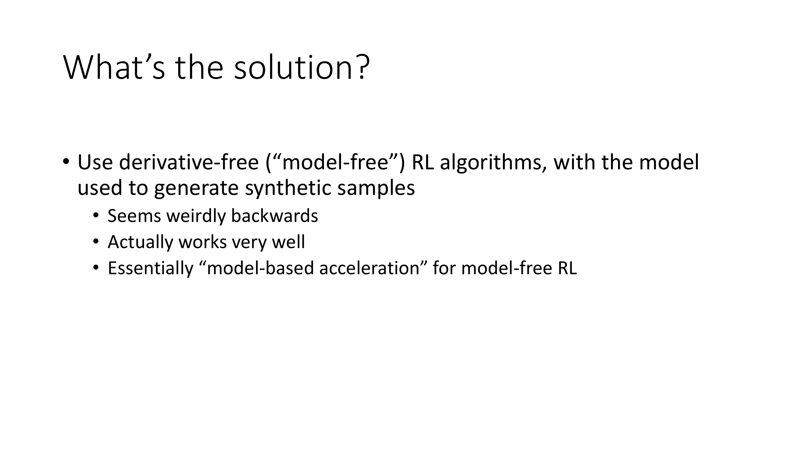

Hi, welcome to lecture 12 of CS285.

Today we're going to talk about model-based reinforcement learning for learning policies.

So at the conclusion of the previous lecture, the final model-based RL algorithm that we concluded on was a model-based RL method with model predictive control.

So I dubbed this model-based RL version 1.5, that's of course not what it's actually called but that's just the name that I was using for it.

The way it works is you first collect some data using some initial policy like random policy, then you train a dynamics model, then you plan through this model to choose actions using one of the variety of planning methods that we discussed, execute the first action that was planned, then observe the resulting state, append that transition to the buffer, and then plan again.

So every single time step you're replanning through the model which of course as we discussed helps compensate for model errors, and then every so many steps you would retrain the model with the additional data that you've collected.

Oftentimes this N is some multiple of the horizon so you would retrain the model after every few trajectories but you could also do it continuously.

So the convenience with methods like this is that they can essentially use many of those optimal control planning of trajectory optimization procedures as a kind of subroutine, but they have some shortcomings.

So the biggest shortcoming of course is that most of the planning methods that we talked about, especially the simplest ones like random shooting and cross-entropy method, are open loop methods, meaning that they are going to optimize for the expected reward given a sequence of actions.

As we discussed before, open loop control is suboptimal.

So if you want to think about an example that illustrates why it's suboptimal, the example that I gave last week was this example of the math test.

So if I tell you that I'm going to give you a math test, a very simple one, just add two one-digit numbers, and you get a choice.

You have two time steps.

On the first time step you can either accept the test or go home and on the second time step you have to look at the test and produce an answer.

If you produce the right answer you get two thousand dollars.

If you produce the wrong answer you lose one thousand dollars and if you go home then you get nothing.

If you have an open loop strategy that means that on that very first time step before even seeing the test you have to commit to an answer.

You have to actually commit to both actions.

So any optimal planner in this case would actually choose not to take the test.

because the probability of guessing the answer randomly before seeing the exam is very low.

Model predictive control doesn't actually solve this, because although model predictive control replans every time step, each time step it is still planning an open loop.

So if it ever enters the state where it's presented with a math test, it'll produce the right answer, but it will not choose to enter that state, because it doesn't realize it'll get the opportunity to replan.

And this is actually very important.

This is part of what makes these control algorithms relatively simple, but it's also one of their biggest downsides.

So to overcome this, we really need to move towards the closed loop case, where instead of committing to a sequence of actions, we commit to a policy.

So in the closed loop case, the agent observes a state, and then produces a policy that will be followed thereafter.

And the objective for that is much closer to the original reinforcement learning problem.

The difference, of course, with the model-based RL setting is that we will model p(s_{t+1}|s_t,a_t) explicitly, which might potentially give us some other ways of addressing this problem.

But the objective is exactly the same as in regular RL.

It's to produce a policy that will choose actions for whatever state you might find yourself in.

And this kind of approach, if we're able to develop an effective closed-loop control algorithm, would address the math test problem, because it would be able to optimize a policy that gives the right answer for every possible observed state of the math test.

And therefore, it will realize that it can safely take the test and then produce the right answer, even though it doesn't know what the answer is until the test has been observed.

Now, of course, in reality, there's a choice to be made, which is the form of π.

So when we talked about model-free RL before, we generally discussed π represented by highly expressive function approximators like neural networks.

And these give us global policies that will produce decent actions everywhere, or at least everywhere that they were trained.

When we discussed optimal control methods last week, we also talked about some methods that can give closed-loop controllers, but that are only locally good.

For example, iterative LQR doesn't just produce a sequence of actions, it will actually produce a linear feedback controller, and that linear feedback controller will give you good actions in a local neighborhood around the open-loop plan that you've produced.

So, this is kind of an in-between where it is technically closed-loop, but it's not a globally effective closed-loop strategy, so it's only going to be effective if you deviate a little bit from your initial plan.

So, in today's lecture, we're really going to focus on methods that we can use to train global policies like neural networks, but leveraging learned models, and thereby getting us full policy-based model-based RL methods.

So, let's start with a little strawman example.

If we didn't know anything about reinforcement learning, if we just missed the entire first part of this course, and we tried to set up this problem, where we have learned models, and we want to learn a policy that maximizes reward, and we just wanted to bring to bear the tools that we know and love from deep learning, essentially the tools of backpropagation and continuous optimization.

How might we do this?

Well, what we might do is we might set up a computation graph.

We have an optimization problem, which is to maximize the total reward.

In deep learning, we know how to solve optimization problems, we implement them with automatic differentiation software, compute gradients, and then do gradient descent or gradient ascent.

So, our objective is the sum of rewards.

So, let's set up a computation graph that allows us to compute the sum of rewards for a given policy.

So, in this computation graph, there are basically three types of functions.

There are policies, which look at states and produce actions.

There are dynamics, which look at states and actions and produce the next state.

And there are rewards that look at states and actions and produce a scalar value.

So, this is basically the computation graph.

If you assume that the reward is a known function, maybe something that you can also compute derivatives for, and f is a learned model, so that's a neural net, and π is a learned model, that's also a neural net, this is a perfectly valid computation graph that you could set up.

You could actually implement this in pytorch.

You could implement a loss, which is the negative of the sum of all the rewards, and you can call dot gradients on it.

I'm kind of sweeping under the rug all the details about stochasticity, so this is only for deterministic systems.

But even for stochastic systems, for certain kinds of stochastic models, you can still do this.

For example, if you have Gaussian models, you can use something called the reparameterization trick, which we will talk about later in this course, to set up computation graphs like this that are continuously differentiable, even if you have Gaussian noise being added to both the policy and the model.

But for now, let's just think about the deterministic case, so everything here can be implemented.

You can call dot gradients on it, and it will actually give you the gradient of the reinforcement learning objective, at least for the stochastic case.

So the question is, will this work?

If you actually set this up, will you be able to optimize π_θ?

So will you be able to actually run back propagation from each of those reward nodes into all of the θs, the parameters of those π_θ nodes, and actually optimize your policy to yield a larger and larger reward?

In general, the answer is no.

So let me just walk through this, I'm going to call this Model-Based RL Version 2.0, let me just make it very explicit what this algorithm is, and then I'll explain why, in general, this doesn't really work.

So just like before, you would start off by running some base policy to collect the dataset, train a dynamics model on it, and then you would build this computation graph that I've drawn here, or something like it, back propagate through your dynamics into the policy to optimize the policy parameters, and then run the policy appending the visited data to the dataset, and then retrain.

So this is a very reasonable way to extend the Model-Based RL Methods we've seen before, to now have learned policies instead of planning.

So what's the problem with this?

Well, I would encourage each of you to pause the video now and think about what the problem might be, why this recipe might go wrong, and as a hint, the reason that this doesn't work is not because it's incorrect, necessarily, it doesn't work for the same reason that many other kinds of neural networks that have this kind of temporal structure in other fields of deep learning tend to fail if implemented naively.

So that's a little hint, maybe consider pausing the video and thinking a little bit about what might be wrong with this recipe.

Okay, so the issue is basically something like this.

Just like in trajectory optimization, when we talked about shooting methods, we discussed how the actions earlier on in the trajectory have compounding effects much later in the future, whereas the actions at the end have relative ability to have little effects.

So you have really big gradients with respect to the actions at the beginning and therefore big gradients with respect to the policy parameters compared with smaller gradients at the end.

And those of you that are familiar with numerical optimization will probably recognize at this point that if you have a situation where some of the variables get hit with really big gradients, some get hit with really small gradients, you're typically in a situation where something is very ill-conditioned.

And that's in fact what happens here.

So visually, you can think of it like this, that a small change to that action at the beginning will wiggle the rest of this trajectory in pretty drastic ways.

And the problem is similar to the parameter sensitivity that we get with shooting methods in trajectory optimization, except that it's no longer convenient to use second-order methods like LQR.

So when we learned about trajectory optimization and shooting methods, we talked about this LQR method, which looks a little bit like Newton's method.

It actually computes quantities that look like second derivatives and actually provide a much better behaved optimization process.

Again, those of you that are familiar with numerical optimization will probably recognize what I'm saying now, that if you have an ill-conditioned problem, meaning something where the Hessian has very high curvature, you would probably want to use a second-order method and it would improve significantly over a first-order method.

That's more or less the same thing that's happening here.

However, with trajectory optimization and shooting methods, using second-order techniques was very convenient, because  we never had to build a giant hessian we could just use this dynamic programming procedure to compute the what was essentially a Hessian vector product very efficiently using LQR.

That option is no longer available to us when we're optimizing policies, because the policy parameters couple all the time steps together.

So you no longer have this convenient optimization procedure that can start at the end and work its way backwards.

It is possible to implement second-order optimizers in general for these kinds of problems, and they will work better than first-order optimizers, but they no longer benefit from the convenient temporal structure in the problem, and tend to be fairly difficult to use.

They're especially difficult to use with neural nets, because second-order optimizers for neural nets tend to be kind of flaky and difficult to set up.

So it's not impossible, but it doesn't tend to work very well.

From more of a deep learning perspective, the problems are actually very similar to what you get when you try to train recurrent neural networks naively with back propagation through time.

So those of you that are familiar with RNN training will probably recognize a lot of what I'm saying, that if we set up a recurrent neural network naively, without using fancy architectures like LSTMs or transformers, then we get these problems with vanishing and exploding gradients, because the derivatives of the later rewards with respect to the earlier policy parameters involve the product of many, many Jacobians.

And unless those Jacobians have eigenvalues that are close to 1, then the gradients will either explode or vanish.

So if the eigenvalues tend to be larger than 1, they'll explode.

If they tend to be smaller than 1, they'll vanish.

Very similar to the problem that you get when training recurrent neural networks.

Now, at this point of course you might wonder if these are similar to the problems that we get when training recurrent neural networks, can we use similar solutions?

For example, could we use something like an LSTM model?

The problem here is that in an RNN, you essentially get to choose the dynamics.

Whereas here, we don't get to choose the dynamics ourselves.

So we have to really train f to be as close as possible to the real dynamics, otherwise we won't get policies that will actually end up working in the real system.

So, with an LSTM, we could choose a form for those functions that participate in the backpropagation through time, so that for example, their derivatives have eigenvalues close to 1, maybe their derivatives are dominated by an identity matrix, that's more or less what an LSTM provides you with.

But that's not really an option when you're doing model-based RL, because you don't get to use any dynamics you want.

You really need f to match the real dynamics, which might have high curvature, and it might have Hessians with eigenvalues that are very far from 1.

So since you don't get to choose f, you can't really use most of the solutions that have been developed in the deep learning world, because most of those solutions have to do with essentially changing the function to make it an easier function to differentiate.

So, we're actually in a bit of trouble here.

While it's certainly plausible that future innovations for model-based RL will make it easier to push gradients through long temporal chains like this, at the moment, differentiating through long chains consisting of learned dynamics, and learned policies, tends to behave very poorly.

And for this reason, gradient-based optimization with model-based RL for policies is kind of a very tricky proposition.

So what's the solution?

Well, most of what we're going to discuss in today's lecture actually has to do, perhaps surprisingly, with using derivative free RL algorithms with models that are going to be used to generate synthetic samples.

This might seem weirdly backwards.

Like essentially what this means is, if you're going to learn a model, don't actually make use of the fact that the model is known or has known derivatives.

Instead, pretend that the model is essentially a simulator of the environment, and use it to simulate a lot more data to speed up model-free RL.

It might seem strange that that's kind of the best that we've got, but it actually is often the best that we can do, and it actually tends to work very well.

Now, in reality, we can of course hybridize to some degree between model-free training and some amount of planning, but just using models to simulate experience for model-free RL can be very effective.

It's essentially a kind of model-based acceleration for model-free RL.

So the underlying RL methods will be virtually identical to the ones that we talked about before.

There'll be policy gradient methods, actor critic methods, Q-learning methods, and so on, but they'll just get additional data generated by a learned model.

So that's what we'll talk about in the next section.