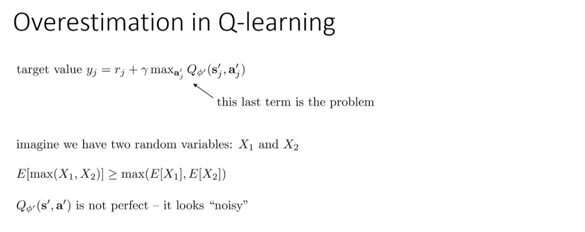
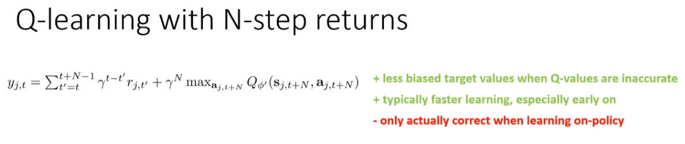
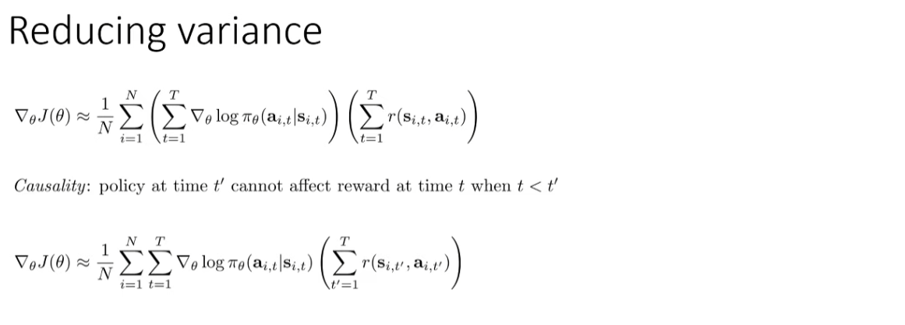
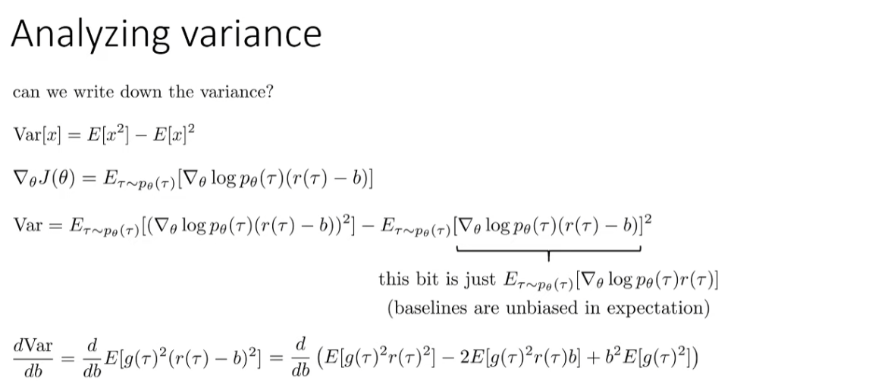
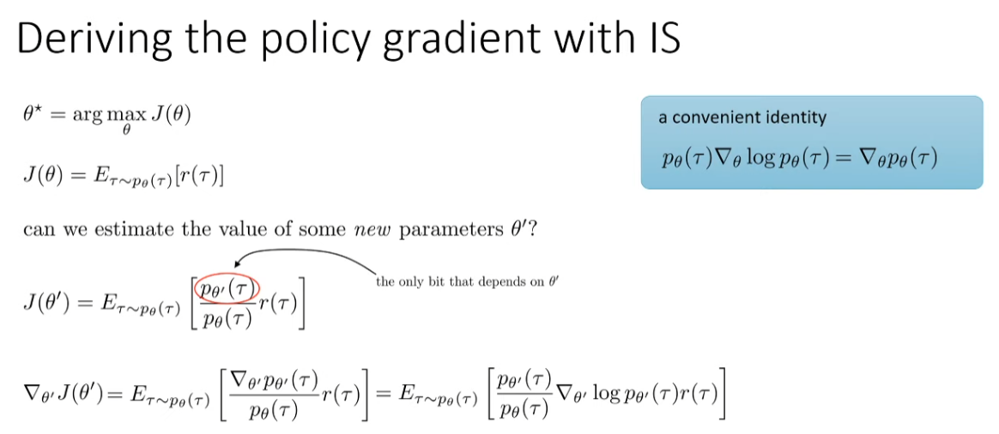
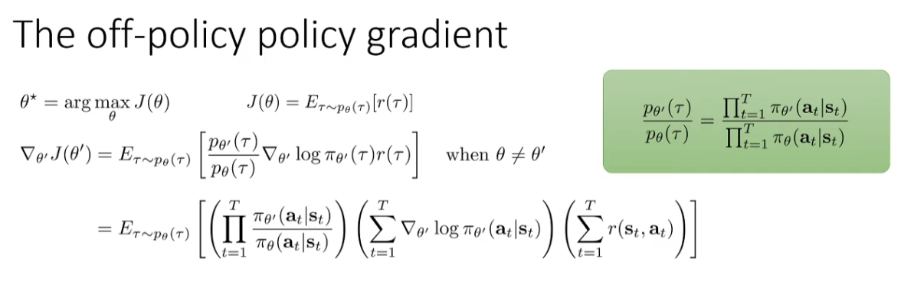
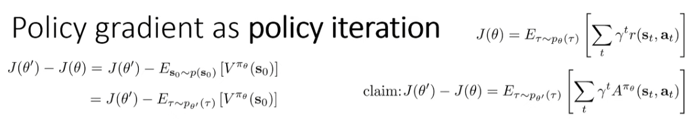
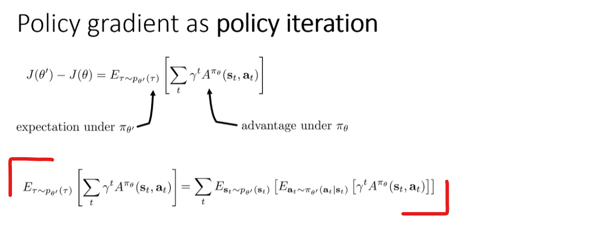

Compilation and automatic differentiation can be composed arbitrarily, so you can express sophisticated algorithms and get maximal performance without having to leave Python.

컴파일과 자동 미분은 임의로 구성될 수 있어, 복잡한 알고리즘을 표현하고 파이썬을 벗어나지 않고도 최대 성능을 얻을 수 있습니다.

sophisticated : 정교한, 복잡한

The code blocks are identical aside from replacing np with jnp, and the results are the same. As we can see, JAX arrays can often be used directly in place of NumPy arrays for things like plotting.

코드 블록은 np를 jnp로 바꾼 것을 제외하고는 동일하며, 결과도 같습니다. 보다시피, JAX 배열은 종종 그래프를 그리는 것과 같은 용도로 NumPy 배열 대신 직접 사용될 수 있습니다.

aside from : apart from :  …외에는, …을 제외하고

After you break that block, you bounce back down, and your value dips, because you know that you're not going to get any points for a little while, while your ball flies down and needs to get bounced from the paddle.

그 블록을 깨고 나면, 공이 다시 아래로 튕겨져 내려가면서 점수가 감소합니다. 왜냐하면 공이 아래로 날아가 패들에 튕겨져야 할 때까지는 당분간 점수를 얻지 못할 것이라는 것을 알기 때문입니다.

This is not a fluke.

이것은 우연이 아닙니다.

Well, if you imagine that your Q-function is not perfect, if you imagine that your Q-function kind of looks like the true Q-function, plus some noise, then when you take this max and the target value, you're doing exactly this.

만약 여러분의 Q-function이 완벽하지 않다고 상상한다면, 실제 Q-function에 어떤 잡음이 더해진 것처럼 보인다고 상상해 보세요. 그런 다음 이 최대값과 target value를 취할 때, 여러분은 정확히 이러한 행위를 하고 있는 것입니다.

Well, one way that we can think about fixing this is to note, if we think back to the fitted Q-iteration, the way that we got this max was by basically modifying the policy iteration procedure.

우리가 이 문제를 해결할 수 있는 한 가지 방법은, fitted Q-iteration을 되돌아보고, 우리가 이 최대값을 얻은 방식이 기본적으로 policy iteration 절차를 수정한 것임을 주목하는 것입니다.

So if Q_{ϕ'} erroneously thinks that some action is a little bit better because of some noise, then that's the action we'll select, and then the value that we'll use for our target value is the value for that same action, which has that same noise.

따라서 만약 Q_{ϕ'}가 어떤 잡음 때문에 어떤 행동이 조금 더 좋다고 잘못 판단한다면, 그것이 우리가 선택할 행동이 될 것이고, 그런 다음 우리가 목표 값으로 사용할 값은 그 같은 잡음을 가진 같은 행동의 값이 될 것입니다.

So the system will be kind of self-correcting.

그래서 시스템은 어느 정도 자가 수정될 수 있습니다.

kind of : 약간, 어느 정도

So the reason for this is that if you have a sample collected with a different policy, then that second step, t+1, might actually be different for your new policy, right?

그 이유는 다른 정책으로 수집한 샘플이 있다면 두 번째 단계인 t+1은 실제로 새 정책에 따라 달라질 수 있기 때문입니다.

Your Q function is conditioned on action, so that'll be valid for any policy, and your second time step, where this would matter, in the second time step you actually take the max with respect to action, you don't use the action that was actually sampled.

여러분의 Q function은 action에 따라 조건이 붙기 때문에, 이는 어떤 policy에도 유효합니다. 그리고 이것이 중요한 두 번째 time step에서, 실제로 샘플된 action을 사용하지 않고, action에 대해 최대값을 취합니다.

So, in some sense, it presents a slightly easier optimization problem than the kind of problems we typically take on with SGD.

따라서 어느 정도로는, SGD로 일반적으로 다루는 문제들보다 약간 더 쉬운 최적화 문제를 제시합니다.

But then, instead of simply taking the best one, cross-entropy method refines the distribution from which you sample to then sample more samples in the good regions and then repeat.

하지만 교차 엔트로피 방법은 단순히 가장 좋은 것을 취하는 대신 샘플링하는 분포를 세분화하여 좋은 영역에서 더 많은 샘플을 추출한 다음 반복합니다.

This is going to be a little bit similar to option one, only instead of running the optimization separately for every single argmax that we have to take, we'll actually train a second neural network to perform the maximization.

이 방법은 첫 번째 옵션과 약간 비슷할 것입니다. 하지만 우리가 수행해야 할 모든 argmax에 대해 최적화를 별도로 실행하는 대신, 실제로 최대화를 수행하기 위한 두 번째 신경망을 훈련할 것입니다.

Q-learning methods are generally quite a bit more finicky to use than policy gradient methods, so they tend to require a little bit more care to use correctly.

Q-learning 방법은 일반적으로 policy gradient 방법보다 사용하기가 더 까다롭기 때문에, 올바르게 사용하기 위해 좀 더 세심한 주의가 필요합니다. * finicky : 지나치게 까다로운, 세심한 주의를 요하는

For Breakout, it kind of goes up and then wiggles a whole bunch.

Breakout의 경우, 점수가 상승한 후에 많이 변동합니다. * wiggle : 씰룩씰룩[꼼지락꼼지락/꿈틀꿈틀] 움직이다

And at that point, the algorithm really starts looking a lot more like fitted Q iteration, which is perhaps part of the explanation for its improved stability.

그 시점에서 알고리즘은 fitted Q iteration과 매우 유사해 보이기 시작하며, 이는 그것의 향상된 안정성을 설명하는 데 일부 기여할 수 있습니다.

So far away from the minimum, the Huber loss looks like absolute value, and close to the minimum, because absolute value is a non-differentiable cusp, the Huber loss actually flattens it out with a quadratic.

최소값에서 멀리 떨어져 있을 때, Huber 손실은 절대값과 유사하게 보이고, 최소값에 가까울 때는 절대값이 미분 불가능한 cusp를 가지므로, Huber 손실은 이를 quadratic으로 평탄화합니다. * cusp : (두 곡선이 만나는 뾰족한) 끝

You'll see that the algorithm is very inconsistent between runs, so you should run a few different random seeds to make sure that things are really working the way you expect, and that you didn't get a fluke, and the fluke can either be unusually bad or unusually good.

알고리즘이 실행 간에 매우 일관성이 없음을 알게 될 것입니다. 따라서 몇 가지 무작위 시드를 실행하여 실제로 예상대로 작동하는지, 그리고 fluke가 발생하지 않았는지, fluke는 비정상적으로 나쁘거나 비정상적으로 좋을 수 있습니다. * fluke : 요행(수)

So to improve the objective, we need to come up with a way to estimate its derivative.
그래서 목표를 개선하기 위해서는 그것의 도함수를 추정하는 방법을 찾아내야 합니다. 

* come up with : …을 생산하다, 제시[제안]하다. (해답·돈 등을) 찾아내다[내놓다]

So I'll collect some of the terms and use slightly more concise notation to make this a little clearer so you can equivalently write it as ∇log π_θ(τ) r(τ) where this ∇log π_θ(τ) is just the sum over the individual ∇log π_θ.

따라서 몇몇 용어를 수집하고 조금 더 간결한 표기법을 사용하여 이것을 좀 더 명확하게 설명하겠습니다. 이를 ∇log π_θ(τ) r(τ)로 동등하게 표현할 수 있는데, 여기서 이 ∇log π_θ(τ)는 개별 ∇log π_θ의 합입니다.

As a reminder the markov property simply says that future states are conditionally independent of past states given present states.

마르코프 성질은 간단히 말해서 미래 상태는 현재 상태가 주어진 조건에서 과거 상태와 독립적이라고 말합니다.

So depending on which samples you end up with, randomly, you might end up with very different values of the policy gradient for any finite sample size.

따라서 임의로 어떤 표본이 나오느냐에 따라 finite sample size에 대한 policy gradient 값이 매우 다를 수 있습니다.

* end up with : 결국 ~하게 되다

And a lot of advances in policy gradient algorithms basically revolve around different ways to reduce their variance.

그리고 policy gradient 알고리즘의 많은 발전은 기본적으로 분산을 줄이기 위한 다양한 방법을 중심으로 이루어집니다.

* revolve around : ~을 중심으로 다루다

By ensuring that your reward sums are finite by putting a discount in front of them, you're also reducing variance at the cost of introducing bias by not accounting for all those rewards in the future.

그들 앞에 할인을 제공함으로써 보상 합계가 유한한 것을 보장함으로써, 미래의 모든 보상을 고려하지 않음으로써 편향 을 도입하는 비용으로 분산을 줄일 수도 있습니다.

If we can somehow get away with using transitions that were generated by much older actors, then maybe we don't even need multiple threads.

만약 우리가 훨씬 오래된 actor들에 의해 생성된 transition을 어떻게든 사용할 수 있다면, 우리는 여러 스레드가 필요하지 않을 수도 있습니다. * get away with : …을 잘 해내다

And what I've done here is I used the distributive property to distribute the sum over rewards into the sum over ∇log π. So you can think of this as taking that first set of parentheses over the sum of ∇log π's and taking the outer parentheses and wrapping it around the rewards.

여기서 저는 분배 법칙을 사용하여 보상에 대한 합을 ∇log π에 대한 합으로 분배했습니다. 따라서 이것을 ∇log π의 합에 대한 첫 번째 괄호를 취하고 외부 괄호를 사용하여 보상을 감싸는 것으로 생각할 수 있습니다.

The proof is somewhat involved so I won't go through it here, but once we show that this is true, then we can simply change the summation of rewards and instead of summing from t'=1 to T, simply sum from t'=t to T.

* involved : 관여하는, 복잡한

And in many cases when we just need a quick and dirty baseline we'll use average reward.

그리고 우리가 단지 빠르고 간단한 baseline이 필요한 많은 경우에는 평균 보상을 사용할 것입니다. * quick and dirty : 약식으로 간단히 한[빠르고 간편한]

So all I've done here is I've just expanded out the quadratic form (r - b)^2, distributed the g^2 into it, and then pulled constants out of expectations.

여기서 제가 한 일은 단지 이차형식 (r - b)^2를 풀어내고, g^2를 그 안에 분배한 다음, 기대값에서 상수를 끄집어낸 것입니다.

Now when you look at this equation, you'll probably immediately recognize it as exactly the equation that we get if we took the policy gradient and just stuck in an importance weight.

이 방정식을 볼 때, 여러분은 아마도 이것이 바로 policy gradient를 취하고 중요도 가중치를 넣은 정확히 그 방정식임을 즉시 알아차릴 것입니다.

And if we substituted in all three now the terms in this policy gradient, the importance weights are product overall time steps of π_{θ'}/π_θ.

이제 이 policy gradient의 세 가지 조건을 모두 대입하면 importance weight는 π_{θ'}/π_θ의 전체 time step의 곱입니다.

And the reason we're doing all this is because we really just want an excuse to delete that term.

그리고 우리가 이 모든 일을 하는 이유는 그 용어를 삭제할 구실이 필요하기 때문입니다. * excuse : 변명, 이유, 구실, 핑계 거리

And don't be concerned if you have to go through it a couple of times to really get the full gist of it.

이해를 완전히 하기 위해 몇 번이고 강의를 다시 듣는다 해도 걱정하지 마세요. * gist : (말·글·대화의) 요지[골자]

Why is it that we can count on policy gradient to improve our policy?

* count on : 기대하다

But conceptually, we can think of a more general way of looking at policy gradient, where we have one step, which is to estimate the approximate advantage for state action tuples for our current policy π.

하지만 개념적으로, 우리는 policy gradient를 좀 더 일반적으로 바라볼 수 있는데, 이는 우리의 현재 policy π에 대한 state action 튜플의 근사적인 advantage를 추정하는 한 단계를 포함합니다.

And that might be desirable if you think that your advantage estimator is not perfect.

* desirable : 바람직한, 호감 가는, 가치 있는

So, in a sense, what we're going to discuss today is how to formalize this notion and explain why we should expect this kind of softened policy iteration procedure, which is policy gradients, to work well.

그러므로 오늘 우리가 논의할 것은 이 개념을 어떻게 형식화하고, 왜 우리가 이러한 유연한 정책 반복 절차인 policy gradients가 잘 작동할 것으로 기대해야 하는지 설명하는 방법입니다.

* in a sense : 어떤 뜻으로, 어느 정도

I'm going to show you how we can write this expression, the difference between the RL objective for some new parameter θ' minus the objective for some old parameter, as an expression that describes the expected advantage under the new policy where the advantage is taken from the old policy.

새로운 매개변수 θ'에 대한 강화 학습(RL) 목표와 오래된 매개변수에 대한 목표의 차이를, 오래된 policy에서 얻은 advantage를 사용하여 새로운 policy 하에서의 기대 advantage를 설명하는 표현식으로 작성하는 방법을 보여드리겠습니다.

And I can put in p_{θ'}(τ) here because it has the same initial state marginal and the quantity inside the expectation only depends on s_0. So in a sense, that value doesn't change if I take the expectation with respect to different policies.

여기에 p_{θ'}(τ)를 넣을 수 있는 이유는 그것이 같은 초기 상태 marginal을 가지고 있고, 기대값 안의 양이 오직 s_0에만 의존하기 때문입니다. 따라서 어떤 면에서, 다른 정책에 대한 기대값을 취한다 하더라도 그 값은 변하지 않습니다.

And this equation can be written out as a sum over all of our time steps of the expectation under the state-action marginal, of the advantage of θ'.

이 방정식은 모든 시간 단계에 대해, state-action marginal 하에서 θ'의 이점에 대한 기대값의 합으로 표현될 수 있습니다.