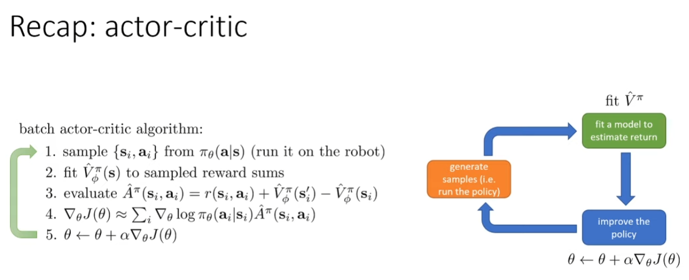

We would fit a value function to those samples, which is a neural network in the previous lecture that mapped states to scalar-valued values.

이전 강의에서 상태를 스칼라 값으로 매핑하는 신경망인 value function을 해당 샘플에 맞추게 됩니다.

And then we would use these estimated advantages to estimate a policy gradient on line 4 using the same policy gradient formula that we learned about in the preceding lecture.

그런 다음 이 추정된 advantages를 사용하여 4번 줄에서 이전 강의에서 배운 같은 policy gradient 공식을 사용하여 policy gradient를 추정하게 됩니다.

What if we just learn a value function and then try to use that value function to figure out how to act?

만약 우리가 단순히 value function을 학습하고, 그 value function을 사용하여 어떻게 행동할지 결정하려고 시도한다면 어떨까요?

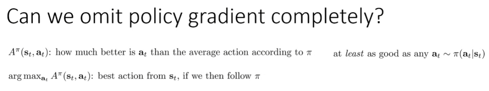

Which means that the argmax with respect to a_t of the advantage is going to be at least as good as an action that we would have sampled from our current policy

이는 a_t에 대한 advantage의 argmax가 우리 현재 policy에서 샘플링했을 행동보다 적어도 그만큼 좋거나 더 좋을 것임을 의미합니다.

So if it's the best action from s_t if we then follow π thereafter, then it's at least as good as whatever action π would have chosen.

따라서 s_t에서 최선의 행동을 취한 후에 π를 따른다면, 그 행동은 적어도 π가 선택했을 어떤 행동만큼은 좋을 것입니다.

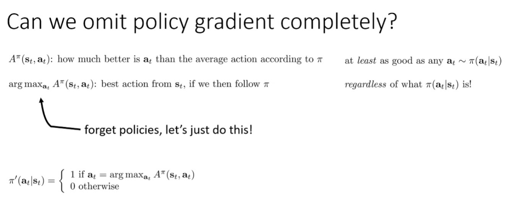

So we will construct new policies implicitly, so at every iteration we can construct a new policy π' that assigns a probability of 1 to the action a_t if it is the argmax of the advantage A^π(s_t,a_t), where A^π is the advantage for the previous implicit policy.

그러므로 우리는 새로운 정책을 암시적으로 구성할 것입니다. 따라서 모든 반복에서, 만약 a_t가 이전 암시적 정책의 advantage인 A^π(s_t,a_t)의 argmax라면, 새로운 정책 π'를 구성하여 a_t 행동에 확률 1을 할당할 수 있습니다.

And then we will of course re-estimate the advantage function for π' and then construct a new policy that's the argmax with respect to that.

그런 다음 우리는 물론 π'에 대한 advantage function을 재평가하고, 그에 따른 argmax를 적용한 새로운 정책을 구성할 것입니다.

So step two is pretty straightforward, if we especially have a discrete action space, computing an argmax is something that is not hard to do by simply checking the advantage value of every possible action.

2단계는 매우 간단합니다. 특히 이산 행동 공간을 가지고 있다면, 가능한 모든 행동의 advantage 값을 단순히 확인함으로써 argmax를 계산하는 것은 어렵지 않습니다.

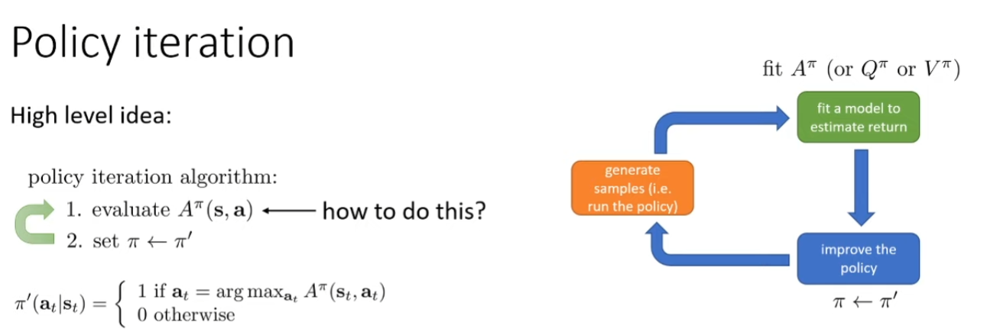

How do you evaluate the advantage A^π for a particular state action tuple for a given previous policy π, which will also be an implicit policy, but we don't care so much about that right now.

어떻게 주어진 이전 정책 π에 대해 특정 상태-행동 튜플의 advantage A^π를 평가할 수 있을까요? 이 정책은 암시적인 정책이기도 하지만, 지금은 그것에 대해 크게 신경 쓸 필요는 없습니다.

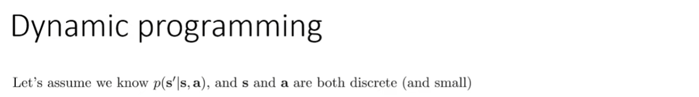

This is not the setting we usually operate in, in model-free RL, but we'll assume that that's our setting for now, just so that we can derive the simple dynamic programming algorithm and then turn it into a model-free algorithm later.

이것은 일반적으로 모델 프리 강화학습에서 운영하는 환경이 아니지만, 우리는 현재 그것이 우리의 환경이라고 가정할 것입니다. 이렇게 함으로써 간단한 동적 프로그래밍 알고리즘을 도출한 다음 나중에 모델 프리 알고리즘으로 전환할 수 있습니다.

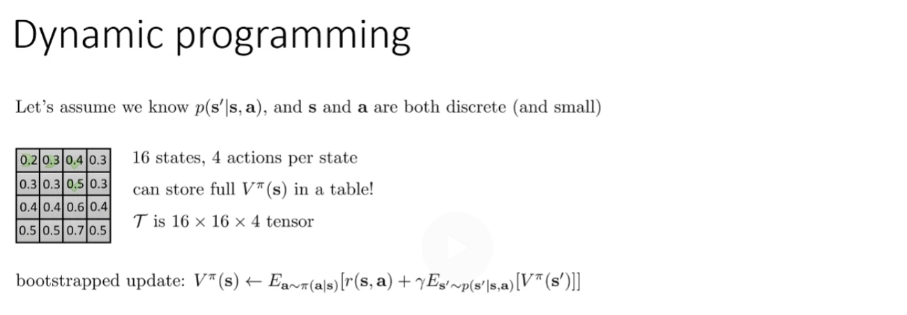

So when we say we're doing tabular reinforcement learning or tabular dynamic programming, what we're really referring to is a setting kind of like this.

따라서 우리가 tabular reinforcement learning이나 tabular dynamic programming을 하고 있다고 말할 때, 우리가 실제로 언급하는 것은 이와 같은 설정입니다.

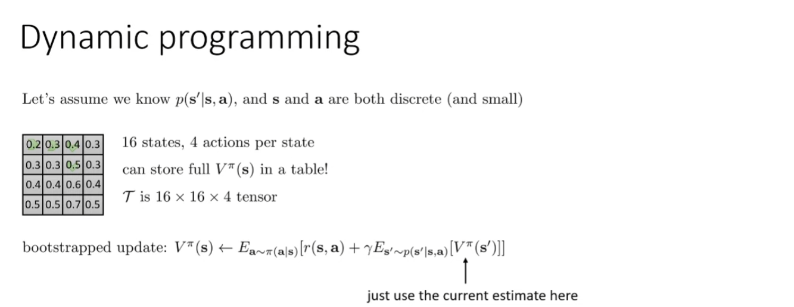

So we're just going to use our current estimate of the value function for that value. We're going to basically take that number from the table.

그러므로 우리는 해당 값에 대해 현재 추정된 value function을 사용할 것입니다. 기본적으로 우리는 그 숫자를 테이블에서 가져올 것입니다.

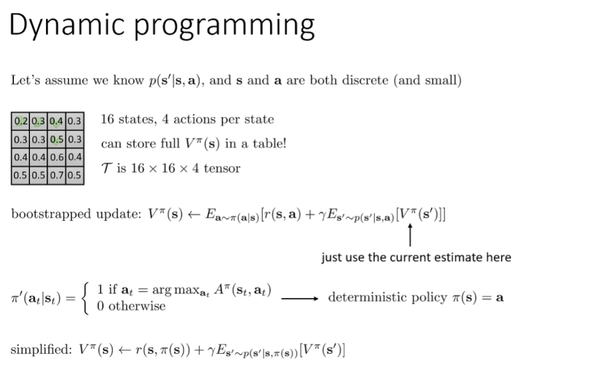

So expected values with respect to this π will be pretty easy to compute.

따라서 이 π에 대한 기대 값은 계산하기가 매우 쉽습니다.

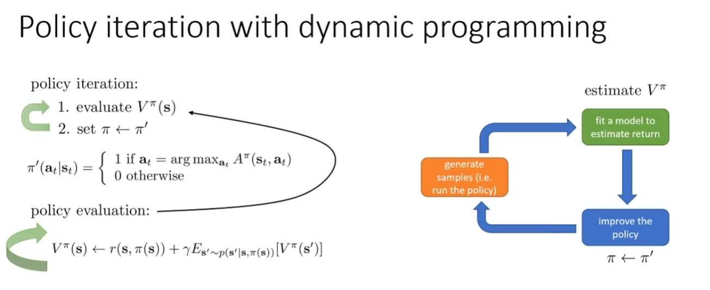

For those of you that are a bit more mathematically inclined, I will also point out that if you write V^π(s) equals r(s,π(s)) plus this expectation, that actually represents a system of linear equations that describe the value function V^π. And the system of linear equations, can then be solved with any linear equation solver.

수학적으로 좀 더 관심이 있는 분들을 위해, V^π(s)가 r(s,π(s))와 이 기대값의 합으로 표현될 때, 이는 사실상 value function V^π를 설명하는 선형 방정식 시스템을 나타낸다는 점을 지적하고 싶습니다. 그리고 이 선형 방정식 시스템은 어떤 선형 방정식 해결기를 사용하여도 풀 수 있습니다.

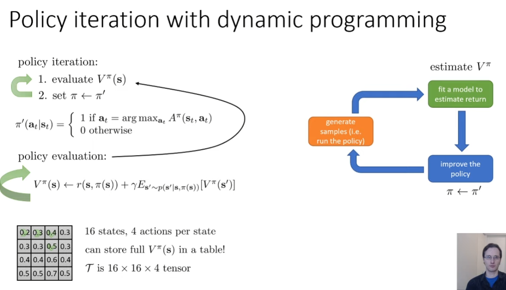

And we perform this in the inner loop of our policy iteration procedure, which simply alternates between policy evaluation and updating the policy to be this argmax policy, where the advantage is obtained from the value function that we found in step 1.

우리는 이 과정을 policy iteration 절차의 inner loop에서 수행합니다. 이 절차는 단순히 policy evaluation과 policy를 argmax policy로 업데이트하는 것을 번갈아 가며 진행합니다. 여기서 advantage는 1단계에서 찾은 value function에서 얻어집니다.

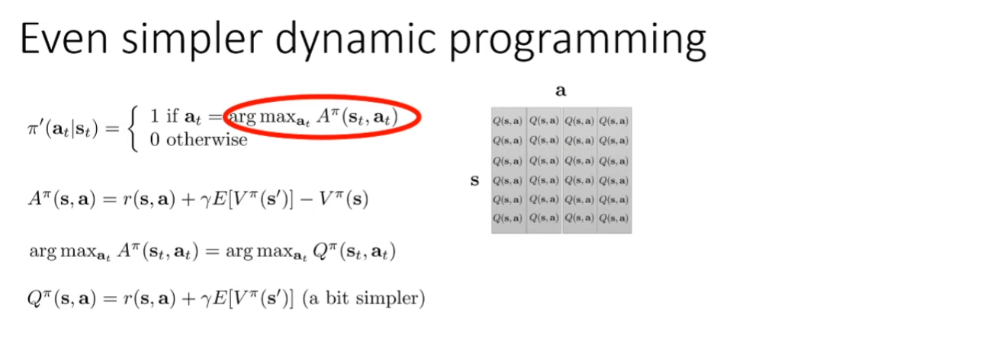

And the way that we can think about this graphically is that the Q function is a table with one entry for every state and every action. So here different rows are different states and different columns are different actions.

그래픽적으로 이해할 수 있는 방법은, Q function이 모든 state와 모든 action에 대해 하나의 항목을 가진 표라는 것입니다. 여기서 다른 행은 다른 state를 나타내고, 다른 열은 다른 action을 나타냅니다.

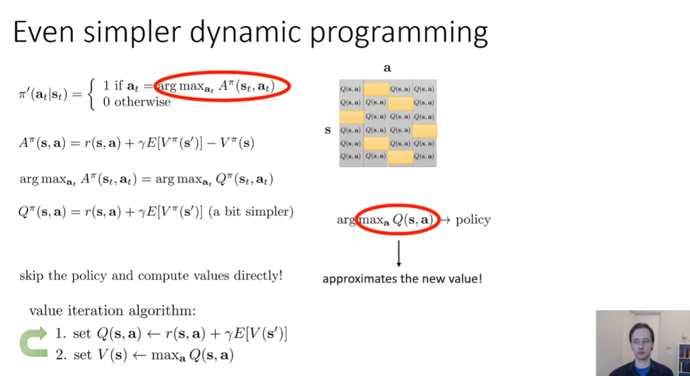

We don't have our action to present the policy explicitly, but you can think of it as showing up implicitly in step two, because setting the value to be the max over the actions in the Q value table is analogous to taking the argmax and then plugging the index of the argmax into the table to recover the value.

우리는 policy를 명시적으로 제시하는 action이 없지만, 2단계에서 암시적으로 나타나는 것으로 생각할 수 있습니다. 왜냐하면 Q value table에서 actions에 대한 최대값을 설정하는 것은 argmax를 취하고 그 다음 argmax의 인덱스를 테이블에 대입하여 값을 복구하는 것과 유사하기 때문입니다.

But since taking the argmax and then plugging into the table is the same as just taking the max, we can basically short circuit that step and get this procedure.

그러나 argmax를 취한 다음 테이블에 대입하는 것이 최대값을 직접 취하는 것과 동일하기 때문에, 우리는 기본적으로 그 단계를 단축하여 이 절차를 얻을 수 있습니다. 

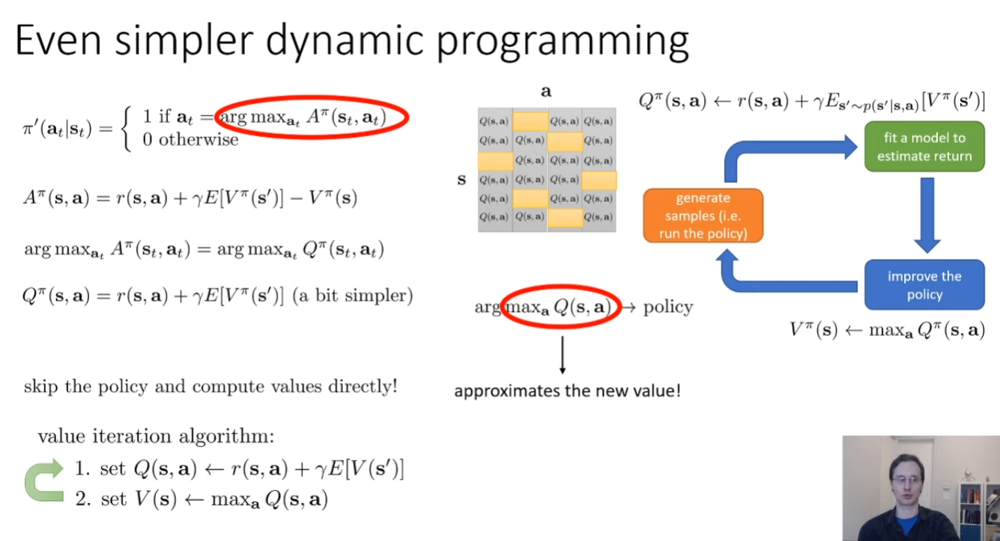

So you notice that V(s) only shows up in one place, which is inside that expectation step one. So if you simply replace that with a max over a of Q(s,a), you don't even need to represent the value  function. You only need to represent the Q function.

V(s)가 오직 한 곳에서만 나타난다는 것을 알 수 있는데, 그것은 바로 기대값 계산의 첫 단계 안입니다. 따라서 만약 여러분이 그것을 Q(s,a)에 대한 a의 최대값으로 단순히 대체한다면, value function을 표현할 필요조차 없습니다. 여러분은 오직 Q function만을 표현하면 됩니다.

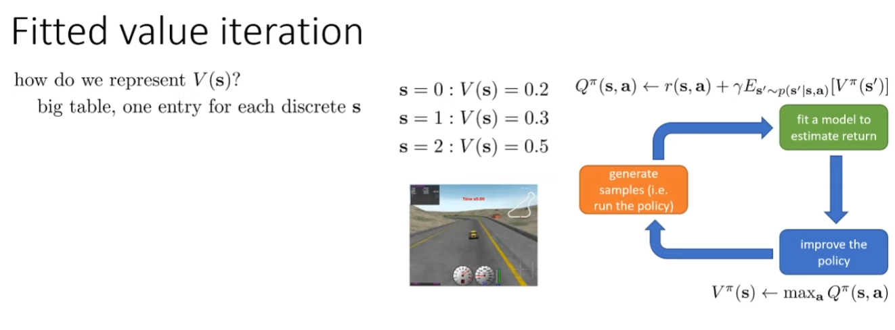

Why might we not want to represent the value function as a table?

value function을 테이블로 표현하고 싶지 않은 이유는 무엇일까요?

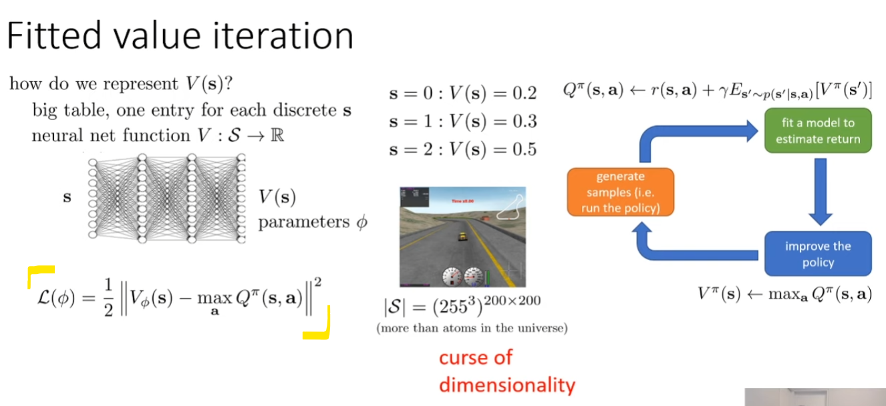

So what we can do is we can fit our neural net value function in much the same way as we did in lecture 6 by doing least squares regression onto target values.

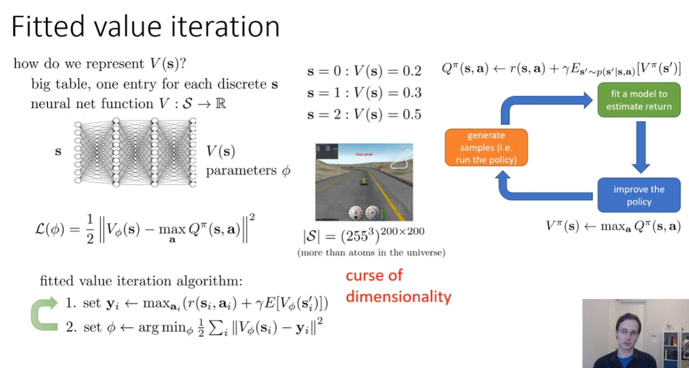

So then our fitted value iteration algorithm would look like this. We would take our dataset of states and actions. For every sample state, we would evaluate every possible action you could take in that state, and we would take a max over those actions of our Q values. So what I have in the parentheses here is I have to substituted in the Q value. So the Q values of the reward, plus γ times the expected value of the next state.

We just compute it as we go to evaluate the max.

최대값을 평가할 때 계산하기만 하면 됩니다.

So there are two ways in which this requires knowledge of the transition dynamics.

따라서 전환 역학에 대한 지식이 필요한 두 가지 방법이 있습니다.

Because now, as my policy π changes, the action for which I need to sample s', basically the a that's on the right of the conditioning bar and p(s'|s,a), doesn't actually change.

왜냐하면 지금, 내 policy π가 변함에 따라, s'을 샘플링해야 하는 action, 기본적으로 조건부 바 오른쪽에 있는 a와 p(s'|s,a)는 실제로 변하지 않기 때문입니다.

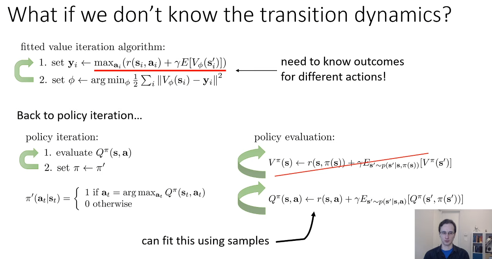

And this might at first seem like a very subtle difference, but it's a very, very important one.

Because now, as my policy π changes, the action for which I need to sample s', basically the a that's on the right of the conditioning bar and p(s'|s,a), doesn't actually change.

Which means that if I have a bunch of samples, (s,a,s'), I can use those samples to fit my Q function regardless of what policy I have.
The only place where the policy shows up is as an argument to the Q function at the state s' inside of the expectation.

And it turns out that this very seemingly very simple change allows us to perform policy iteration style algorithms without actually knowing the transition dynamics, just by sampling some (s, a, s') tuples, which we can get by running any policy we want.

So, this second recurrence that I've written here doesn't require knowing the transition probabilities, it just requires samples of the form (s,a,s').

So if we do this for step one in policy iteration, we would no longer require knowing the transition probabilities.

And this is very important.

This is the basis of most value-based model-free RL algorithms.

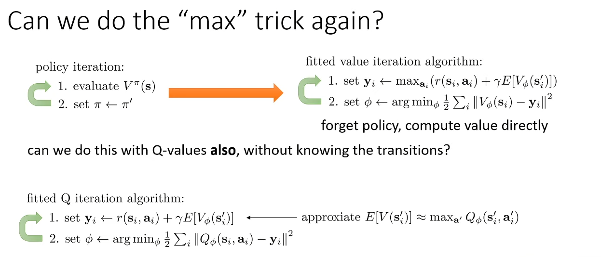

And second, instead of taking a full expectation over all possible next states, we're going to use the sampled state s'_i that we got when we generated that sample.

둘째, 가능한 모든 다음 상태를 완전히 예상하는 대신 샘플을 생성할 때 얻은 샘플링된 상태 s'_i를 사용할 것입니다.

Step two, fit a new ϕ with regression onto your target values using the same exact samples that you used to compute your target values.

2단계, target values을 계산할 때 사용한 것과 동일한 샘플을 사용하여 회귀를 통해 새 ϕ를 target values에 맞춥니다.

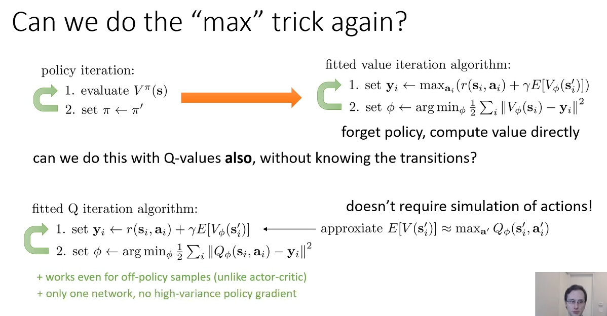

So this algorithm does not make any assumptions that the actions were actually sampled from the latest policy.

The actions could have been sampled from anything.

So you can store all the data you've collected so far.

It doesn't need to come from your latest policy, unlike Actor-Critic, where we had an on-policy algorithm.

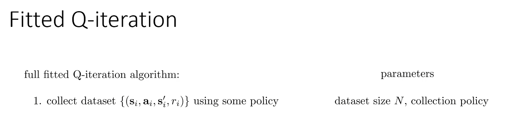

Now, not all policy choices are equally good, but the principles will apply to any policy, and it certainly doesn't have to be the latest policy.

And one of the parameters you have to choose is the number of such transitions you are to collect.

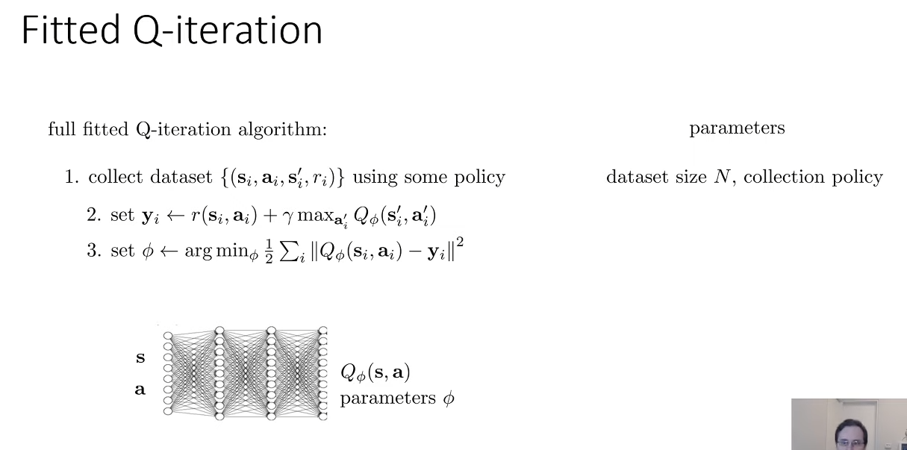

You can think of that as a special case of this design, and I'll discuss in class a little about how those relate.

이 디자인의 특수한 경우라고 생각하시면 되는데, 이 둘이 어떻게 연관되는지 수업 시간에 잠깐 설명해 드리겠습니다.

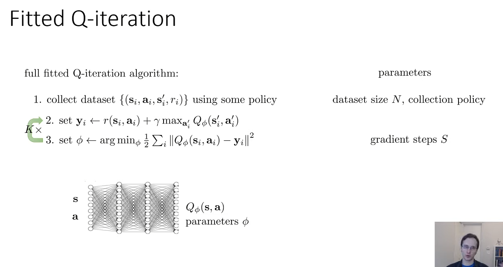

Now doing step 3 once doesn't actually get you the best possible Q function.

이제 3단계를 한 번 수행한다고 해서 실제로 최상의 Q function을 사용할 수 있는 것은 아닙니다.

Many different algorithms can actually be interpreted as variants of fitted Q iteration, including algorithms like Q-learning, which I will cover shortly.

곧 다루게 될 Q-학습과 같은 알고리즘을 포함하여 다양한 알고리즘이 실제로 fitted Q iteration의 변형으로 해석될 수 있습니다.

Fundamentally, JAX is a library that enables transformations of array-manipulating programs written with a NumPy-like API.

근본적으로, JAX는 NumPy와 유사한 API로 작성된 배열 조작 프로그램의 변환을 가능하게 하는 라이브러리입니다.

Therefore, unless we block_until_ready or convert the array to a regular Python type, we will only time the dispatch, not the actual computation.

따라서, block_until_ready를 사용하거나 배열을 일반 파이썬 타입으로 변환하지 않는 한, 실제 계산이 아닌 dispatch만 시간을 측정하게 됩니다.

This makes the JAX API quite different from other autodiff libraries like Tensorflow and PyTorch, where to compute the gradient we use the loss tensor itself (e.g. by calling loss.backward()).

이로 인해 JAX API는 손실 텐서 자체를 사용하여 그래디언트를 계산하는 Tensorflow나 PyTorch와 같은 다른 자동 미분 라이브러리와 매우 다릅니다 (예를 들어, loss.backward()를 호출함).

Once you become accustomed to this way of doing things, it feels natural: your loss function in code really is a function of parameters and data, and you find its gradient just like you would in the math.

이 방식에 익숙해지면 자연스럽게 느껴집니다: 코드 상의 손실 함수는 매개변수와 데이터의 함수이며, 수학에서처럼 그래디언트를 찾을 수 있습니다.

Does this mean that when doing machine learning, we need to write functions with gigantic argument lists, with an argument for each model parameter array? No. JAX comes equipped with machinery for bundling arrays together in data structures called ‘pytrees’, on which more in a 'later guide'. 

이것이 기계 학습을 할 때, 모델 매개변수 array마다 하나의 argument를 가진 거대한 argument 목록을 가진 함수를 작성해야 한다는 것을 의미할까요? 아닙니다. JAX는 'pytrees'라고 불리는 데이터 구조체에 array를 함께 묶을 수 있는 장치를 갖추고 있으며, 이에 대해 '나중에 안내할 가이드'에서 더 자세히 설명합니다.

The important feature of functional programming to grok when working with JAX is very simple: don’t write code with side-effects.

JAX를 사용할 때 이해해야 할 함수형 프로그래밍의 중요한 특징은 매우 간단합니다: side-effect가 있는 코드를 작성하지 마세요.

A side-effect is any effect of a function that doesn’t appear in its output. One example is modifying an array in place:

side-effect는 함수의 출력에 나타나지 않는 모든 효과를 말합니다. 한 예로, array를 in place에서 수정하는 것이 있습니다:

If we don’t use the old array after modifying it ‘in place’ using indexed update operators, the compiler can recognise that it can in fact compile to an in-place modify, resulting in efficient code in the end.

인덱스 업데이트 연산자를 사용하여 array를 'in place'에서 수정한 후에 이전 array를 사용하지 않는다면, 컴파일러는 실제로 in place 수정으로 컴파일할 수 있음을 인식할 수 있으며, 결국 효율적인 코드가 생성됩니다.

As a rule of thumb, however, any functions intended to be transformed by JAX should avoid side-effects, and the JAX primitives themselves will try to help you do that.

그러나 경험칙으로, JAX에 의해 변환될 것으로 예상되는 함수는 side-effect를 피해야 하며, JAX 기본 요소들도 이를 돕기 위해 노력할 것입니다.

We will explain other places where the JAX idiosyncrasies become relevant as they come up.

JAX의 특이성이 중요해지는 다른 경우들에 대해서는 나중에 발생하면 설명하겠습니다.

As you will see going through these guides, this basic recipe underlies almost all training loops you’ll see implemented in JAX.

이 가이드를 통해 알게 되겠지만, 이 기본적인 방법은 JAX에서 구현된 거의 모든 훈련 루프의 기초가 됩니다.

In this section, we will further explore how JAX works, and how we can make it performant. 

이 섹션에서는 JAX가 어떻게 작동하는지, 그리고 어떻게 성능을 향상시킬 수 있는지에 대해 더 자세히 알아볼 것입니다.

However, as a rule of thumb, you can expect (but shouldn’t rely on) the side-effects of a JAX-transformed function to run once (during the first call), and never again. 

그러나 경험칙으로, JAX로 변환된 함수의 side-effect는 첫 번째 호출 시 한 번 실행되고 그 후로는 실행되지 않을 것으로 기대할 수 있습니다(하지만 이에 의존해서는 안 됩니다).

However, the side-effects still happen during the trace itself.

그럼에도 불구하고, side-effect는 추적 과정 중에 여전히 발생합니다. 이는 JAX가 함수의 실행 경로를 추적하는 동안 함수 내에서 발생하는 모든 side-effect를 포착하며, 이는 최초의 함수 호출 시에만 일어날 수 있습니다. 따라서, 함수의 변환 과정에서 예상치 못한 side-effect에 의존하는 것은 피해야 합니다.

The fact that the Python code runs at least once is strictly an implementation detail, and so shouldn’t be relied upon.

파이썬 코드가 적어도 한 번 실행된다는 사실은 엄격히 말해 구현 세부 사항에 불과하므로, 이에 의존해서는 안 됩니다. 이러한 특성을 기반으로 하는 것은 프로그램의 안정성과 예측 가능성을 저해할 수 있습니다.

A key thing to understand is that jaxpr captures the function as executed on the parameters given to it. For example, if we have a conditional, jaxpr will only know about the branch we take:

이해해야 할 중요한 점은 jaxpr이 주어진 매개변수에서 실행된 함수를 포착한다는 것입니다. 예를 들어, 조건문이 있을 경우, jaxpr은 우리가 선택한 분기에 대해서만 알게 됩니다:

The code above is sending one operation at a time to the accelerator. This limits the ability of the XLA compiler to optimize our functions.

위의 코드는 한 번에 하나의 연산을 가속기로 보내고 있습니다. 이는 XLA 컴파일러가 우리의 함수를 최적화하는 능력을 제한합니다.

This allows the compiled function to work on all possible inputs with the same shape – the standard use case in machine learning. However, because the tracers have no concrete value, if we attempt to condition on one, we get the error above.

이는 컴파일된 함수가 같은 모양의 모든 가능한 입력에 대해 작동하도록 허용합니다 — 기계 학습에서의 표준 사용 사례입니다. 그러나, tracer에 구체적인 값이 없기 때문에, tracer를 조건으로 사용하려고 시도할 때 위와 같은 오류가 발생합니다.

The cost of this is that the resulting jaxpr is less flexible, so JAX will have to re-compile the function for every new value of the specified static input. It is only a good strategy if the function is guaranteed to get limited different values.

이로 인한 대가는 결과적으로 생성된 jaxpr이 덜 유연해지므로, JAX는 지정된 정적 입력의 새로운 값마다 함수를 다시 컴파일해야 합니다. 이 전략은 함수가 제한된 다양한 값만 받을 것이 확실한 경우에만 좋은 방법입니다.

Generally, you want to jit the largest possible chunk of your computation; ideally, the entire update step. This gives the compiler maximum freedom to optimise.

일반적으로, 계산의 가능한 가장 큰 부분을 jit(Just-In-Time 컴파일)하려고 해야 합니다; 이상적으로는 전체 업데이트 단계까지 포함됩니다. 이렇게 하면 컴파일러가 최대한 최적화할 수 있는 자유를 갖게 됩니다.

For most cases, JAX will be able to use the compiled, cached function in subsequent calls to jax.jit. 

대부분의 경우, JAX는 이후 jax.jit 호출에서 컴파일되고 캐시된 함수를 사용할 수 있습니다.

However, because the cache relies on the hash of the function, it becomes problematic when equivalent functions are redefined.

그러나 캐시가 함수의 해시에 의존하기 때문에, 동등한 함수가 재정의될 때 문제가 발생할 수 있습니다.