So intuitively, the main reason that Fitted Q iteration allows us to get away with using off-policy data is that the one place where the policy is actually used is actually utilizing the Q function rather than stepping through the simulator.

* get away with : …을 잘 해내다

So as our policy changes, what really changes is this max.

Remember, the way that we got this max was by taking the argmax, which is our policy, the policy in an argmax policy, and then plugging it back into the Q value to get the actual value for the policy.

So inside of that max, you can kind of unpack it.

And pretend that it's actually Q_ϕ of s'_i comma argmax of Q_ϕ, and that argmax is basically our policy.

So this is the only place where the policy shows up.

And conveniently enough, it shows up as an argument to the Q function, which means that as our policy changes, as our action a'_i changes, we do not need to generate new rollouts.

그리고 편리하게도 Q function에 대한 argument로 표시되므로 policy가 변경되면 액션 a'_i가 변경되므로 새로운 롤아웃을 생성할 필요가 없습니다.

You can almost think of this as a kind of model.

The Q function allows you to sort of simulate what kind of values you would get if you were to take different actions.

Q 함수를 사용하면 다양한 행동을 취했을 때 어떤 값이 나오는지 시뮬레이션할 수 있습니다.

And then, of course, you take the best action if you want to most improve your behavior.

So this max approximates the value of π', our greedy policy, at s'_i.

And that's why we don't need new samples.

We're basically using our Q function to simulate the value of new actions.

So given a state and an action, the transition is actually independent of π. Right?

If s_i and a_i are fixed, no matter how much we change π, s'_i is not going to change, because π only influences a_i, and here a_i is fixed.

So one way that you can think of Fitted Q iteration kind of structurally is that you have this big bucket of different transitions, and what you'll do is you'll back up the values along each of those transitions, and each of those backups will improve your Q value.

따라서 Fitted Q 반복을 구조적으로 생각할 수 있는 한 가지 방법은 다양한 전환으로 구성된 큰 버킷이 있고, 각 전환을 따라 값을 백업하고 각 백업이 Q 값을 향상시킨다고 생각하면 됩니다.

So you can imagine that you have this data set of transitions, and you're just plugging away on this data set, running Fitted Q iteration, improving your Q function each time you go around the loop.

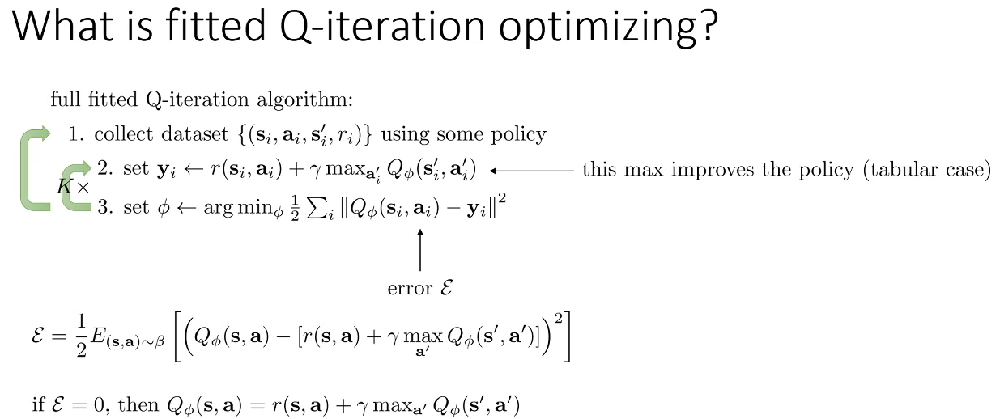

So if you had a tabular update, you would just directly write those y_i into your table, but since you have a neural network, you have to actually perform some optimization to minimize an error against those y_i, and you might not drive the error perfectly to 0.

따라서 테이블 형식의 업데이트가 있다면 테이블에 해당 y_i를 직접 쓰면 되지만, 신경망을 사용하므로 실제로 해당 y_i에 대한 에러를 최소화하기 위해 약간의 최적화를 수행해야 하며, 에러를 완벽하게 0으로 만들지 못할 수도 있습니다.

But of course, that error itself doesn't really reflect the goodness of your policy.

It's just the accuracy with which you're able to copy your target values.

타겟 값을 얼마나 정확하게 복사할 수 있는지가 관건입니다.

But if the error is not 0, then you can't really say much about the performance of this policy.

So what we know about Fitted Q iteration is, in the tabular case, your error will be 0, which means that you'll recover Q^{*}.

If your error is not 0, then most guarantees are lost when we leave the tabular case.

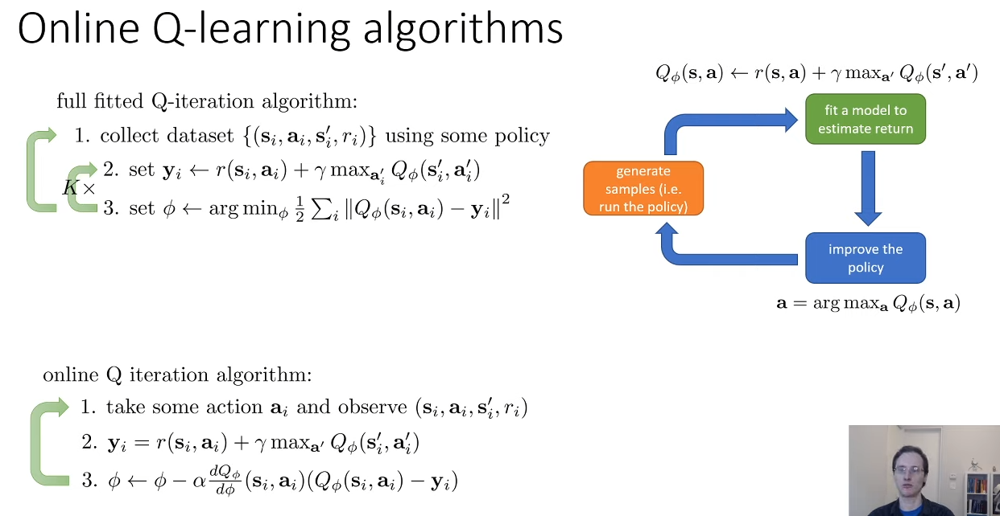

Very much analogous to how you calculate the advantage value in Actor-Critic, in online Actor-Critic, for the one transition that you just took.

온라인 액터 크리틱에서 방금 수행한 하나의 전환에 대해 액터 크리틱에서 어드벤티지 값을 계산하는 방식과 매우 유사합니다.

So the equation that I have here, it looks a little complicated, but I basically just applied the chain rule of probability to that objective inside the argmin in step three.

그래서 여기에 있는 방정식은 조금 복잡해 보이지만 기본적으로 3단계에서 argmin 내부의 목표에 확률의 연쇄 법칙을 적용했습니다.

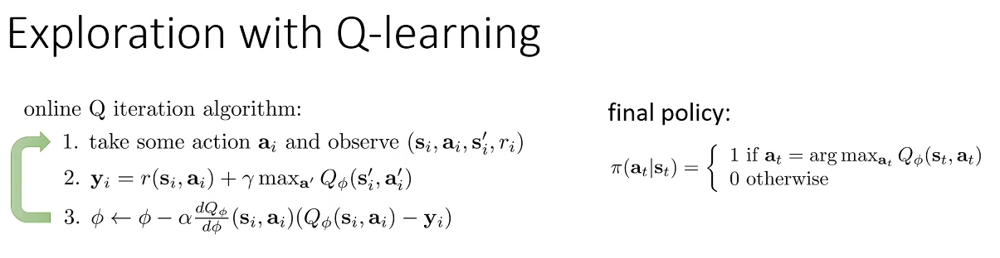

Why might we not want to use the greedy policy, the argmax policy, in step one while running online Q-learning or online Q iteration?

온라인 Q 러닝 또는 온라인 Q 이터레이션을 실행하는 동안 1단계에서 greedy policy인 argmax 정책을 사용하지 않는 이유는 무엇일까요?

Then, it will essentially commit our argmax policy to take the same action every time it enters a particular state.

그러면 기본적으로 특정 상태에 들어갈 때마다 동일한 행동을 취하도록 argmax 정책을 적용합니다.

And if that action is not a very good action, we might be stuck taking that bad action essentially in perpetuity, and we might never discover that better actions exist.

* perpetuity : 영속, 영원한 것

And if that action is not a very good action, we might be stuck taking that bad action essentially in perpetuity, and we might never discover that better actions exist.

그리고 그 행동이 그다지 좋은 행동이 아니라면, 우리는 그 나쁜 행동을 영원히 계속하게 될 수도 있고, 더 좋은 행동이 존재한다는 사실을 발견하지 못할 수도 있습니다.

So in practice, when we run fitted Q iteration or Q-learning algorithms, it's highly desirable to modify the policy that we use in step one to not just be the argmax policy, but to inject some additional randomness to produce better exploration.

So in practice, when we run fitted Q iteration or Q-learning algorithms, it's highly desirable to modify the policy that we use in step one to not just be the argmax policy, but to inject some additional randomness to produce better exploration.

따라서 실제로 피티드 Q 이터레이션이나 Q 러닝 알고리즘을 실행할 때는 1단계에서 사용하는 정책을 단순히 argmax 정책이 아니라 더 나은 탐색을 위해 추가적인 무작위성을 주입하도록 수정하는 것이 매우 바람직합니다.

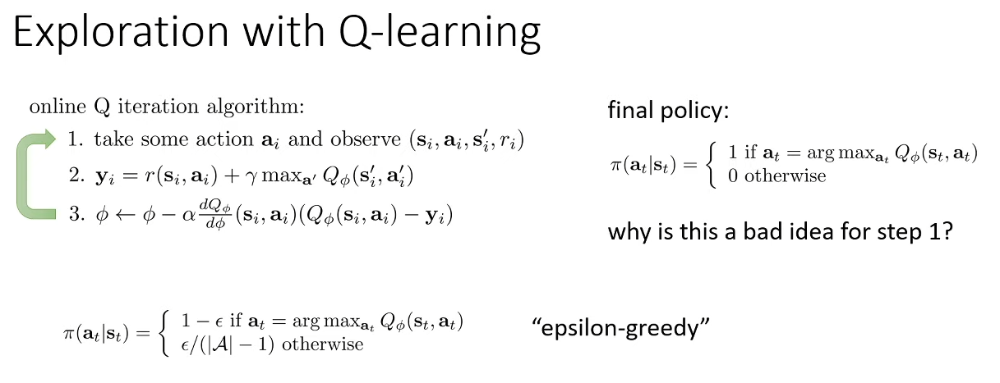

So the probability of every action is (1 - ϵ) of this the argmax and then ϵ divided by the nubmer of actions minus one otherwise.

A very common practical choice is to actually vary the value of ϵ over the course of training.

And that makes a lot of sense, because you expect your Q function to be pretty bad initially, and at that point you might want to use a larger ϵ, and then as learning progresses, your Q function gets better, and then you can reduce ϵ.

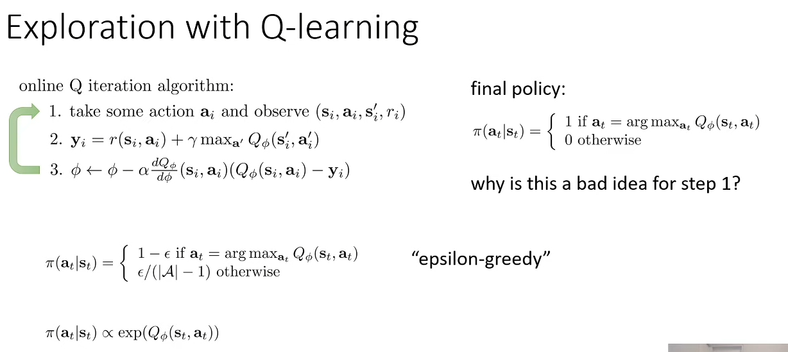

In some cases, this kind of exploration rule can be preferred over ϵ greedy, because with ϵ greedy, the action that happens to be the max gets much higher probability, and if there are two actions that are about equally good, the second best one has a much lower probability.

Whereas with this exponentiation rule, if you really have two equally good actions, you'll take them about an equal number of times.

The second reason it might be better is if you have a really bad action, and you've already learned that it's just a really bad action, you probably don't want to waste your time exploring it.

Whereas ϵ greedy won't make use of that.

반면 ϵ greedy는 이를 활용하지 않습니다.

We'll discuss more sophisticated ways to do exploration in much more detail in another lecture in the second half of the course, but these simple rules are hopefully going to be enough to implement basic versions of Q iteration and Q learning algorithms.

탐색을 수행하는 더 정교한 방법은 후반부의 다른 강의에서 훨씬 더 자세히 설명할 예정이지만, 이 간단한 규칙만으로도 기본적인 버전의 Q 이터레이션과 Q 러닝 알고리즘을 구현하는 데 충분할 것입니다.

* second half : 후반부

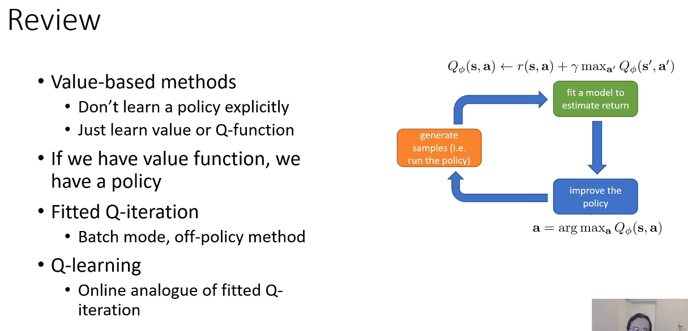

We've discussed how if you have a value function, you can recover a policy by using the argmax, and how we can devise this fitted Q iteration method, which does not require knowing the transition dynamics, so it's a true model-free method.

value function이 있는 경우 argmax를 사용하여 정책을 복구할 수 있는 방법과 transition 역학을 알 필요가 없으므로 진정한 model-free 방법인 fitted Q iteration 방법을 고안하는 방법에 대해 설명했습니다.

The last topic I'll cover in this lecture is a little bit of theory in regard to value-based methods and a little bit more explanation for what I meant before when I said that value-based methods with neural networks don't in general converge to the optimal solution.

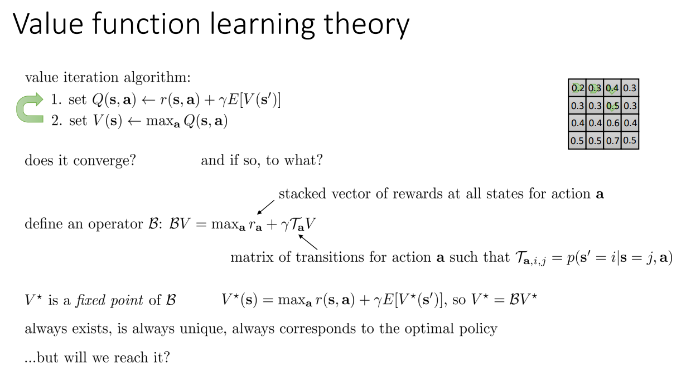

It's a pretty simple algorithm and it's a little easier for us to think about, but we'll get back to the Q iteration methods a little bit later.

So one of the ways that we can get started with this analysis is we can define an operator, which I'm going to write as script B.

And this operator is called the Bellman operator.

The Bellman operator, when applied to a value function, and remember the value function here is a table, so you can think of it as just a vector of numbers.

When applied to this vector of numbers, it performs the following operation.

First, it takes V and applies the operator.

And then it takes the operator T_a.

T_a is a matrix with dimensionality S by S, where every entry in that matrix is the probability of (s'|s,a), where a is chosen according to that max.

So this is basically computing that expectation.

The expectation is a linear operator.

We multiply it by γ and we add this vector r_a.

The vector r_a is a vector of rewards, where for every state, you pick the reward for the corresponding action a.

And then outside of this, you perform a max over a.

And crucially, this max is per element.

그리고 결정적으로 이 max는 요소당입니다.

So for every state, we take a max.

So this funny way of writing the Bellman backup basically just captures the value iteration algorithm.

The max comes from step 2, and the stuff inside the max comes from step 1.

최대값은 2단계에서 가져온 것이고 최대값 안의 내용은 1단계에서 가져온 것입니다.

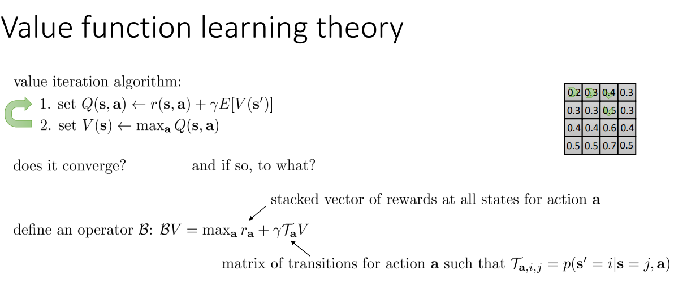

So the reward is a stacked vector of rewards at all states for action a.

And T_a is a matrix of transitions for action a, such that T_{a,i,j} is the probability that s' equals i, given that s equals j and we took the action a.

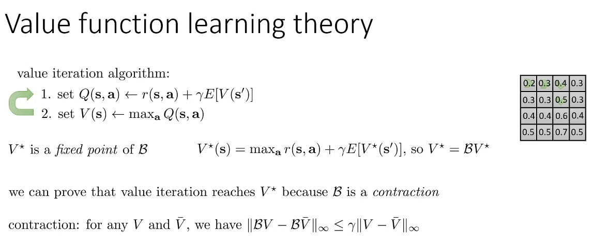

So I won't go through the proof in detail in this lecture, but the high-level sketch behind how we argue that value iteration converges, is by arguing that it's a contraction.

So we can prove that value iteration reaches $V^{*}$ because B is a contraction.

What does it mean to be a contraction?

It means that if you have any two vectors, V and $\bar{V}$, then applying B to both V and $\bar{V}$ will bring those vectors closer together, meaning that B V minus B $\bar{V}$, their norm is less than or equal to the norm of V minus $\bar{V}$.

In fact, it's a contraction by some coefficient, and that coefficient happens to be γ.

실제로는 어떤 계수에 의한 축약이며, 그 계수는 γ입니다.

So not only is BV minus B $\bar{V}$ norm less than or equal to V minus $\bar{V}$ norm, it's actually less than or equal to V minus $\bar{V}$ norm times γ.

So you will contract, and you'll actually contract by some non-trivial amount, which means that V and $\bar{V}$ will always get closer together as you apply B to them.

따라서 축약할 것이고, 실제로는 사소하지 않은 정도까지 축약할 것입니다. 즉, V와 $\bar{V}$는 B를 적용할 때 항상 서로 가까워집니다.

Now, the proof that B is a contraction is not actually all that complicated.

I just don't want to go through it on this slide, but you can look it up as a standard kind of textbook result.

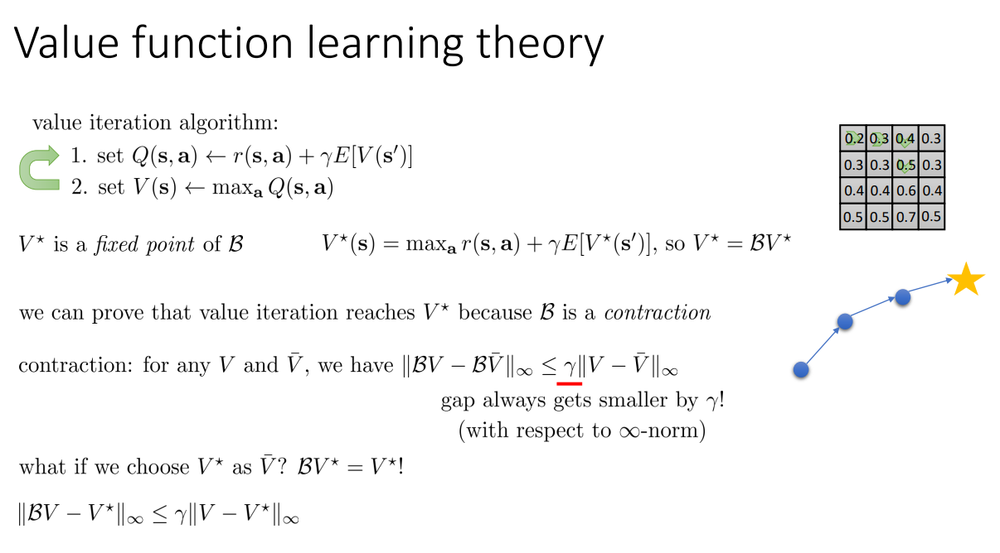

But just to very briefly explain why showing that it's a contraction implies that value iteration converges, if you choose $V^{*}$ as your $\bar{V}$, you know that $V^{*}$ is a fixed point of B.

So if you substitute in $V^{*}$ for $\bar{V}$, then you get the equation BV minus $V^{*}$ norm is less than or equal to γ times V minus $V^{*}$ norm.

It's important to note here that the norm under which the operator B is a contraction is the infinity norm.

So the infinity norm is basically the difference for the largest entry.

So the infinity number of vector is the value of the largest entry in that vector.

So the state at which V and $V^{*}$ disagree the most, they will disagree less after you apply B.

따라서 V와 $V^{*}$가 가장 일치하지 않는 상태는 B를 적용하면 일치하지 않는 정도가 줄어듭니다.

This will come up shortly.

이 내용은 곧 공개될 예정입니다.

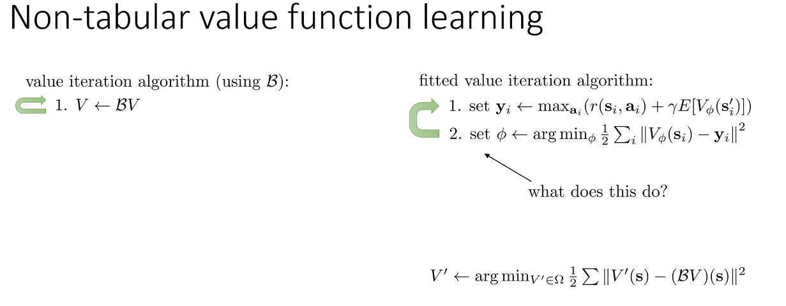

Well, one of the ways you can think of supervised learning is that you have some set of value functions that you can represent.

지도 학습을 생각할 수 있는 방법 중 하나는 표현할 수 있는 가치 함수 집합이 있다는 것입니다.

That set, if your value function is a neural network, it's actually a continuous set that consists of all possible neural nets with your particular architecture but with different weight values.

이 집합은 가치 함수가 신경망인 경우 실제로는 특정 아키텍처를 사용하지만 가중치 값이 다른 모든 가능한 신경망으로 구성된 연속 집합입니다.

So we'll denote that set as a set Ω.

In supervised learning we sometimes refer to this as the hypothesis set or the hypothesis space.

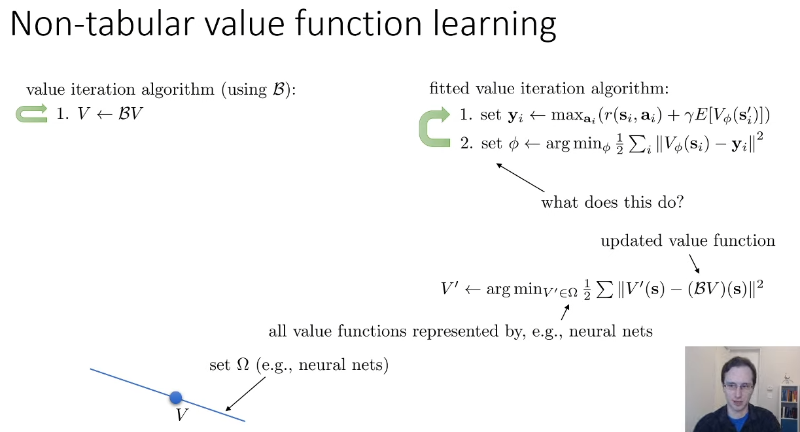

Now this procedure is itself actually also a contraction, right?

So when you perform this supervised learning, you can think of it as a projection in the L2 norm.

So you have your old V, you have your set of possible neural nets represented by this line.

So Ω is basically all the points on that line.

The whole space is all possible value functions.

Omega doesn't contain all possible value functions.

So Ω restricts us to this line.

When we construct BV, we might step off this line.

So the point BV doesn't line the set Ω.

When we perform supervised learning, when we perform step two of fitted value iteration, what we're really doing is we're finding a point in the set Ω that is as close as possible to BV.

And as close as possible means that it's going to be at a right angle.

그리고 가능한 한 가깝다는 것은 직각이 된다는 것을 의미합니다.

So we'll project down onto the set Ω, and it'll be a right angle projection.

So that'll get us V'

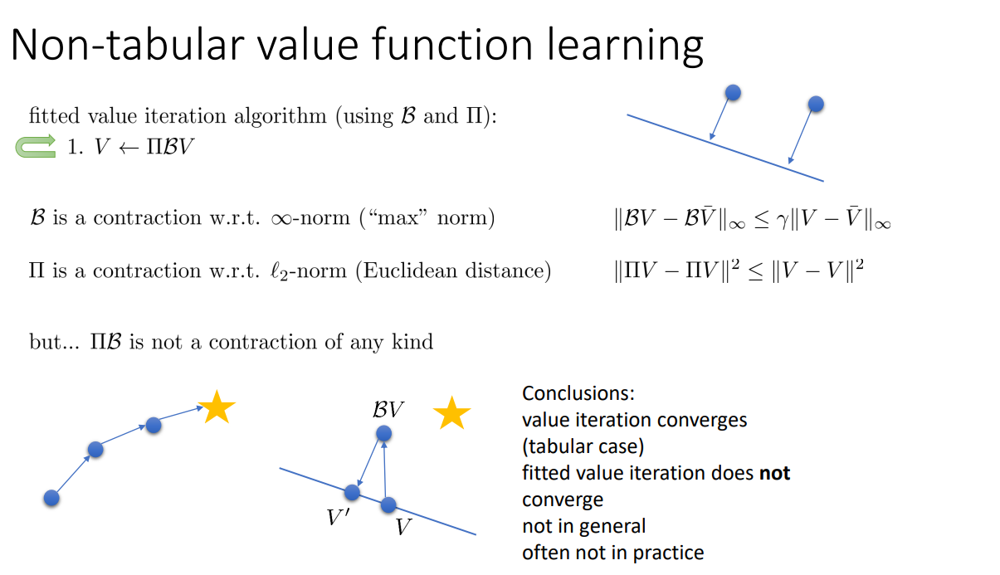

The reason, by the way, the intuition behind why Π is a contraction, is that if you have any two points in Euclidean space and you project them on a line, they can only get closer to each other, they can never get further.

그런데 Π가 축약인 이유에 대한 직관적인 이유는 유클리드 공간에 두 점이 있고 이를 선상에 project하면 서로 가까워질 수 있을 뿐 결코 멀어질 수 없기 때문입니다.

This might at first seem surprising, because they're both contractions individually, but remember that they're contractions for different norms.

두 가지 모두 개별적으로 축약되어 있기 때문에 처음에는 놀랍게 보일 수 있지만, 서로 다른 노름에 대한 축약이라는 점을 기억하세요.

And this is not just a theoretically idiosyncrasy.

그리고 이것은 이론적으로만 특이한 것이 아닙니다.

This actually happens in practice.

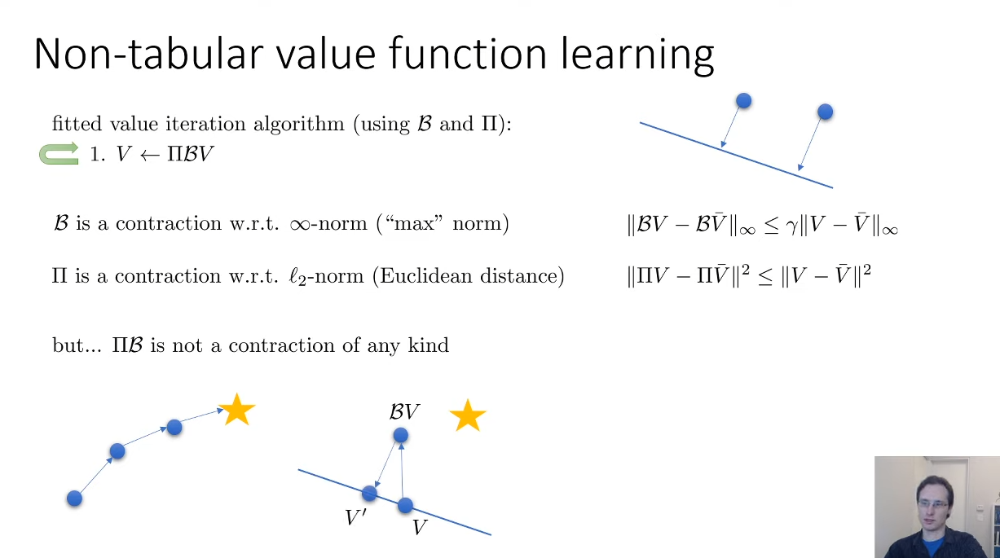

If you have a projected value iteration algorithm, a fitted value iteration algorithm, then you're going to restrict your value function to this line each step of the way.

So your Bellman backup, BV, will get you closer to the star in terms of infinity norm, and then your projection will move you back onto the line.

And while both of those operations are contractions, notice that V' is now actually further from the star than V is.

이 두 연산은 모두 축약이지만, V'가 실제로는 V보다 별에서 더 멀리 떨어져 있다는 점에 주목하세요.

And you can get these situations where each step of the way actually gets you further and further from $V^{*}$.

그리고 각 단계가 실제로 $V^{*}$에서 점점 더 멀어지는 상황이 발생할 수 있습니다.

So the sad conclusions from all this are that value iteration does converge in the tabular case, fitted value iteration does not converge in general, and it doesn't converge in general, and it often doesn't converge in practice.

따라서 이 모든 것의 슬픈 결론은 값 반복은 표 형식의 경우 수렴하고, Fitted Value Iteration은 일반적으로 수렴하지 않으며, 일반적으로 수렴하지 않으며, 실제로는 종종 수렴하지 않는다는 것입니다.

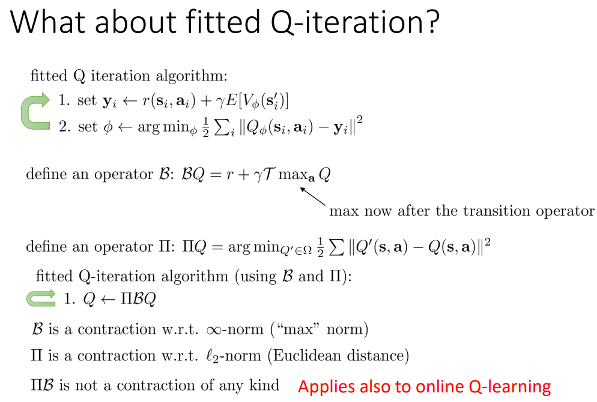

So in fitted Q iteration, you can also define an operator B.
It looks a little bit different.

Now it's r + γT max Q, so the max is now at the target value, but same basic principle.

So now the max is after the transition operator.

That's the only difference.

B is still a contraction in the infinity norm.

You can define an operator Π exactly the same way as the operator that finds the argmin in your hypothesis class that minimizes square difference.

You can define fitted Q iteration, as Q becomes ΠBQ, just like with value iteration.

And just like before, B is a contraction in the infinity norm, Π is a contraction in the L2 norm, and ΠB is not a contraction of any kind.

This also applies to online Q learning and basically any algorithm of this sort.

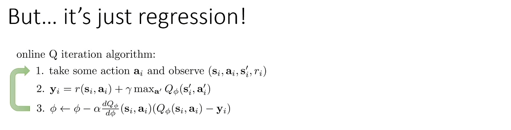

Don't we know that regression converges?

회귀가 수렴한다는 것을 알지 않나요?

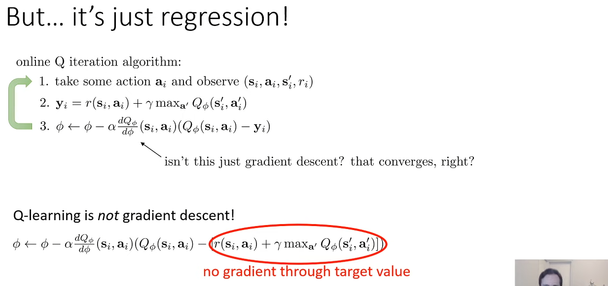

It's because the target values in Q learning themselves depend on the Q values.

And this is also true for Q iteration.

But you're not considering the gradient through those target values.

So the gradient that you're actually using is not the true gradient of a well-defined function.

And that's why it might not converge.

Now it's probably worth mentioning that you could turn this algorithm into a gradient descent algorithm by actually computing the gradient through those target values.

이제 이 알고리즘을 실제로 타겟 값을 통해 그래디언트를 계산하여 그래디언트 하강 알고리즘으로 바꿀 수 있다는 점을 언급할 가치가 있습니다.

They're non-differential because of the max, but there are some technical ways to deal with that.

max 때문에 non-differential이지만 이를 처리할 수 있는 기술적 방법이 몇 가지 있습니다.

The bigger problem is that the resulting algorithm, which is called a residual algorithm, has very, very poor numerical properties and doesn't work very well in practice.

더 큰 문제는 residual algorithm이라고 불리는 결과 알고리즘의 수치적 특성이 매우 열악하고 실제로는 잘 작동하지 않는다는 것입니다.

In fact, even though this kind of Q learning procedure that I described is not guaranteed to converge, in practice it actually tends to work much, much better than residual gradient, which, though guaranteed to converge, has extremely poor numerical properties.

사실 제가 설명한 이런 종류의 Q 러닝 절차는 수렴이 보장되지는 않지만 실제로는 수렴이 보장되기는 하지만 수치적 특성이 극도로 떨어지는 residual gradient보다 훨씬 더 잘 작동하는 경향이 있습니다.

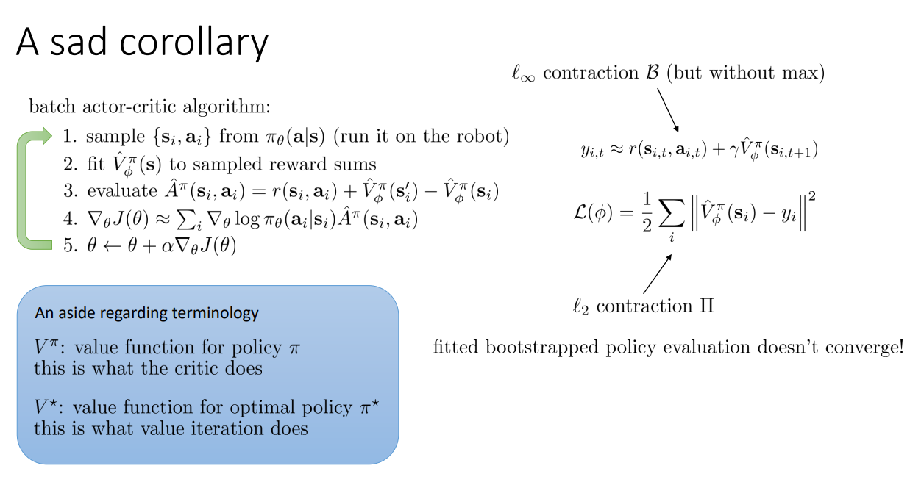

When I use $V^{*}$, this is the value function for the optimal policy $π^{*}$, and this is what we're trying to find in value iteration.

$V^{*}$를 사용하면 이것이 최적 정책 $π^{*}$의 가치 함수이며, 이것이 바로 가치 반복에서 찾으려는 것입니다.

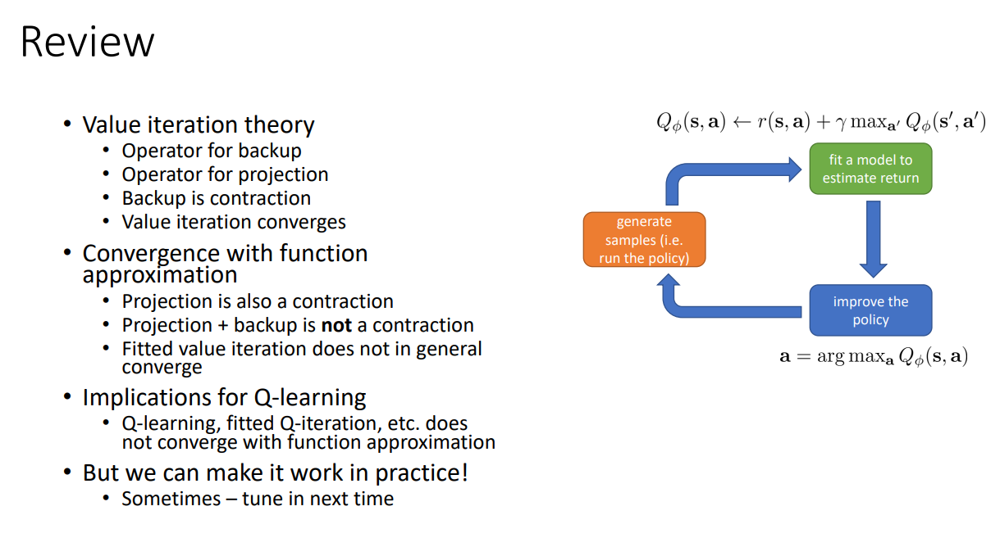

We talked about some convergence properties with function approximation, where the projection is also a contraction, but because it's a contraction in a different norm, backup followed by projection is not actually a contraction.

함수 근사법에서 일부 수렴 속성에 대해 이야기했는데, 여기서 투영도 축약이지만 다른 노름에서의 축약이므로 백업 후 투영은 실제로는 축약이 아닙니다.

And therefore, Fitted value iteration does not in general converge, and its implications for Q-learning are that Q-learning, fitted  Q-iteration, et cetera, also do not converge when we use neural nets, when we have a projection operator.

따라서 적합값 반복은 일반적으로 수렴하지 않으며, 신경망을 사용할 때, 투영 연산자가 있을 때 Q 러닝, fitted Q iteration 등도 수렴하지 않는다는 것이 Q 러닝에 미치는 영향입니다.

This might seem somewhat somber and depressing.

다소 침울하고 우울해 보일 수 있습니다.

* somber : 침울한, 우울한
* depressing : 우울한

