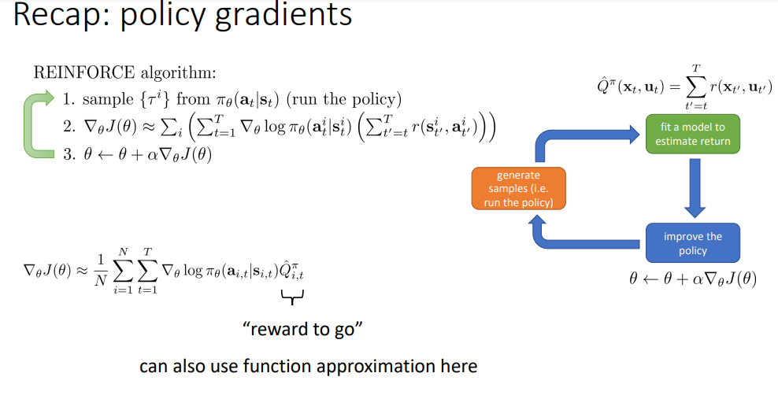
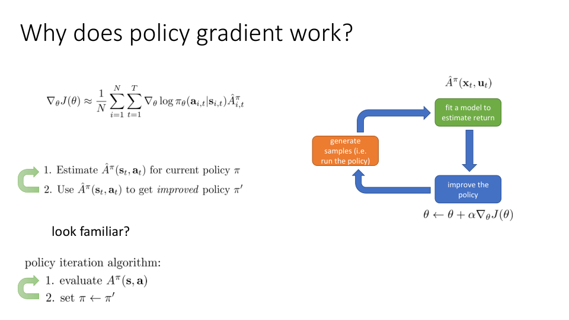
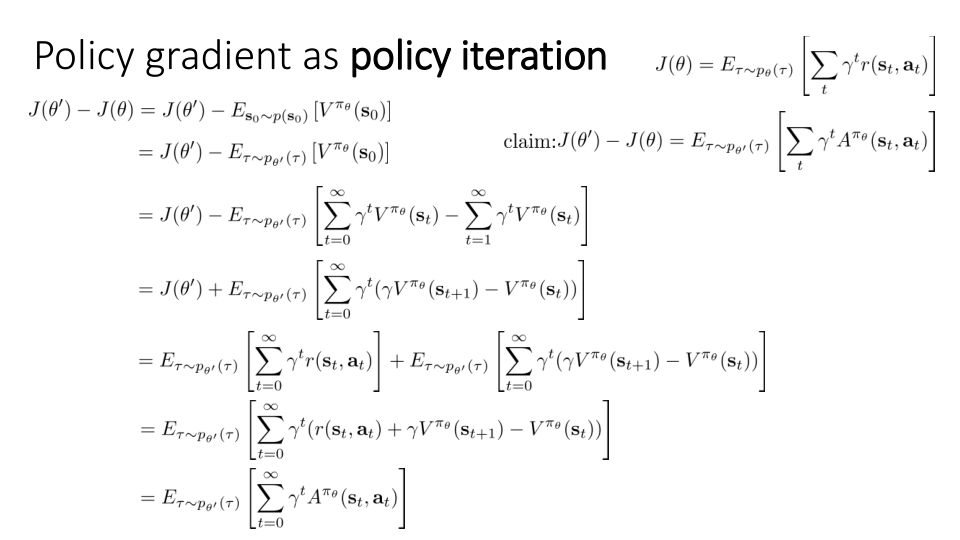
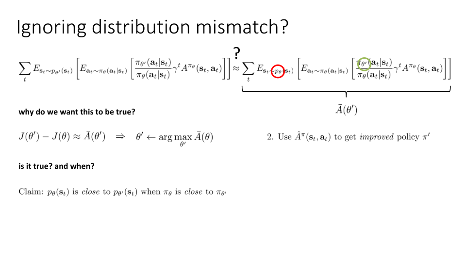

So the goal in today's lecture is going to be to combine some of the policy gradient ideas that we discussed before with some more recent concepts that we cover in the course, like policy iteration, to provide a new perspective on policy gradient methods and a little bit of analysis about when and why we would expect policy gradients to work.

따라서 오늘 강의의 목표는 이전에 논의했던 정책 그래디언트 아이디어 중 일부를 정책 반복과 같이 이 과정에서 다루는 최신 개념과 결합하여 정책 그래디언트 방법에 대한 새로운 관점을 제공하고 정책 그래디언트가 언제, 왜 작동할 것으로 기대하는지에 대한 약간의 분석을 제공하는 것입니다.

So if you have an interest in reinforcement learning theory, in understanding how and why to design algorithms in a certain way, and if you just want to get more in-depth knowledge about policy gradients, this is the lecture for you.

따라서 강화 학습 이론에 관심이 있고, 알고리즘을 특정 방식으로 설계하는 방법과 이유를 이해하고, 정책 그래디언트에 대해 더 깊이 있는 지식을 얻고자 한다면 이 강의가 적합합니다.

And then we saw, for instance, in the Actor-Critic lecture that this reward to go could be computed in various ways, using the Monte Carlo estimator as shown here or with more sophisticated methods that involve actually learning value function estimators.

예를 들어, 액터-크리틱 강의에서 이 reward to go는 여기에 표시된 것처럼 몬테카를로 추정기를 사용하거나 실제로 가치 함수 추정기를 학습하는 더 정교한 방법으로 다양한 방식으로 계산할 수 있다는 것을 알 수 있었습니다.

They generate samples in the orange box, fit some estimate to the reward to go, either with a learned value function or just with Monte Carlo estimates in the green box, and then perform gradient ascent in the blue box.

주황색 상자에서 샘플을 생성하고, 학습된 가치 함수를 사용하거나 녹색 상자에서 몬테카를로 추정치만 사용하여 보상에 일부 추정치를 맞춘 다음, 파란색 상자에서 그래디언트 상승을 수행합니다.

And if we do a little bit of analysis, we can actually get some idea of how and why we should expect the policy gradient procedure to work.

그리고 약간의 분석을 수행하면 실제로 정책 그래디언트 절차가 어떻게 그리고 왜 작동해야 하는지 어느 정도 파악할 수 있습니다.

So one of the ways that we can think of policy gradient more conceptually, so there was this kind of REINFORCE method on the previous slide, which is a particular instance of policy gradient.

그래서 정책 그래디언트를 좀 더 개념적으로 생각할 수 있는 방법 중 하나가 이전 슬라이드에 REINFORCE라는 방법이 있었는데, 이것이 정책 그래디언트의 구체적인 예시입니다.

What algorithm do you remember that had this type of structure, where we alternate between estimating the value of the current policy and then using that estimated value to improve that policy?

현재 정책의 가치를 추정하고 그 추정된 가치를 사용하여 정책을 개선하는 이런 유형의 구조를 가진 알고리즘을 기억하시나요?

And we covered the policy iteration algorithm when we discussed value-based methods, primarily as a way to set the stage for what will come next, which was Q-learning.

그리고 가치 기반 방법을 논의할 때 정책 반복 알고리즘을 다루었는데, 이는 주로 다음 단계인 Q 러닝을 위한 준비 단계였습니다.

So you could almost think of policy gradients as a kind of softened version of the policy iteration procedure we discussed before, where the policy iteration procedure from last week would simply immediately assign a probability of 1 to the highest advantage action, whereas policy gradients changes the policy parameters to move towards parameters that give higher probabilities to the argmax and lower probabilities to actions with worse advantages, but it doesn't immediately jump all the way to 1 and 0.

So you could almost think of policy gradients as a kind of softened version of the policy iteration procedure we discussed before, where the policy iteration procedure from last week would simply immediately assign a probability of 1 to the highest advantage action, whereas policy gradients changes the policy parameters to move towards parameters that give higher probabilities to the argmax and lower probabilities to actions with worse advantages, but it doesn't immediately jump all the way to 1 and 0.

And that might be desirable if you think that your advantage estimator is not perfect.

어드벤티지 추정기가 완벽하지 않다고 생각한다면 그렇게 하는 것이 바람직할 수도 있습니다.

If your advantage estimator is not perfect, perhaps what you would like to do is just slightly change your policy in the direction suggested by your advantage estimator, and then collect some more transitions, some more samples, and improve your advantage estimator.

어드벤티지 추정기가 완벽하지 않다면, 어드벤티지 추정기가 제안하는 방향으로 정책을 약간 변경한 다음 몇 가지 전환과 샘플을 더 수집하여 어드벤티지 추정기를 개선하는 것이 좋을 수 있습니다.

Okay, let's unpack this statement a little bit to try to get some intuition for why we even want to care about this.

자, 우리가 왜 이 문제에 관심을 가져야 하는지에 대한 직관을 얻기 위해 이 문장을 조금 풀어보겠습니다.

So, $J(θ')$ minus $J(θ)$ represents the improvement in the RL objective that we get from going from some old parameter θ to some new parameter θ'.

따라서 $J(θ')$에서 $J(θ)$를 뺀 값은 이전 파라미터 θ에서 새로운 파라미터 θ'로 변경할 때 얻는 RL 목표의 개선을 나타냅니다.

Now, those of you that are paying close attention might realize that there's something a little strange with that statement, because if we're maximizing $J(θ')$ minus $J(θ)$ with respect to θ', the $J(θ)$ is actually irrelevant.

조금만 주의 깊게 보신 분들은 이 문장에 조금 이상한 점이 있다는 것을 눈치채셨을 것입니다. θ'에 대해 $J(θ')$에서 $J(θ)$를 뺀 값을 최대화할 경우, $J(θ)$는 실제로 관련이 없기 때문입니다.

So maximizing $J(θ')$ with respect to θ' is exactly the same as maximizing $J(θ')$ minus $J(θ)$ with respect to θ'.

따라서 θ'에 대해 $J(θ')$를 최대화하는 것은 θ'에 대해 $J(θ')$에서 $J(θ)$를 뺀 값을 최대화하는 것과 정확히 동일합니다.

So, of course, the real goal of this derivation is to show that if we maximize the right-hand side of this equation, the expectation under $π_{θ'}$ of the advantage of $π_θ$, then we're actually maximizing $J(θ')$ minus $J(θ)$, which means that we're actually maximizing $J(θ')$, which is actually what we want.

물론 이 도출의 진정한 목표는 이 방정식의 오른쪽, 즉 $π_θ$의 어드벤티지에 대한 $π_{θ'}$ 아래의 기대치를 최대화하면 실제로는 $J(θ')$에서 $J(θ)$를 뺀 값, 즉 우리가 실제로 원하는 $J(θ')$를 최대화한다는 것을 보여주기 위한 것입니다.

The right-hand side of this equation is expressing the expected value under the trajectory distribution induced by the new policy, the one that you're optimizing, of the advantage of the old policy.

이 방정식의 오른쪽은 최적화 중인 새 정책, 즉 기존 정책의 어드벤티지 값에 대한 궤적 분포에 따른 기대값을 표현한 것입니다.

So if we can show that maximizing the expected value of the advantage of the old policy with respect to a new policy in fact actually optimizes the improvement in the RL objective, then we will have proven that using the advantage of the old policy and maximizing it under the new policy is a correct way to optimize your new policy.

따라서 새로운 정책에 대해 기존 정책의 어드벤티지 값의 기대치를 최대화하는 것이 실제로 RL 목표의 개선을 최적화한다는 것을 보여줄 수 있다면, 기존 정책의 어드벤티지를 활용하고 새로운 정책에서 이를 최대화하는 것이 새로운 정책을 최적화하는 올바른 방법임을 입증한 셈이 됩니다.

And the reason that I want to write it this way is because now, $p(s_0)$ doesn't depend on θ.

이렇게 쓰고 싶은 이유는 이제 $p(s_0)$이 θ에 의존하지 않기 때문입니다.

So everything that depends on θ is inside the expectation.

따라서 θ에 의존하는 모든 것은 기대치 안에 있습니다.

So what that means is I can change the distribution under which the expectation is taken to be any distribution whose marginal over the initial state is $p(s_0)$.

즉, 기대치를 취하는 분포를 초기 상태에 대한 마지널이 $p(s_0)$인 분포로 변경할 수 있다는 뜻입니다.

And this includes $p_θ(τ)$, $p_{θ'}(τ)$, and p any θ τ.

Basically, the trajectory distribution for any policy must have the same initial state marginal.

기본적으로 모든 정책의 궤적 분포는 동일한 초기 상태 마진을 가져야 합니다.

So what I would like to do is I would like to write this sum essentially as a bunch of terms that look a little bit like advantages.

그래서 제가 하고 싶은 것은 이 총합을 본질적으로 어드벤티지처럼 보이는 용어들로 묶어서 쓰고 싶다는 것입니다.

So what does this all have to do with policy gradients?

그렇다면 이 모든 것이 정책 그래디언트와 어떤 관련이 있을까요?

Well, so what we've shown is that the RL objective, maximizing the RL objective is the same as maximizing this equation, where the advantage is taken under $π_θ$ and the expectation is taken under $π_{θ'}$.

지금까지 살펴본 바와 같이 RL 목표를 최대화하는 것은 이 방정식을 최대화하는 것과 같으며, 여기서 어드벤티지는 $π_θ$ 아래에서, 기대치는 $π_{θ'}$ 아래에서 취합니다.

And now we're getting to something that's very close to the policy gradient expressions that we had before.

그리고 이제 이전에 사용했던 정책 그래디언트 표현에 매우 근접한 것을 얻게 되었습니다.

Because remember, we could get policy gradient just by differentiating an equation very similar to this with respect to θ' at the value θ equals θ'.

왜냐하면 θ가 θ'라는 값에서 이와 매우 유사한 방정식을 θ'에 대해 미분하면 정책 그래디언트를 얻을 수 있다는 것을 기억하세요.

The only difference is that our states are still distributed according to θ', not according to $p_θ$.

유일한 차이점은 상태가 여전히 $p_θ$가 아닌 θ'에 따라 분포된다는 점입니다.

Essentially, we need to somehow ignore the fact that we need to use state sampling from $p_{θ'}(s_t)$ and instead get away with using state sampling from $p_θ(s_t)$.

기본적으로 $p_{θ'}(s_t)$에서 상태 샘플링을 사용해야 한다는 사실을 어떻게든 무시하고 대신 $p_θ(s_t)$에서 상태 샘플링을 사용해야 한다는 사실에서 벗어나야 합니다.

