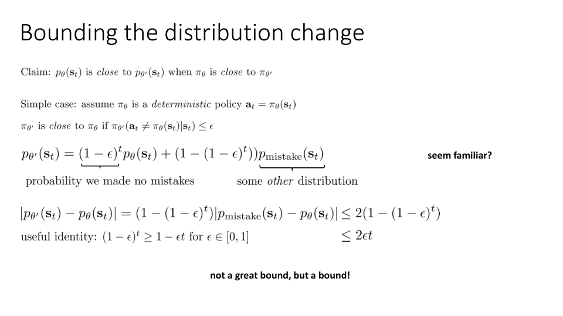
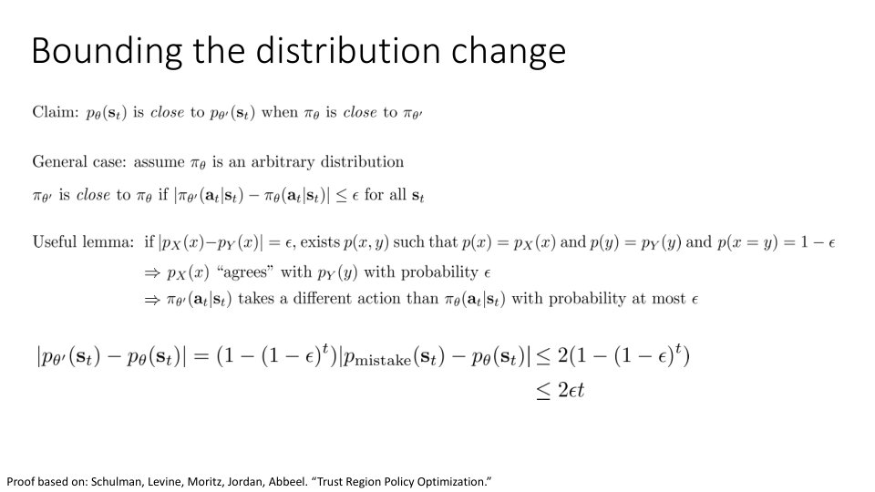
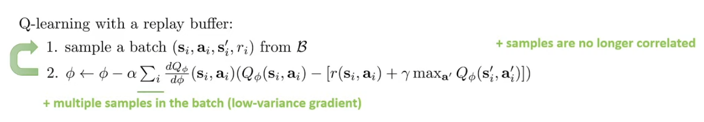
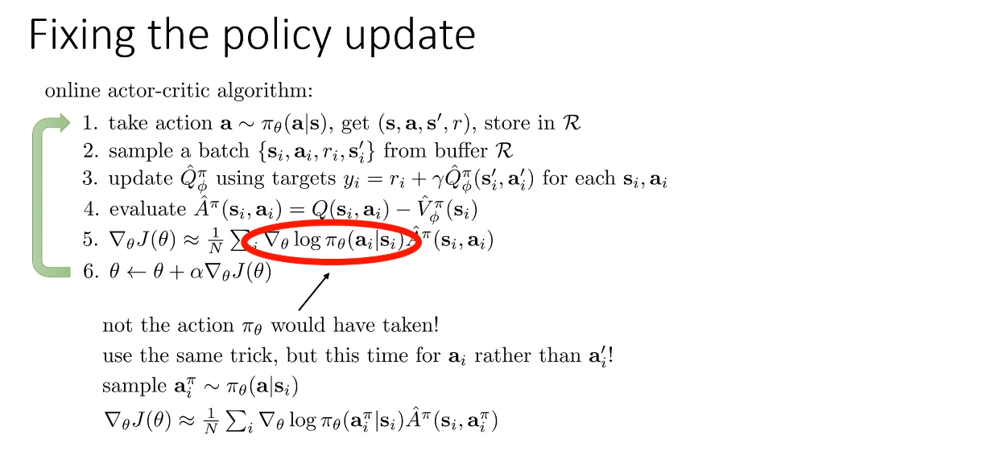
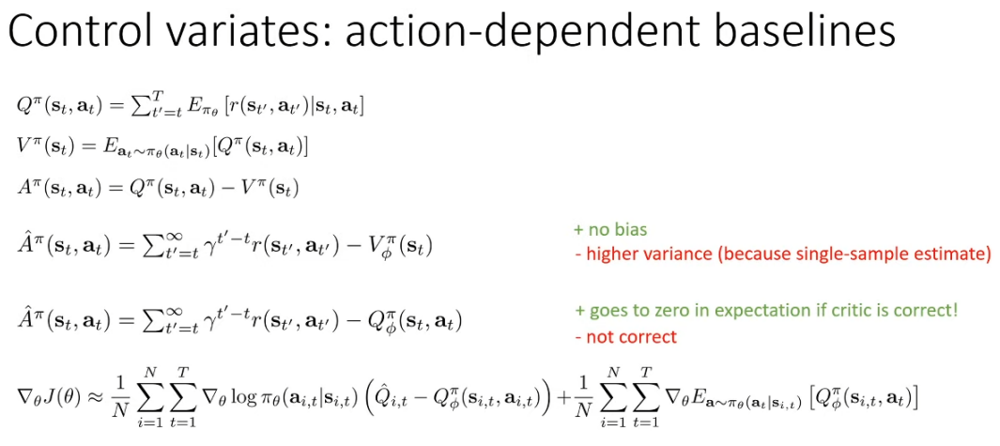

We want to use $p_θ(s_t)$ instead of $p_{θ'}(s_t)$ such that the only dependence on θ' in this whole equation is in the importance weight because we know from our previous policy gradient lecture that if we differentiate the thing on the right-hand side, we get exactly the policy gradient.

이 전체 방정식에서 θ'에 대한 유일한 의존성이 중요도 가중치에만 있도록 $p_{θ'}(s_t)$ 대신 $p_θ(s_t)$를 사용하고 싶은 이유는 앞서 정책 그래디언트 강의에서 오른쪽의 것을 미분하면 정책 그래디언트를 정확히 구할 수 있다는 것을 알고 있기 때문입니다.

And when that's the case, then the right-hand side approximates the left-hand side, meaning the difference between them can be bounded by some quantity which is small if the difference between $π_θ$ and $π_{θ'}$ is small.

이 경우 $π_θ$와 $π_{θ'}$의 차이가 작으면 오른쪽이 왼쪽에 근사하므로, 두 값의 차이는 어떤 양에 의해 경계가 정해질 수 있습니다.

So in this case what we're going to try to show is that the state marginals for θ and θ' are close if π_{θ'} is close to π_θ.

따라서 이 경우 π_{θ'}가 π_θ에 가까우면 θ와 θ'의 상태 마지널이 가깝다는 것을 보여드리려고 합니다.

Now π_{θ'} is not necessarily deterministic, and the way that we define close is that the probability that π_{θ'} assigns to any action that is not the action that π_θ would have taken, is less than or equal to ϵ.

이제 π_{θ'}가 반드시 결정론적인 것은 아니며, 우리가 근접을 정의하는 방식은 π_{θ'}가 π_θ가 취했을 행동이 아닌 어떤 행동에 할당하는 확률이 ϵ보다 작거나 같다는 것입니다.

So this is the probability we made no mistake, and this is some other distribution on which we're going to make no assumption whatsoever.

따라서 이것은 우리가 실수하지 않은 확률이며, 이것은 우리가 어떤 가정도 하지 않을 다른 분포입니다.

So it's only that second part, and that second part has a multiplier of (1 - (1 - ϵ)^t) in front of it, and that multiplies the TV(total variation) divergence between p_{mistake} and p_θ.

따라서 두 번째 부분만 있고, 그 두 번째 부분 앞에 (1 - (1 - ϵ)^t)의 multiplier가 있으며, 이는 p_{mistake}와 p_θ 사이의 TV(total variation) 차이를 곱합니다.

So it's not a great bound, but it is a bound because it shows that as ϵ decreases, the state marginals become similar to one another.

따라서 큰 바운드는 아니지만 ϵ가 감소함에 따라 상태 마지널이 서로 비슷해진다는 것을 보여주기 때문에 바운드라고 할 수 있습니다.

And this proof follows the proof in the trust region policy optimization paper, which is a reference to the bottom of the slide.

그리고 이 증명은 슬라이드 하단의 참조 자료인 trust region policy optimization paper의 증명을 따릅니다.

Then there exists a joint distribution p(x,y) so that its marginal p(x) is p_X(x) and its marginal p(y) is p_Y(y). And the probability of x equals y is 1 - ϵ.

그러면 공동 분포 p(x,y)가 존재하므로 그 마지널 p(x)는 p_X(x), 마지널 p(y)는 p_Y(y)가 됩니다. 그리고 x가 y와 같을 확률은 1 - ϵ입니다.

So to unpack this lemma a little bit, what this says is that if you have two distributions over the same variable, p_X(x) and p_Y(x), and their total variation divergence is ϵ, then you can construct a joint distribution over two variables, such that the marginals of that joint distribution with respect to its first and second argument are the two distributions you started with, and the probability of its two arguments being equal is 1 - ϵ.

이 공리를 조금 더 풀어서 설명하자면, 동일한 변수에 대한 두 분포, 즉 p_X(x)와 p_Y(x)가 있고 이들의 총 변화 차이가 ϵ인 경우, 두 변수에 대한 합동 분포를 구성할 수 있으며, 첫 번째와 두 번째 인수에 대한 해당 합동 분포의 마지널은 시작했던 두 분포이고 두 인수가 동일할 확률은 1 - ϵ라는 것입니다.

So if we could express a probability that π_{θ'} and π_θ will take the same action when both of them are stochastic, then we can use that to generalize the result from the previous slide to the case where the policies are stochastic.

따라서 π_{θ'}와 π_θ가 모두 확률적일 때 같은 행동을 취할 확률을 표현할 수 있다면, 이를 사용하여 이전 슬라이드의 결과를 정책이 확률적일 경우로 일반화할 수 있습니다.

In retrospect, this is actually kind of obvious, because if their total variation divergence is ϵ, and total variation divergence is the difference in probability, it kind of makes sense that the sliver of probability mass that is different between them would have a volume of ϵ.

돌이켜 보면 이것은 사실 다소 당연한 일입니다. 왜냐하면 이들의 total variation divergence가 ϵ이고, total variation divergence가 확률의 차이라면, 그들 사이에 다른 확률 질량의 조각이 ϵ의 부피를 갖는다는 것은 어느 정도 말이 되기 때문입니다.

So if you're if you kind of have a more geometric way of thinking about it, just imagine the two distributions as bar graphs, overlay them on top of each other and look at the differences in the bars.

좀 더 기하학적인 사고방식을 원한다면 두 분포를 막대 그래프로 상상하고 서로 겹쳐서 막대의 차이를 살펴보세요.

The volume of those differences will be equal to ϵ, which means that your probability of doing something different to ϵ.

이러한 차이의 크기는 ϵ와 같으며, 이는 ϵ와 다른 일을 할 확률을 의미합니다.

But if you prefer to think about things symbolically, then hopefully this lemma kind of puts your mind at ease.

하지만 사물을 상징적으로 생각하는 것을 선호하신다면 이 레마가 마음을 편안하게 해줄 수 있기를 바랍니다.

That, in fact, if the total variation divergence is ϵ, then the probability of a mistake is at most ϵ.

즉, 실제로 total variation divergence가 ϵ이면 실수 확률은 최대 ϵ입니다.

So what this lemma allows us to do is it allows us to state the same result that we had on the previous slide, which is the total variation divergence between the state marginals is 1 - (1 - ϵ)^t times p_{mistake} - p_θ, only now we can say this even when π_θ is stochastic, provided the total variation divergence between π_{θ'} and π_θ is bounded by ϵ.

이 레마는 우리가 이전 슬라이드에서 얻은 결과와 같은 결과를 제시할 수 있게 해줍니다. 즉, state marginal 사이의 total variation divergence는 1 - (1 - ϵ)^t times p_{mistake} - p_θ입니다. 다만 이제 π_θ가 stochastic일 때에도, π_{θ'}와 π_θ 사이의 total variation divergence가 ϵ로 제한되어 있다면 이를 말할 수 있습니다.

Well, so for this I'm going to derive another little calculation, which describes the expected values of functions under distributions when the total variation divergence between those distributions is bounded.

이를 위해 분포 사이의 total variation divergence가 바운드되었을 때 분포에서 함수의 예상값을 설명하는 또 다른 작은 계산을 도출해 보겠습니다.

So as the two policies get closer together, as ϵ gets small, that second term can always be made arbitrarily small so long as f is bounded, basically, so long as f doesn't go off to infinity for any state.

따라서 두 정책이 서로 가까워질수록 ϵ가 작아짐에 따라 기본적으로 f가 무한대로 가지 않는 한 두 번째 항은 항상 임의로 작게 만들 수 있습니다(기본적으로 어떤 상태에서도 f가 무한대로 가지 않는 한).

So by taking everything inside the brackets to be f, then we can bound this quantity below by the expected value under p_θ(s)t of the same quantity, and this thing now just looks exactly like the thing that we differentiate to get the policy gradient, minus an error term, and the error term is 2ϵt times a constant C, and the constant C is the largest value that the thing inside the brackets, the thing inside the state expectation, can take on.

그래서 괄호 안의 모든 것을 f로 잡으면 아래 이 양을 같은 양의 p_θ(s_t) 아래의 기대값으로 바운드할 수 있고, 이제 이 것은 우리가 미분해서 정책 그래디언트를 구한 것에서 에러항을 뺀 것과 똑같아 보이는데, 에러항은 2ϵt 곱하기 상수 C이고 상수 C는 괄호 안의 것, 상태 기대값 안의 것이 취할 수 있는 가장 큰 값입니다.

So that means that the largest value that C could take on is the largest possible reward times the number of time steps, because all those importance weights and all those expectations, they have to sum up to 1.

즉, 모든 중요도 가중치와 모든 기대치를 합하면 1이 되어야 하므로 C가 받을 수 있는 최대 값은 가능한 최대 보상에 시간 단계 수를 곱한 값입니다.

So that means that the, basically, the expected value of any function can't possibly be larger than the largest value that function takes on, and the largest value that an advantage can take on is the number of time steps times the largest reward.

즉, 기본적으로 어떤 함수의 기대값은 그 함수가 취할 수 있는 최대 값보다 클 수 없으며, 어드벤티지가 취할 수 있는 최대 값은 시간 단계 수에 가장 큰 보상을 곱한 값입니다.

By the way, as an aside here, if you're doing reinforcement learning theory, and you ever see a term that looks like 1 over (1-γ), just mentally substitute the time horizon for that, because 1 over (1-γ) is essentially the equivalent of a horizon in the infinite horizon case.

참고로 여기서 간단히 말씀드리자면, 강화학습 이론을 공부하시면서 1 over (1-γ)와 같은 항을 보게 된다면, 그것을 무한 지평선 상황에서의 지평선(horizon)과 동일한 것으로 생각하시면 됩니다. 왜냐하면 1 over (1-γ)는 사실상 무한 지평선 경우의 지평선에 해당하기 때문입니다.

So essentially, all this says is the maximizing this equation at the bottom maximizes a bound on the thing that we really want, which is the expectation under p_{θ'}, which we've proven to be the same as maximizing the RL objective.

따라서 이 방정식을 최대화하면 우리가 실제로 원하는 것, 즉 p_{θ'} 아래의 기대치를 최대화할 수 있으며, 이는 RL 목표를 최대화하는 것과 동일하다는 것이 입증되었습니다.

And the thing that we have to watch out for is that we get this error term that scales as 2ϵt times a constant.

여기서 주의해야 할 점은 상수의 2ϵt 배로 스케일링되는 에러 항이 발생한다는 것입니다.

All right, so what we have so far is that maximizing this objective, basically the expected value under p_θ, the expected value under π_θ of the importance weighted advantage, is a good way to maximize the RL objective so long as π_{θ'} is close to π_θ in terms of total variation divergence.

지금까지 살펴본 바에 따르면, 기본적으로 중요도 가중 어드벤티지 값의 π_θ 하에서의 기대값, 즉 π_{θ'}가 total variation divergence 측면에서 π_θ에 가깝다면 이 목표를 최대화하는 것이 RL 목표를 최대화하는 좋은 방법이라는 것을 알 수 있습니다.

Essentially, if you restrict θ' to not go too far from θ so this constraint is satisfied, then maximizing this tractable objective is the same as maximizing the true RL objective.

기본적으로, 만약 θ'를 θ에서 너무 멀어지지 않도록 제한하여 이 제약을 만족시킨다면, 이 다루기 쉬운 목표를 최대화하는 것은 실제 RL 목표를 최대화하는 것과 같습니다.

We still unfortunately don't have a real gradient, because we're not computing the derivative through this second term, but at least the sample is not correlated.

불행히도 우리는 여전히 실제 그래디언트를 가지고 있지 않습니다, 왜냐하면 우리는 이 두 번째 항을 통한 미분을 계산하지 않고 있기 때문이지만, 적어도 샘플은 상관관계가 없습니다.

But as long as none of the threads hang up, then you'll be okay.

하지만 스레드가 끊어지지 않는 한 괜찮을 것입니다.

Another way to think about it is we can no longer assume that our action came from our latest policy π_θ, so we'll instead learn a state action value function that is valid for any action so that we can train it even using actions that didn't come from π_θ, but then query it using actions from π_θ.

이에 대해 생각하는 또 다른 방법은 우리의 action이 최신 policy π_θ에서 온 것이라고 더 이상 가정할 수 없기 때문에, π_θ에서 오지 않은 action을 사용하여도 훈련할 수 있고, 그런 다음 π_θ에서 온 action을 사용하여 query 할 수 있는, 어떤 action에 대해서도 유효한 state action value function을 대신 학습할 것입니다.

And now we'll just plug in this a_i^π into our policy gradient equation and that's now correct because a'_i did in fact come from π_θ so this is in fact an unbiased estimator of expectations under π_θ.

이제 이 a_i^π를 정책 그래디언트 방정식에 대입하면 a'_i가 실제로 π_θ에서 나온 것이므로 실제로는 π_θ 아래의 기대치에 대한 편향되지 않은 추정치이므로 이제 맞습니다.

So it has a very similar effect as the discount, which also maybe sheds some light on the role that discounts play in policy gradients.

따라서 할인과 매우 유사한 효과를 내며, 할인이 정책 그래디언트에서 어떤 역할을 하는지도 알 수 있습니다.

And that's in fact what's the case.

그리고 실제로 그것이 사실입니다.

So we have 10,000 total state action pairs, which means that we're going to need to calculate 10,000 of these 1 million length vectors.

우리는 총 10,000개의 state action 쌍을 가지고 있으며, 이는 우리가 1백만 길이의 벡터 10,000개를 계산해야 함을 의미합니다.

So instead of calculating the derivative of the neural net's output with respect to its input, and then multiplying that by the derivative of the loss, we do the opposite. We first calculate the derivative of the loss, and then back propagate it through the neural network using the back propagation algorithm, which is what our automatic differentiation tools will do for us.

신경망의 출력에 대한 입력의 derivative를 계산하고, 그 결과를 손실의 derivative와 곱하는 대신에, 우리는 반대 의 과정을 수행합니다. 우리는 먼저 손실의 derivative를 계산하고, 그것을 역전파 알고리즘을 사용하여 신경망을 통해 역전파합니다. 이는 우리의 자동 미분 도구가 수행할 작업입니다.

We will also have an entire other lecture later on in the course on even more advanced policy gradients materials.

이 과정의 후반부에는 더 고급 정책 그래디언트 자료에 대한 다른 강의도 준비되어 있습니다.

The intuition is that this is a essentially the same problem as optimizing, let's say, a quadratic function where the eigenvalues of the corresponding matrix have a very large ratio. So if you have a quadratic function with some eigenvalues that are very large and some that are very small, then first-order gradient descent methods are really going to struggle in this kind of function.

직관적으로 이것은 해당 행렬의 고유값이 매우 큰 비율을 갖는 이차 함수를 최적화하는 것과 본질적으로 같은 문제라는 것을 알 수 있습니다. 따라서 일부 고유값이 매우 크고 일부 고유값이 매우 작은 이차 함수가 있다면 이런 종류의 함수에서 일차 그래디언트 하강 방법은 정말 어려움을 겪게 될 것입니다.

So can we rescale the gradient so that this doesn't happen? What if we instead iteratively solve this problem, maximize the linearized objective, but subject to a constraint that the distributions don't change too much?

그렇다면 이런 일이 발생하지 않도록 그래디언트의 스케일을 다시 조정할 수 있을까요? 대신 이 문제를 반복적으로 해결하고 선형화된 목표를 최대화하되 분포가 너무 많이 변하지 않는다는 제약 조건을 적용하면 어떨까요?

* subject to : ~을 조건으로